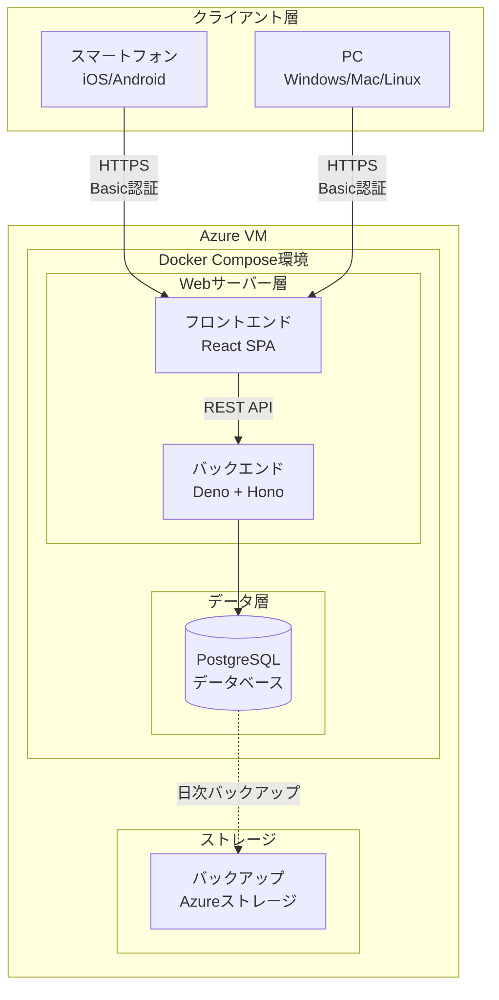
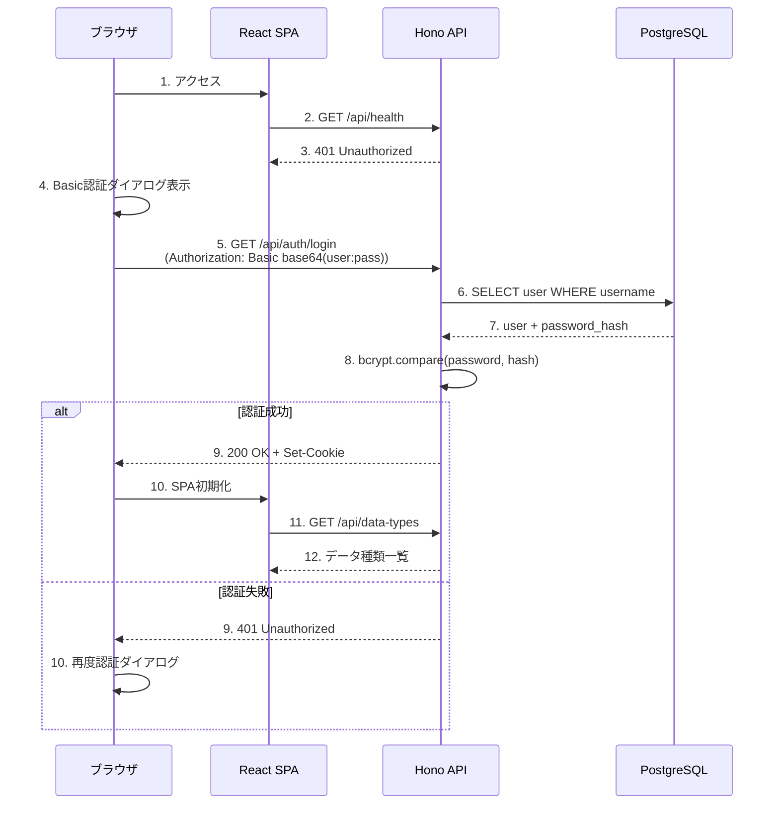
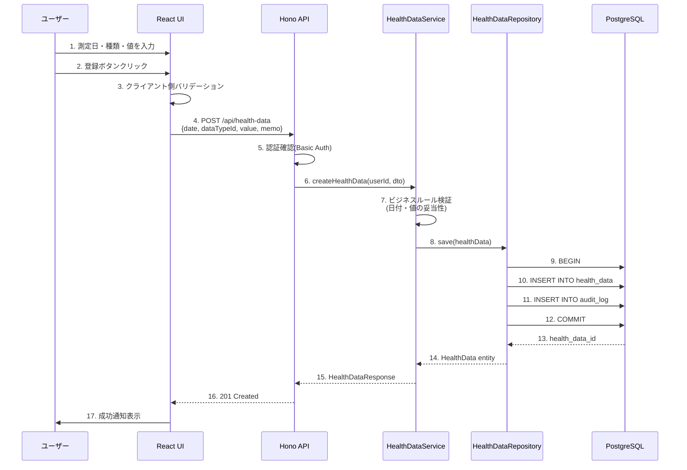
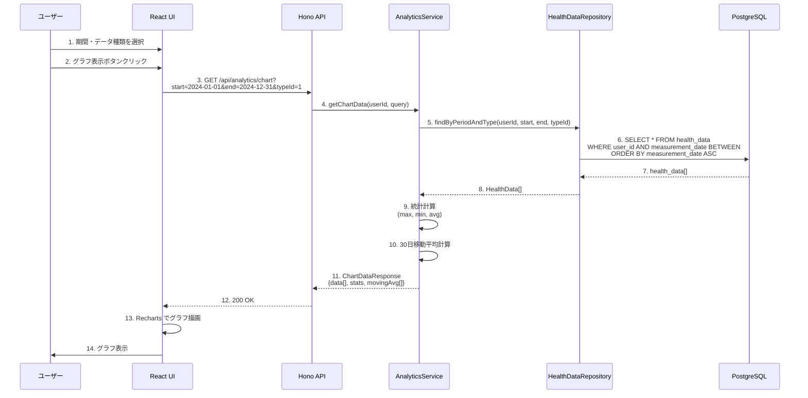

# 技術設計書

## 概要

本システムは、個人ヘルスケアレコード(PHR: Personal Healthcare Record)管理システムです。日々の健康情報を記録・蓄積・分析し、医療機関との情報共有を支援するWebアプリケーションを提供します。

**目的**: 既存のヘルスケアアプリの「過剰機能」と「機能不足」の間のギャップを埋める、シンプルで柔軟な個人健康記録管理ソリューションを実現します。ユーザーが日々の健康情報を継続的に記録し、長期的なデータ蓄積と傾向分析を可能にし、定期健診時にかかりつけ医へ効率的にデータを報告できます。

**ユーザー**: 健康意識の高い個人ユーザー(40〜70代想定)が、日常的な健康データ入力、データ分析、医療機関への情報提供のために利用します。システム管理者はデータ種類マスタの管理とシステム運用を担当します。

**影響**: 完全な新規開発プロジェクトであり、既存システムへの影響はありません。Azure VM上にDocker Composeで構成されたDeno + Hono + React + PostgreSQLスタックを新規構築します。

### ゴール

- ユーザーがスマホ・PCから1秒以内に健康情報を登録できる使いやすいUI/UXを提供する
- 蓄積されたデータから統計値(最大・最小・平均)と折れ線グラフ・30日移動平均を3秒以内に表示する
- PDF/CSV形式で医療機関へ提出可能なデータ出力機能を10秒以内に生成する
- Basic認証とHTTPSによるセキュアな通信で個人の健康情報を保護する
- 99.5%以上のシステム稼働率と月額100円/ユーザー以下の低コスト運用を実現する

### 非ゴール

- 電子カルテシステムとのリアルタイム連携(将来検討)
- ウェアラブルデバイスからの自動データ取込(初期フェーズ外)
- 多言語対応(日本語のみ対応)
- 複数ユーザー間でのデータ共有機能
- AI/機械学習による健康予測機能

---

## アーキテクチャ

### 高レベルアーキテクチャ



**アーキテクチャ統合**:
- **既存パターン保持**: 新規開発のため既存パターンなし
- **新コンポーネント根拠**:
  - React SPA: レスポンシブデザインとリッチなグラフ描画のためのモダンフロントエンド
  - Hono: 軽量で高速なWebフレームワーク、Denoとの親和性が高い
  - PostgreSQL: トランザクション管理とデータ整合性が必要な健康情報の永続化
- **技術スタック整合性**: Deno + Hono + React + PostgreSQLの組み合わせはTypeScript統一環境を実現し、開発効率とメンテナンス性を向上させる
- **ステアリング準拠**: 要件定義書(RDDD0301)の技術スタック要求(REQ-18)に準拠し、シンプルなシステム構成(REQ-14)と低コスト運用(REQ-15)を実現

---

### 技術スタックと設計判断

#### 技術スタック

**フロントエンド層**:
- **選択**: React 18+ with TypeScript
- **根拠**:
  - コンポーネントベースアーキテクチャによる再利用性とメンテナンス性
  - 豊富なチャート描画ライブラリ(Recharts等)のエコシステム
  - レスポンシブデザインの実装が容易
- **代替案**:
  - Vue.js: 学習曲線は緩やかだが、TypeScript統合がやや劣る
  - Svelte: パフォーマンスは優れるが、エコシステムが小規模

**バックエンド層**:
- **選択**: Deno 1.40+ with Hono 4.0+
- **根拠**:
  - TypeScript/JavaScriptのネイティブサポート、追加のトランスパイル不要
  - Honoの軽量性と高速性(Express比で10倍高速)
  - 標準ライブラリの充実とセキュリティのデフォルト(HTTPS強制、セキュアなパーミッション)
  - 低メモリフットプリント、コスト最適化に貢献
- **代替案**:
  - Node.js + Express: 成熟したエコシステムだが、レガシーな依存関係管理
  - Bun + Hono: 高速だが、本番環境での実績が不足

**データベース層**:
- **選択**: PostgreSQL 15+
- **根拠**:
  - ACIDトランザクションによる健康データの整合性保証
  - JSON型サポートによる柔軟なデータ構造(将来の拡張性)
  - 成熟したバックアップ・復旧ツールチェーン
  - Azure VMでの安定した運用実績
- **代替案**:
  - MySQL: 機能的には十分だが、JSON型サポートがやや劣る
  - SQLite: シンプルだが、同時接続性能とバックアップ機能が不足

**インフラ層**:
- **選択**: Azure VM + Docker Compose
- **根拠**:
  - シンプルな単一VM構成による低コスト運用(月額100円/ユーザー以下)
  - Docker Composeによる簡易なコンテナオーケストレーション
  - Azureストレージによる安価なバックアップ保存
  - 垂直スケーリング(VMスペックアップ)による段階的拡張
- **代替案**:
  - Kubernetes: オーバーエンジニアリング、初期ユーザー数100人には不要
  - AWS Lightsail: コスト的には競合だが、Azureとの整合性重視

#### 主要な設計判断

##### 判断1: レイヤードアーキテクチャの採用

**決定**: プレゼンテーション層、アプリケーション層、ドメイン層、インフラストラクチャ層の4層構造を採用します。

**コンテキスト**: システムの複雑性が中程度であり、将来的な機能拡張が見込まれるため、適切な関心の分離が必要です。

**代替案**:
1. **MVC (Model-View-Controller)**: シンプルだが、ビジネスロジックとデータアクセスの分離が不十分
2. **ヘキサゴナルアーキテクチャ**: 高い柔軟性だが、初期開発コストが高く小規模システムには過剰
3. **トランザクションスクリプト**: 最もシンプルだが、コードの重複とメンテナンス性の低下

**選択されたアプローチ**: レイヤードアーキテクチャ
- **プレゼンテーション層**: React UIコンポーネント、Hono HTTPハンドラ
- **アプリケーション層**: ユースケース実装、トランザクション境界
- **ドメイン層**: ビジネスロジック、エンティティ、値オブジェクト
- **インフラストラクチャ層**: PostgreSQLリポジトリ、外部サービス連携

**根拠**:
- ビジネスロジックの再利用性: ドメイン層が複数のユースケースから独立して利用可能
- テスタビリティ: 各層が独立してテスト可能、モック化が容易
- 保守性: 変更の影響範囲が明確、層間の依存関係が一方向
- 適切な複雑性: ヘキサゴナルアーキテクチャほど複雑でなく、MVCより構造化されている

**トレードオフ**:
- **獲得**: コードの整理と長期的なメンテナンス性、チーム開発での役割分担の明確化
- **犠牲**: 初期開発の若干のオーバーヘッド、ボイラープレートコードの増加

##### 判断2: Basic認証の採用(OAuth 2.0ではなく)

**決定**: システム認証にHTTP Basic認証を採用します。

**コンテキスト**: 初期ユーザー数100人、3年後でも1,000人の小規模システムであり、シンプルさと低コスト運用が最優先です。

**代替案**:
1. **OAuth 2.0 + JWT**: 業界標準だが、実装・運用コストが高い
2. **セッションベース認証**: 実装は容易だが、水平スケーリング時にセッションストレージが必要
3. **APIキー認証**: シンプルだが、ユーザー体験が劣る

**選択されたアプローチ**: HTTP Basic認証(HTTPS強制)
- ブラウザのネイティブサポートによる実装の簡素化
- パスワードハッシュ化(bcrypt)による安全性確保
- TLS 1.2以上による通信暗号化

**根拠**:
- 実装コスト: 追加のライブラリやトークン管理インフラが不要
- 運用コスト: セッションストレージやトークンリフレッシュロジックが不要
- ユーザー体験: ブラウザの認証情報保存機能を活用、手動ログイン不要
- セキュリティ: HTTPSと組み合わせることで十分な安全性を確保

**トレードオフ**:
- **獲得**: 開発・運用コストの大幅削減、システム構成のシンプル化
- **犠牲**: ソーシャルログイン(Google/Facebook等)の不可、きめ細かい権限制御の困難さ

##### 判断3: 同期型データ処理(非同期ジョブキューではなく)

**決定**: データ登録、参照、分析、出力のすべての処理を同期型HTTPリクエスト/レスポンスで実装します。

**コンテキスト**: パフォーマンス要件(データ登録1秒、参照2秒、グラフ描画3秒、出力10秒)が同期処理で達成可能な範囲内です。

**代替案**:
1. **非同期ジョブキュー(BullMQ等)**: 高負荷対応だが、複雑性とインフラコストが増加
2. **Server-Sent Events(SSE)**: リアルタイム性は高いが、本システムには不要
3. **WebSocket**: 双方向通信が可能だが、本システムの要件に過剰

**選択されたアプローチ**: 同期型HTTP API
- REST APIによるCRUD操作
- PostgreSQLトランザクション内での一貫性保証
- クライアント側でのローディング表示

**根拠**:
- パフォーマンス十分性: ピーク時20ユーザーの同時接続、処理時間要件を満たす
- 実装の簡素化: ジョブキュー、ワーカープロセス、ジョブステータス管理が不要
- デバッグ容易性: リクエスト/レスポンスのトレースが直感的
- コスト最適化: 追加のインフラ(Redisキュー等)が不要

**トレードオフ**:
- **獲得**: システム構成のシンプル化、開発・運用コストの削減
- **犠牲**: 大量データ処理(1年分以上のPDF出力等)でのタイムアウトリスク、高負荷時のレスポンス遅延

---

## システムフロー

### ユーザー認証フロー



### 健康情報登録フロー



### データ分析・グラフ描画フロー



---

## 要件トレーサビリティ

| 要件 | 要件サマリー | コンポーネント | インターフェース | フロー |
|------|-------------|--------------|--------------|-------|
| 1.1-1.6 | 健康情報登録 | HealthDataService, HealthDataRepository | POST /api/health-data, PUT /api/health-data/:id, DELETE /api/health-data/:id | 健康情報登録フロー |
| 2.1-2.5 | 健康情報参照 | HealthDataService, HealthDataRepository | GET /api/health-data?start&end&typeId | データ参照フロー |
| 3.1-3.5 | データ種類管理 | DataTypeService, DataTypeRepository | GET /api/data-types, POST /api/data-types, PUT /api/data-types/:id | マスタ管理フロー |
| 4.1-4.6 | データ分析機能 | AnalyticsService, HealthDataRepository | GET /api/analytics/stats, GET /api/analytics/chart | データ分析・グラフ描画フロー |
| 5.1-5.5 | データ出力機能 | ExportService, HealthDataRepository | POST /api/export/pdf, POST /api/export/csv | データ出力フロー |
| 6.1-6.6 | 過去データ移行 | ImportService, HealthDataRepository | POST /api/import/csv | CSVインポートフロー |
| 7.1-7.6 | 認証とアクセス制御 | AuthService, UserRepository, AuthMiddleware | POST /api/auth/login, GET /api/auth/logout | ユーザー認証フロー |
| 8.1-8.6 | システム稼働とパフォーマンス | 全コンポーネント | 全API(1秒/2秒/3秒レスポンス) | 全フロー |
| 9.1-9.6 | データ保護とバックアップ | BackupService | cron job: pg_dump | バックアップフロー |
| 10.1-10.5 | マルチデバイス対応 | React UI(レスポンシブデザイン) | 全UIコンポーネント | 全フロー |
| 11.1-11.6 | 運用とサポート | MonitoringService, LoggingMiddleware | GET /api/health, GET /api/metrics | 監視フロー |
| 12.1-12.8 | セキュリティ対策 | AuthMiddleware, InputValidator, SecurityMiddleware | 全API(HTTPS, CSRF Token) | 全フロー |

---

## コンポーネントとインターフェース

### フロントエンド層

#### React UIコンポーネント

**責任と境界**
- **主要責任**: ユーザーインタラクションの処理、データの表示、バックエンドAPIとの通信
- **ドメイン境界**: プレゼンテーション層、ビジネスロジックを含まない
- **データ所有権**: UIステート(入力フォームの状態、ローディング状態)のみ所有
- **トランザクション境界**: なし(バックエンドAPIがトランザクション管理)

**依存関係**
- **インバウンド**: なし(エンドユーザーが直接操作)
- **アウトバウンド**: Hono REST API(axios経由)
- **外部**: React 18+, Recharts(グラフ描画), TailwindCSS(スタイリング), axios(HTTP通信)

**外部依存関係の調査**:
- **React 18.2+**: 公式ドキュメント(https://react.dev/)確認済み、Concurrent Rendering、Suspense、Server Componentsをサポート
- **Recharts 2.10+**: グラフ描画ライブラリ(https://recharts.org/)、折れ線グラフ・エリアチャート対応、レスポンシブデザイン対応
- **TailwindCSS 3.4+**: ユーティリティファーストCSSフレームワーク、モバイルファーストのレスポンシブデザインをサポート
- **axios 1.6+**: HTTPクライアント、インターセプターによるBasic認証ヘッダー自動付与

**契約定義: サービスインターフェース**

```typescript
// UIコンポーネントの主要インターフェース
interface HealthDataFormProps {
  onSubmit: (data: HealthDataInput) => Promise<void>;
  dataTypes: DataType[];
}

interface HealthDataInput {
  measurementDate: string; // ISO 8601 date
  dataTypeId: number;
  value: number;
  memo?: string;
}

interface DataType {
  id: number;
  name: string;
  unit: string;
  displayOrder: number;
}

interface ChartProps {
  data: HealthDataPoint[];
  movingAverage?: MovingAveragePoint[];
  stats: Statistics;
}

interface HealthDataPoint {
  date: string;
  value: number;
}

interface Statistics {
  max: number;
  min: number;
  average: number;
}
```

**事前条件**: ユーザーがBasic認証を完了していること、ブラウザがJavaScript有効であること
**事後条件**: バックエンドAPIが正常にレスポンスを返すこと、UIステートが更新されること
**不変条件**: 認証セッションが有効である限り、APIリクエストが認証ヘッダーを含むこと

**状態管理**
- **状態モデル**: React Context API + useReducerによるグローバルステート管理
- **永続化**: LocalStorageに認証トークンを保存(オプション)
- **並行性制御**: なし(UIは単一スレッド)

---

### バックエンド層 - アプリケーション層

#### HealthDataService

**責任と境界**
- **主要責任**: 健康情報のCRUD操作、ビジネスルール検証、トランザクション管理
- **ドメイン境界**: 健康情報管理ドメイン
- **データ所有権**: HEALTH_DATAテーブルのデータ所有
- **トランザクション境界**: 各サービスメソッドがトランザクション境界

**依存関係**
- **インバウンド**: Hono APIハンドラ
- **アウトバウンド**: HealthDataRepository, DataTypeRepository
- **外部**: なし

**契約定義: サービスインターフェース**

```typescript
interface HealthDataService {
  /**
   * 健康情報を登録する
   * @precondition dataTypeIdがDATA_TYPE_MASTERに存在すること
   * @postcondition HEALTH_DATAテーブルにレコードが追加されること
   * @throws ValidationError 入力値が不正な場合
   * @throws DuplicateError 同一ユーザー・日付・データ種類の組み合わせが既に存在する場合
   */
  createHealthData(
    userId: number,
    input: CreateHealthDataDto
  ): Promise<Result<HealthData, HealthDataError>>;

  /**
   * 健康情報を更新する
   * @precondition healthDataIdが存在し、userIdが所有者であること
   * @postcondition HEALTH_DATAテーブルのレコードが更新されること
   * @throws NotFoundError 指定されたhealthDataIdが存在しない場合
   * @throws ForbiddenError userIdが所有者でない場合
   */
  updateHealthData(
    userId: number,
    healthDataId: number,
    input: UpdateHealthDataDto
  ): Promise<Result<HealthData, HealthDataError>>;

  /**
   * 健康情報を削除する
   * @precondition healthDataIdが存在し、userIdが所有者であること
   * @postcondition HEALTH_DATAテーブルからレコードが削除されること
   */
  deleteHealthData(
    userId: number,
    healthDataId: number
  ): Promise<Result<void, HealthDataError>>;

  /**
   * 健康情報を検索する
   * @precondition start <= end であること
   * @postcondition userIdが所有する健康情報のみが返却されること
   */
  findHealthData(
    userId: number,
    query: HealthDataQuery
  ): Promise<Result<HealthData[], HealthDataError>>;
}

interface CreateHealthDataDto {
  measurementDate: string; // ISO 8601 date
  dataTypeId: number;
  value: number;
  memo?: string;
}

interface UpdateHealthDataDto {
  value: number;
  memo?: string;
}

interface HealthDataQuery {
  startDate: string;
  endDate: string;
  dataTypeId?: number;
}

type HealthDataError = ValidationError | DuplicateError | NotFoundError | ForbiddenError;
```

**事前条件**: userIdが有効なユーザーIDであること、データ種類IDがマスタに存在すること
**事後条件**: データベーストランザクションがコミットされること、監査ログが記録されること
**不変条件**: ユーザーは自身の健康データのみアクセス可能であること

---

#### AnalyticsService

**責任と境界**
- **主要責任**: 統計計算(最大・最小・平均)、30日移動平均計算、グラフ用データ整形
- **ドメイン境界**: データ分析ドメイン
- **データ所有権**: なし(読み取り専用)
- **トランザクション境界**: なし(読み取り専用操作)

**依存関係**
- **インバウンド**: Hono APIハンドラ
- **アウトバウンド**: HealthDataRepository
- **外部**: なし

**契約定義: サービスインターフェース**

```typescript
interface AnalyticsService {
  /**
   * 統計値を計算する
   * @precondition start <= end であること
   * @postcondition 最大・最小・平均値が返却されること(データが0件の場合はnull)
   */
  calculateStatistics(
    userId: number,
    query: AnalyticsQuery
  ): Promise<Result<Statistics | null, AnalyticsError>>;

  /**
   * グラフ用データを生成する(折れ線グラフ + 30日移動平均)
   * @precondition start <= end であること
   * @postcondition 時系列データと移動平均が返却されること
   */
  getChartData(
    userId: number,
    query: AnalyticsQuery
  ): Promise<Result<ChartData, AnalyticsError>>;
}

interface AnalyticsQuery {
  startDate: string;
  endDate: string;
  dataTypeId: number;
}

interface ChartData {
  dataPoints: DataPoint[];
  movingAverage: DataPoint[];
  statistics: Statistics;
}

interface DataPoint {
  date: string;
  value: number;
}

interface Statistics {
  max: number;
  min: number;
  average: number;
  count: number;
}

type AnalyticsError = ValidationError | NotFoundError;
```

**事前条件**: userIdが有効、データ種類IDが存在すること
**事後条件**: 3秒以内にレスポンスが返却されること
**不変条件**: 他ユーザーのデータは含まれないこと

---

#### ExportService

**責任と境界**
- **主要責任**: PDF/CSV形式でのデータ出力、医療機関提出用フォーマット生成
- **ドメイン境界**: データ出力ドメイン
- **データ所有権**: DATA_EXPORTテーブルのデータ所有(出力履歴)
- **トランザクション境界**: 各出力操作がトランザクション境界

**依存関係**
- **インバウンド**: Hono APIハンドラ
- **アウトバウンド**: HealthDataRepository, DataExportRepository
- **外部**: PDFKit(PDF生成), csv-stringify(CSV生成)

**外部依存関係の調査**:
- **PDFKit 0.14+**: PDF生成ライブラリ、Node.js/Deno対応、日本語フォント対応要確認(実装フェーズで調査必要)
- **csv-stringify 6.4+**: CSV生成ライブラリ、ストリーミング対応、Deno互換性要確認

**契約定義: サービスインターフェース**

```typescript
interface ExportService {
  /**
   * PDF形式でデータを出力する
   * @precondition start <= end であること
   * @postcondition PDFファイルが生成され、出力履歴が記録されること
   * @performance 1年分のデータ(約1,800件)を10秒以内に生成すること
   */
  exportToPDF(
    userId: number,
    query: ExportQuery
  ): Promise<Result<Buffer, ExportError>>;

  /**
   * CSV形式でデータを出力する
   * @precondition start <= end であること
   * @postcondition CSVファイルが生成され、出力履歴が記録されること
   */
  exportToCSV(
    userId: number,
    query: ExportQuery
  ): Promise<Result<string, ExportError>>;
}

interface ExportQuery {
  startDate: string;
  endDate: string;
  dataTypeIds: number[];
}

type ExportError = ValidationError | NotFoundError | ExportGenerationError;
```

**事前条件**: userIdが有効、期間が妥当であること
**事後条件**: 10秒以内にファイルが生成されること、出力履歴がDATA_EXPORTテーブルに記録されること
**不変条件**: 他ユーザーのデータは含まれないこと

---

### バックエンド層 - インフラストラクチャ層

#### HealthDataRepository

**責任と境界**
- **主要責任**: HEALTH_DATAテーブルへのCRUD操作、SQLクエリの実行
- **ドメイン境界**: データアクセス層
- **データ所有権**: HEALTH_DATAテーブルへのアクセス権
- **トランザクション境界**: なし(サービス層がトランザクション管理)

**依存関係**
- **インバウンド**: HealthDataService, AnalyticsService, ExportService, ImportService
- **アウトバウンド**: PostgreSQLデータベース
- **外部**: postgres.js(PostgreSQLクライアントライブラリ)

**外部依存関係の調査**:
- **postgres.js 3.4+**: PostgreSQLクライアント、Deno対応、プリペアドステートメント対応、コネクションプーリング機能

**契約定義: リポジトリインターフェース**

```typescript
interface HealthDataRepository {
  save(data: HealthData): Promise<HealthData>;
  update(id: number, data: Partial<HealthData>): Promise<HealthData>;
  delete(id: number): Promise<void>;
  findById(id: number): Promise<HealthData | null>;
  findByUserId(userId: number, query: HealthDataQuery): Promise<HealthData[]>;
  findByPeriod(userId: number, start: string, end: string, dataTypeId: number): Promise<HealthData[]>;
  countByUserId(userId: number): Promise<number>;
}

interface HealthData {
  id: number;
  userId: number;
  dataTypeId: number;
  measurementDate: string;
  value: number;
  memo?: string;
  createdAt: Date;
  updatedAt: Date;
}
```

**統合戦略**: 新規開発のため、既存システムとの統合なし

---

### バックエンド層 - APIコントラクト

#### REST API エンドポイント

| Method | Endpoint | Request | Response | Errors |
|--------|----------|---------|----------|--------|
| POST | /api/auth/login | `Authorization: Basic base64(user:pass)` | `{userId, username}` | 401 |
| GET | /api/health | なし | `{status: "ok"}` | 503 |
| GET | /api/data-types | なし | `DataType[]` | 401, 500 |
| POST | /api/data-types | `{name, unit, displayOrder}` | `DataType` | 400, 401, 409, 500 |
| GET | /api/health-data | `?start&end&dataTypeId` | `HealthData[]` | 400, 401, 500 |
| POST | /api/health-data | `{measurementDate, dataTypeId, value, memo?}` | `HealthData` | 400, 401, 409, 500 |
| PUT | /api/health-data/:id | `{value, memo?}` | `HealthData` | 400, 401, 403, 404, 500 |
| DELETE | /api/health-data/:id | なし | `204 No Content` | 401, 403, 404, 500 |
| GET | /api/analytics/stats | `?start&end&dataTypeId` | `Statistics` | 400, 401, 500 |
| GET | /api/analytics/chart | `?start&end&dataTypeId` | `ChartData` | 400, 401, 500 |
| POST | /api/export/pdf | `{startDate, endDate, dataTypeIds[]}` | `application/pdf` | 400, 401, 500 |
| POST | /api/export/csv | `{startDate, endDate, dataTypeIds[]}` | `text/csv` | 400, 401, 500 |
| POST | /api/import/csv | `multipart/form-data: file` | `{imported: number, errors: Error[]}` | 400, 401, 500 |

**リクエストスキーマ例**:

```typescript
// POST /api/health-data
interface CreateHealthDataRequest {
  measurementDate: string; // ISO 8601 date (YYYY-MM-DD)
  dataTypeId: number;
  value: number; // 小数点2桁まで
  memo?: string; // 最大500文字
}

// バリデーションルール
const createHealthDataSchema = z.object({
  measurementDate: z.string().refine(isValidDate),
  dataTypeId: z.number().int().positive(),
  value: z.number().finite(),
  memo: z.string().max(500).optional(),
});
```

**レスポンススキーマ例**:

```typescript
// GET /api/analytics/chart
interface ChartDataResponse {
  dataPoints: Array<{
    date: string; // ISO 8601
    value: number;
  }>;
  movingAverage: Array<{
    date: string;
    value: number;
  }>;
  statistics: {
    max: number;
    min: number;
    average: number;
    count: number;
  };
}
```

**エラーレスポンス形式**:

```typescript
interface ErrorResponse {
  error: {
    code: string; // "VALIDATION_ERROR", "NOT_FOUND", etc.
    message: string; // ユーザー向けエラーメッセージ
    details?: Record<string, string[]>; // フィールドごとのバリデーションエラー
  };
}
```

---

## データモデル

### ドメインモデル

本システムは比較的シンプルなCRUDアプリケーションであり、複雑なビジネスルールや集約を持ちません。以下、主要な概念を定義します。

**コア概念**:

- **ユーザー(User)**: システム利用者、健康データの所有者
- **データ種類(DataType)**: 血圧(上)、血圧(下)、脈拍、体重などの分類
- **健康データ(HealthData)**: 測定日・データ種類・測定値の組み合わせ
- **データ出力(DataExport)**: 出力履歴の記録

**ビジネスルールと不変条件**:

1. **一意性制約**: 同一ユーザー・同一測定日・同一データ種類の組み合わせは一意でなければならない
2. **日付制約**: 測定日は過去日付または当日でなければならない(未来日付は不可)
3. **データ所有権**: ユーザーは自身が登録した健康データのみアクセス可能
4. **データ種類の削除制約**: 健康データが関連付けられているデータ種類は削除不可(論理削除のみ)
5. **カスケード削除**: ユーザー削除時、関連する健康データと出力履歴も自動削除

**集約と境界**:

- **User集約**: Userエンティティが集約ルート、HealthDataとDataExportは別集約(パフォーマンス最適化のため)
- **HealthData集約**: HealthDataエンティティが集約ルート、単一エンティティで構成

---

### 物理データモデル(PostgreSQL)

#### USERテーブル

```sql
CREATE TABLE users (
  user_id BIGSERIAL PRIMARY KEY,
  username VARCHAR(50) NOT NULL UNIQUE,
  password_hash VARCHAR(255) NOT NULL,
  created_at TIMESTAMP NOT NULL DEFAULT CURRENT_TIMESTAMP,
  updated_at TIMESTAMP NOT NULL DEFAULT CURRENT_TIMESTAMP
);

CREATE INDEX idx_users_username ON users(username);
```

**データ型選択根拠**:
- `BIGSERIAL`: 自動採番、最大9,223,372,036,854,775,807件のレコードをサポート
- `VARCHAR(50)`: ユーザー名は最大50文字、ASCII英数字想定
- `VARCHAR(255)`: bcryptハッシュは60文字だが、将来的なアルゴリズム変更に備えて255文字

---

#### DATA_TYPE_MASTERテーブル

```sql
CREATE TABLE data_type_master (
  data_type_id BIGSERIAL PRIMARY KEY,
  data_type_name VARCHAR(100) NOT NULL,
  unit VARCHAR(20) NOT NULL,
  display_order INT NOT NULL DEFAULT 0,
  is_active BOOLEAN NOT NULL DEFAULT TRUE,
  created_at TIMESTAMP NOT NULL DEFAULT CURRENT_TIMESTAMP,
  updated_at TIMESTAMP NOT NULL DEFAULT CURRENT_TIMESTAMP
);

CREATE INDEX idx_data_type_master_is_active ON data_type_master(is_active);
CREATE INDEX idx_data_type_master_display_order ON data_type_master(display_order);
```

**初期データ**:
```sql
INSERT INTO data_type_master (data_type_name, unit, display_order) VALUES
  ('血圧(上)', 'mmHg', 1),
  ('血圧(下)', 'mmHg', 2),
  ('脈拍', 'bpm', 3),
  ('体重', 'kg', 4);
```

---

#### HEALTH_DATAテーブル

```sql
CREATE TABLE health_data (
  health_data_id BIGSERIAL PRIMARY KEY,
  user_id BIGINT NOT NULL REFERENCES users(user_id) ON DELETE CASCADE,
  data_type_id BIGINT NOT NULL REFERENCES data_type_master(data_type_id),
  measurement_date DATE NOT NULL,
  value DECIMAL(10, 2) NOT NULL,
  memo TEXT,
  created_at TIMESTAMP NOT NULL DEFAULT CURRENT_TIMESTAMP,
  updated_at TIMESTAMP NOT NULL DEFAULT CURRENT_TIMESTAMP,
  UNIQUE(user_id, data_type_id, measurement_date)
);

-- パフォーマンス最適化インデックス
CREATE INDEX idx_health_data_user_date ON health_data(user_id, measurement_date DESC);
CREATE INDEX idx_health_data_user_type_date ON health_data(user_id, data_type_id, measurement_date DESC);
```

**データ型選択根拠**:
- `DATE`: 測定日は時刻情報不要、日単位の粒度
- `DECIMAL(10, 2)`: 測定値は小数点2桁まで、最大8桁の整数部(例: 99999999.99)
- `TEXT`: メモは可変長、最大1GBまで対応(PostgreSQL制約)

**インデックス戦略**:
- `(user_id, measurement_date DESC)`: 期間検索のクエリ最適化
- `(user_id, data_type_id, measurement_date DESC)`: データ種類別の期間検索最適化

**パーティション戦略**: 初期フェーズでは不要、ユーザー数1,000以上・年間200万件以上でパーティショニング検討

---

#### DATA_EXPORTテーブル

```sql
CREATE TABLE data_export (
  export_id BIGSERIAL PRIMARY KEY,
  user_id BIGINT NOT NULL REFERENCES users(user_id) ON DELETE CASCADE,
  start_date DATE NOT NULL,
  end_date DATE NOT NULL,
  format VARCHAR(10) NOT NULL CHECK (format IN ('PDF', 'CSV')),
  exported_at TIMESTAMP NOT NULL DEFAULT CURRENT_TIMESTAMP
);

CREATE INDEX idx_data_export_user ON data_export(user_id, exported_at DESC);
```

---

### データ契約とイベント

**APIデータ転送**:
- シリアライゼーション形式: JSON
- バリデーション: Zod スキーマによる実行時型検証
- 日付形式: ISO 8601 (YYYY-MM-DD)

**スキーマバージョニング戦略**:
- 初期フェーズではバージョニング不要
- 将来的にAPI v2を追加する場合は `/api/v2/` プレフィックスを使用

**後方互換性**:
- フィールド追加は後方互換、既存フィールドの削除は破壊的変更として新バージョンで対応

---

## エラーハンドリング

### エラー戦略

本システムでは、エラーを**ユーザーエラー**、**システムエラー**、**ビジネスロジックエラー**の3つのカテゴリーに分類し、それぞれ適切な回復メカニズムを実装します。

### エラーカテゴリーと対応

#### ユーザーエラー(4xx)

**400 Bad Request - 入力値の不正**:
- **発生条件**: バリデーションエラー、不正な日付形式、数値範囲外
- **対応**: フィールド別のエラーメッセージを返却、ユーザーに修正を促す
- **例**: `{"error": {"code": "VALIDATION_ERROR", "details": {"measurementDate": ["未来の日付は指定できません"]}}}`

**401 Unauthorized - 認証失敗**:
- **発生条件**: Basic認証ヘッダーが不正、ユーザー名/パスワードが一致しない
- **対応**: ブラウザの認証ダイアログを再表示、認証ガイダンスを提供
- **例**: `{"error": {"code": "UNAUTHORIZED", "message": "ユーザー名またはパスワードが正しくありません"}}`

**403 Forbidden - アクセス権限なし**:
- **発生条件**: 他ユーザーのデータにアクセスしようとした
- **対応**: アクセス不可の旨を通知、適切なナビゲーションを提供
- **例**: `{"error": {"code": "FORBIDDEN", "message": "このデータにアクセスする権限がありません"}}`

**404 Not Found - リソース未存在**:
- **発生条件**: 指定されたIDのデータが存在しない
- **対応**: データが見つからない旨を通知、一覧画面へのナビゲーションリンクを提供
- **例**: `{"error": {"code": "NOT_FOUND", "message": "指定されたデータは見つかりませんでした"}}`

**409 Conflict - データ競合**:
- **発生条件**: 一意性制約違反(同一ユーザー・日付・データ種類の組み合わせが既に存在)
- **対応**: 既存データの更新を提案、または削除後に再登録を促す
- **例**: `{"error": {"code": "DUPLICATE_ERROR", "message": "この日付のデータは既に登録されています"}}`

#### システムエラー(5xx)

**500 Internal Server Error - サーバー内部エラー**:
- **発生条件**: データベース接続失敗、予期しない例外
- **対応**: グレースフルデグラデーション(一部機能の無効化)、エラーログに詳細記録、管理者にアラート通知
- **回復**: 自動リトライ(最大3回)、サーキットブレーカーパターン適用(5分間エラー率50%超で一時停止)

**503 Service Unavailable - サービス利用不可**:
- **発生条件**: メンテナンス中、データベース過負荷
- **対応**: メンテナンス終了予定時刻を通知、リトライ推奨時間を提示
- **回復**: ヘルスチェックエンドポイント(`/api/health`)で自動復旧検知

**504 Gateway Timeout - タイムアウト**:
- **発生条件**: 長時間処理(大量データの出力等)がタイムアウト
- **対応**: 処理時間の目安を事前表示、タイムアウト時は再試行を促す
- **回復**: 非同期処理への切り替え検討(実装フェーズで要調査)

#### ビジネスロジックエラー(422)

**422 Unprocessable Entity - ビジネスルール違反**:
- **発生条件**: データ種類が無効、削除不可なデータ種類の削除試行
- **対応**: ビジネスルール違反の理由を明確に説明、条件を満たす方法をガイド
- **例**: `{"error": {"code": "BUSINESS_RULE_ERROR", "message": "このデータ種類は使用中のため削除できません"}}`

### 監視とロギング

**エラートラッキング**:
- すべての5xxエラーをログファイルに記録(`/var/log/sphr/error.log`)
- エラー発生時のスタックトレース、リクエスト情報、ユーザーIDを記録
- 重大なエラー(データベース接続失敗等)は即座にメール通知

**ログレベル**:
- **ERROR**: 5xxエラー、予期しない例外
- **WARN**: 4xxエラー、ビジネスロジックエラー
- **INFO**: APIリクエスト/レスポンス、認証成功/失敗
- **DEBUG**: SQLクエリ、外部API呼び出し(開発環境のみ)

**ヘルスモニタリング**:
- `/api/health`エンドポイントでデータベース接続、ディスク容量、メモリ使用率をチェック
- 1分間隔でPrometheusが収集、アラート条件(稼働率99.5%未満、レスポンスタイム3秒超)に達したらメール通知

---

## テスト戦略

### ユニットテスト

**対象コンポーネント**: サービス層、ドメイン層、ユーティリティ関数

**主要テストケース**:
1. **HealthDataService.createHealthData**: 正常系(データ登録成功)、異常系(重複データ、不正な日付、存在しないデータ種類ID)
2. **AnalyticsService.calculateStatistics**: 正常系(統計計算)、境界値(データ0件、1件、1000件以上)
3. **AnalyticsService.calculate30DayMovingAverage**: 移動平均アルゴリズムの正確性、境界値(データ30件未満)
4. **AuthService.verifyPassword**: bcryptハッシュ検証、不正なパスワード
5. **InputValidator.validateDate**: 日付形式、過去日付、未来日付、不正な文字列

**テストフレームワーク**: Deno標準テストランナー(`deno test`)

**モック戦略**: リポジトリ層をモック化、データベースアクセスなし

---

### 統合テスト

**対象フロー**: コンポーネント間の連携、APIエンドポイントのE2Eテスト

**主要テストケース**:
1. **健康情報登録フロー**: POST /api/health-data → データベース保存 → GET /api/health-data で確認
2. **データ分析フロー**: 複数データ登録 → GET /api/analytics/stats → 統計値検証
3. **認証フロー**: POST /api/auth/login(認証成功) → GET /api/health-data(認証済み) → GET /api/health-data(認証なし、401エラー)
4. **CSV出力フロー**: データ登録 → POST /api/export/csv → CSVフォーマット検証
5. **データ移行フロー**: CSV アップロード → POST /api/import/csv → データベース確認

**テスト環境**: Docker Composeでテスト用PostgreSQLコンテナを起動

**データ準備**: テストごとにデータベースをリセット、フィクスチャデータをシード

---

### E2E/UIテスト

**対象**: ブラウザを通じたユーザーシナリオのテスト

**主要テストケース**:
1. **ログインから健康情報登録まで**: Basic認証 → ダッシュボード表示 → データ登録フォーム入力 → 成功通知
2. **データ参照とページネーション**: 100件以上のデータ登録 → 一覧表示 → ページ遷移
3. **グラフ描画**: データ登録 → 分析画面 → 折れ線グラフ表示 → 30日移動平均表示
4. **レスポンシブデザイン**: スマートフォン画面サイズでの操作性(モバイルエミュレーション)
5. **エラーハンドリング**: 不正な日付入力 → バリデーションエラー表示 → フィールドフォーカス

**テストフレームワーク**: Playwright(ブラウザ自動化)

---

### パフォーマンス/負荷テスト

**対象**: システムのパフォーマンス要件達成確認

**主要テストケース**:
1. **データ登録レスポンスタイム**: 1秒以内(要件1.3)、同時20ユーザー
2. **データ参照レスポンスタイム**: 2秒以内(要件2.3)、100件以上のデータ
3. **グラフ描画レスポンスタイム**: 3秒以内(要件4.4)、1年分(365件)のデータ
4. **CSV出力処理時間**: 10秒以内(要件5.4)、1年分(1,800件)のデータ

**テストツール**: Apache JMeter または k6(負荷試験ツール)

**負荷テスト条件**: 同時20ユーザー、1時間継続アクセス、エラー率1%未満

---

## セキュリティ考慮事項

本システムは個人の健康情報(要保護個人情報)を扱うため、厳格なセキュリティ対策を実装します。

### 脅威モデリング

**主要な脅威**:
1. **なりすまし**: 不正なユーザーが他ユーザーとしてログイン
2. **データ漏洩**: ネットワーク傍受、データベース不正アクセス
3. **データ改ざん**: SQLインジェクション、XSS攻撃
4. **サービス妨害(DoS)**: 大量リクエストによるシステムダウン

### セキュリティ制御

#### 認証と認可

**HTTP Basic認証(HTTPS強制)**:
- すべてのHTTP通信をHTTPSで暗号化(TLS 1.2以上)
- パスワードはbcryptでハッシュ化(ソルト10ラウンド)、平文保存なし
- 認証失敗時のレート制限(5分間に5回失敗でアカウント一時ロック)

**アクセス制御**:
- ユーザーは自身のデータのみアクセス可能(ミドルウェアで強制)
- すべてのAPIリクエストでuserIdを検証、他ユーザーのデータアクセスは403エラー

#### データ保護

**通信暗号化**:
- TLS 1.2以上、強力な暗号スイート(AES-256-GCM等)
- HTTP Strict Transport Security (HSTS)ヘッダー設定

**データベース暗号化**:
- PostgreSQL Transparent Data Encryption(TDE)による保存データ暗号化
- バックアップファイルの暗号化(AES-256)

**ログマスキング**:
- アクセスログにパスワード、認証トークンを記録しない
- エラーログに個人情報(ユーザー名、健康データ)を含めない

#### 攻撃対策

**SQLインジェクション対策**:
- プリペアドステートメント(パラメータ化クエリ)の使用、動的SQL禁止
- ORMの使用検討(実装フェーズで判断)

**XSS(クロスサイトスクリプティング)対策**:
- React のデフォルトエスケープ機能に依存
- `dangerouslySetInnerHTML`の使用禁止
- Content Security Policy(CSP)ヘッダー設定

**CSRF(クロスサイトリクエストフォージェリ)対策**:
- SameSite Cookie属性設定(`SameSite=Strict`)
- CSRFトークンの生成と検証(Honoミドルウェアまたはカスタム実装)

**DoS/DDoS対策**:
- レート制限(1分間に60リクエスト/ユーザー)
- ファイルアップロードサイズ制限(10MB)
- タイムアウト設定(APIリクエスト30秒、データベースクエリ10秒)

### コンプライアンス

**個人情報保護法対応**:
- ユーザーの同意に基づくデータ収集
- データ削除リクエストへの対応(ユーザー削除機能)
- データの第三者提供なし(医療機関へはユーザー自身がエクスポート)

---

## パフォーマンスとスケーラビリティ

### 目標メトリクス

| 指標 | 目標値 | 測定方法 |
|------|--------|----------|
| データ登録レスポンスタイム | 1秒以内 | APMツール、アクセスログ分析 |
| データ参照レスポンスタイム | 2秒以内 | APMツール、アクセスログ分析 |
| グラフ描画レスポンスタイム | 3秒以内 | APMツール、ブラウザDevTools |
| データ出力処理時間(1年分) | 10秒以内 | APMツール、タイマーログ |
| システム稼働率 | 99.5%以上 | Prometheusメトリクス、Uptime監視 |
| 同時接続ユーザー数 | 20ユーザー | 負荷テスト(JMeter/k6) |

### スケーリング戦略

**垂直スケーリング(基本戦略)**:
- 初期: Azure VM B2s (2vCPU, 4GB RAM, 100GB SSD) - 月額約$40
- 500ユーザー到達時: B2ms (2vCPU, 8GB RAM, 200GB SSD) - 月額約$80
- 1,000ユーザー到達時: B4ms (4vCPU, 16GB RAM, 500GB SSD) - 月額約$160

**水平スケーリング(将来検討)**:
- 1,000ユーザー超過時に検討
- Azure Load Balancer + 複数VMインスタンス
- PostgreSQL Read Replica(読み取り専用レプリカ)

### キャッシング戦略

**データ種類マスタのキャッシング**:
- アプリケーション起動時にメモリキャッシュ
- 更新頻度が低い(月1回程度)ため、TTL 1時間

**統計値のキャッシング**:
- 初期フェーズでは不要(計算コストが低い)
- 1,000ユーザー以上でRedisキャッシュ検討

### データベース最適化

**インデックス戦略**:
- `(user_id, measurement_date DESC)`: 期間検索の高速化
- `(user_id, data_type_id, measurement_date DESC)`: データ種類別検索の高速化

**クエリ最適化**:
- EXPLAIN ANALYZEによるクエリプラン分析
- N+1問題の回避(JOINまたはIN句による一括取得)

**コネクションプーリング**:
- 最小接続数: 5
- 最大接続数: 20
- アイドルタイムアウト: 30秒

---

## 付録

### 用語集

| 用語 | 定義 |
|------|------|
| PHR (Personal Healthcare Record) | 個人健康記録、個人が自身の健康情報を管理する記録 |
| Basic認証 | HTTP認証方式の一つ、ユーザー名とパスワードをBase64エンコードして送信 |
| bcrypt | パスワードハッシュ化アルゴリズム、ソルトとコストパラメータによる強度調整 |
| 30日移動平均 | 過去30日間のデータの平均値、トレンド分析に使用 |
| EARS | Easy Approach to Requirements Syntax、要件記述形式 |
| RTO (Recovery Time Objective) | 目標復旧時間、障害から復旧するまでの目標時間 |
| RPO (Recovery Point Objective) | 目標復旧時点、データ損失を許容できる時間範囲 |
| CRUD | Create(作成)、Read(読み取り)、Update(更新)、Delete(削除)の頭字語 |

### 参考ドキュメント

- **要件定義書**: `.kiro/specs/personal-healthcare-record/requirements.md`
- **概念データモデル**: `docs/requirements/RDDD0401_conceptual_data_model.md`
- **業務プロセス**: `docs/requirements/RDDD0502_business_process.md`
- **非機能要件**: `docs/requirements/RDDD1201_nonfunctional_requirements.md`
- **ビジネスコンセプト**: `docs/requirements/RDDD0101_business_concept.md`

### 技術ドキュメントリンク

- **Deno公式**: https://deno.land/
- **Hono公式**: https://hono.dev/
- **React公式**: https://react.dev/
- **PostgreSQL公式**: https://www.postgresql.org/
- **Recharts(グラフライブラリ)**: https://recharts.org/
- **Docker Compose**: https://docs.docker.com/compose/
