# 技術設計書

## 概要

本設計書は、個人ヘルスケアレコード(SPHR: Simple Personal Healthcare Record)管理システムの技術設計を定義します。SPHRは、個人ユーザーが日々の健康情報(血圧、脈拍、体重等)を記録・蓄積・分析し、医療機関との情報共有を支援するWebアプリケーションです。

**目的**: SPHRは、既存ヘルスケアアプリの「過剰機能」と「機能不足」のギャップを埋め、シンプルで柔軟な個人ヘルスケア記録管理を個人ユーザーに提供します。

**ユーザー**: システム利用者(個人ユーザー)は日常的な健康情報の登録・参照・分析、システム管理者はデータ種類マスタの管理、かかりつけ医は患者から提供されたデータの参照に利用します。

**影響**: 本システムは新規開発であり、既存システムへの影響はありません。

### 目標

- **データ登録の利便性**: 平均データ登録時間30秒以内を実現し、ユーザーの継続利用を促進
- **データ分析による気づき**: 統計値とグラフによる視覚的な傾向把握を提供し、健康改善のモチベーションを向上
- **医療機関との連携**: PDF・CSV出力により、定期健診時の効率的なデータ報告を実現
- **システム安定性**: 99.5%以上の稼働率、レスポンス時間1〜10秒以内を達成

### 非目標

- **外部システム連携**: 初期フェーズでは電子カルテシステムとの直接連携は実施しない(将来検討)
- **リアルタイム同期**: スマートウォッチ等のウェアラブルデバイスからの自動データ取得は対象外
- **多言語対応**: 初期フェーズは日本語のみ対応

---

## アーキテクチャ

### アーキテクチャ概要

SPHRは、モノリシックなWebアプリケーションとして設計されます。シンプルさと低コスト運用を重視し、単一サーバー上でバックエンドAPI、フロントエンドSPA、PostgreSQLデータベースを稼働させます。

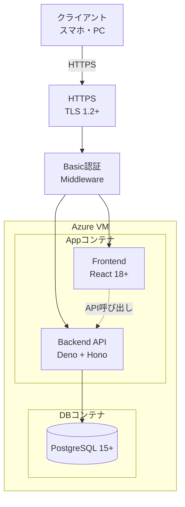
```mermaid
graph TB
    Client[クライアント<br/>スマホ・PC]
    LB[HTTPS<br/>TLS 1.2+]
    Auth[Basic認証<br/>Middleware]

    subgraph "Azure VM"
        subgraph "Appコンテナ"
            Frontend[Frontend<br/>React 18+]
            Backend[Backend API<br/>Deno + Hono]
        end

        subgraph "DBコンテナ"
            DB[(PostgreSQL 15+)]
        end
    end

    Client -->|HTTPS| LB
    LB --> Auth
    Auth --> Frontend
    Auth --> Backend
    Backend --> DB
    Frontend -.API呼び出し.-> Backend
```

**アーキテクチャ統合**:
- **保持されたパターン**: RESTful API、レイヤードアーキテクチャ(Routes → Controllers → Services → Models)
- **新規コンポーネントの根拠**:
  - Basic認証ミドルウェア: セキュアで実装が簡易な認証方式
  - データ分析サービス: 統計計算とグラフ生成の責務を分離
  - CSVインポートサービス: 過去データ移行の特殊要件に対応
- **技術スタック整合性**: Deno 1.40+, Hono 4.0+, React 18+, PostgreSQL 15+を使用し、steering文書で定義された技術選定と完全に整合
- **Steering準拠**: シンプルさ、型安全性、セキュリティ、テスタビリティの原則を遵守

### 技術スタックと設計判断

#### 技術整合性

本システムは、既に確立された技術スタックに基づいて実装します:

**バックエンド**:
- **Runtime**: Deno 1.40+ - TypeScript-native、Secure by default
- **Framework**: Hono 4.0+ - 軽量、高速、TypeScript完全サポート
- **Language**: TypeScript - 型安全性、モダンなECMAScript機能

**フロントエンド**:
- **Library**: React 18+ - コンポーネントベース、豊富なエコシステム
- **Language**: TypeScript - 型安全なコンポーネント開発
- **Styling**: CSS Modules または Tailwind CSS(実装時に決定)

**データベース**:
- **RDBMS**: PostgreSQL 15+ - ACID準拠、JSON対応、豊富なツール

**インフラ**:
- **Containerization**: Docker Compose - 開発・本番環境の一貫性
- **Hosting**: Azure Virtual Machine - コスト効率的、フルコントロール

**新規依存関係**:
- **bcrypt**: パスワードハッシュ化(Deno標準ライブラリまたはnpm経由)
- **Chart.js** または **Recharts**: グラフ描画ライブラリ(Reactコンポーネント)
- **CSV Parser**: CSVインポート処理(Deno標準ライブラリの `encoding/csv` を使用)
- **PDF生成**: PDFKitまたはpuppeteer(実装時に評価)

#### 主要な設計判断

##### 判断1: レイヤードアーキテクチャの採用

**判断**: バックエンドにRoutes → Controllers → Services → Modelsの4層アーキテクチャを採用

**文脈**:
- 要件は7つの機能要件(認証、CRUD、分析、出力、移行等)を含み、明確な責務分離が必要
- チームは小規模(1〜2名)で、過度な複雑さは避けたい
- 将来的な機能拡張とテスタビリティを確保したい

**代替案**:
1. **MVC(Model-View-Controller)**: シンプルだが、ビジネスロジックの配置が曖昧になりがち
2. **Clean Architecture**: 高度な疎結合だが、小規模プロジェクトには過剰
3. **単層アーキテクチャ**: 最もシンプルだが、テストとメンテナンスが困難

**選択したアプローチ**:
- **Routes**: HTTPエンドポイントの定義とリクエストルーティング
- **Controllers**: リクエスト検証、Serviceへの委譲、レスポンス整形
- **Services**: ビジネスロジックの実装(統計計算、データ変換等)
- **Models**: データベースアクセスとORMマッピング

**根拠**:
- 責務が明確で理解しやすく、新規開発者のオンボーディングが容易
- 各層が独立してテスト可能(ユニットテスト、統合テスト)
- シンプルさとメンテナンス性のバランスが取れている

**トレードオフ**:
- **得られるもの**: 明確な責務分離、テスタビリティ、将来の拡張性
- **犠牲にするもの**: Clean Architectureほどの疎結合性、若干のボイラープレートコード

##### 判断2: Basic認証の採用

**判断**: 認証方式としてHTTP Basic Authenticationを採用(HTTPS必須)

**文脈**:
- 個人の健康情報という機密性の高いデータを保護する必要がある
- システム利用者は少数(初期100ユーザー、3年後1,000ユーザー)
- 低コスト運用を実現したい(OAuth等の外部認証サービスは避けたい)

**代替案**:
1. **JWT(JSON Web Token)**: ステートレスで拡張性が高いが、実装が複雑
2. **OAuth 2.0**: 外部IDプロバイダー連携が可能だが、外部依存とコスト増加
3. **セッションベース認証**: シンプルだが、水平スケーリングが困難

**選択したアプローチ**:
- HTTPS上でBasic認証ヘッダー(Base64エンコードされたユーザー名:パスワード)を送信
- パスワードはbcryptでソルト付きハッシュ化してデータベースに保存
- セッション管理はHTTP-onlyセキュアクッキーで実現

**根拠**:
- ブラウザネイティブサポートで実装が簡易
- HTTPS使用により平文送信のリスクを排除
- 小規模ユーザーベースには十分なセキュリティレベル

**トレードオフ**:
- **得られるもの**: 実装の簡易性、低コスト、ブラウザ標準対応
- **犠牲にするもの**: MFA(多要素認証)の実装難易度、OAuth等の高度な認証機能

##### 判断3: データ分析の同期処理

**判断**: データ分析(統計計算、グラフ生成)を同期的なHTTPリクエスト内で処理

**文脈**:
- 統計計算(最大・最小・平均)とグラフデータ生成は、レスポンス時間3秒以内の要件がある
- データ量は初年度20万件/年、3年後200万件/年で、1ユーザーあたりのデータ量は限定的
- システムリソース(vCPU 2〜4コア)でリアルタイム処理が可能

**代替案**:
1. **非同期バッチ処理**: 定期的に事前計算し、結果をキャッシュ。高速だが、リアルタイム性が低い
2. **イベント駆動アーキテクチャ**: 分析処理をキューで非同期実行。複雑性が増加
3. **マテリアライズドビュー**: PostgreSQLの機能で事前集計。更新タイミングの制御が必要

**選択したアプローチ**:
- ユーザーがデータ分析画面を開いた時点で、指定期間のデータをクエリ
- PostgreSQLのウィンドウ関数(`AVG()`, `MAX()`, `MIN()`)で統計値を計算
- 30日移動平均もSQLで計算(`AVG() OVER (ORDER BY measurement_date ROWS BETWEEN 29 PRECEDING AND CURRENT ROW)`)
- 計算結果をJSONでフロントエンドに返却し、Chart.jsでグラフ描画

**根拠**:
- 1ユーザーあたりのデータ量は限定的(年間約1,825件 = 5件/日 × 365日)で、SQL最適化により3秒以内のレスポンスを達成可能
- リアルタイム性を確保し、最新データを常に反映
- アーキテクチャがシンプルで、運用コストが低い

**トレードオフ**:
- **得られるもの**: リアルタイムデータ分析、シンプルなアーキテクチャ、低い運用コスト
- **犠牲にするもの**: 大規模データでのスケーラビリティ(将来的にキャッシュやバッチ処理への移行が必要になる可能性)

---

## システムフロー

### ユーザー認証フロー

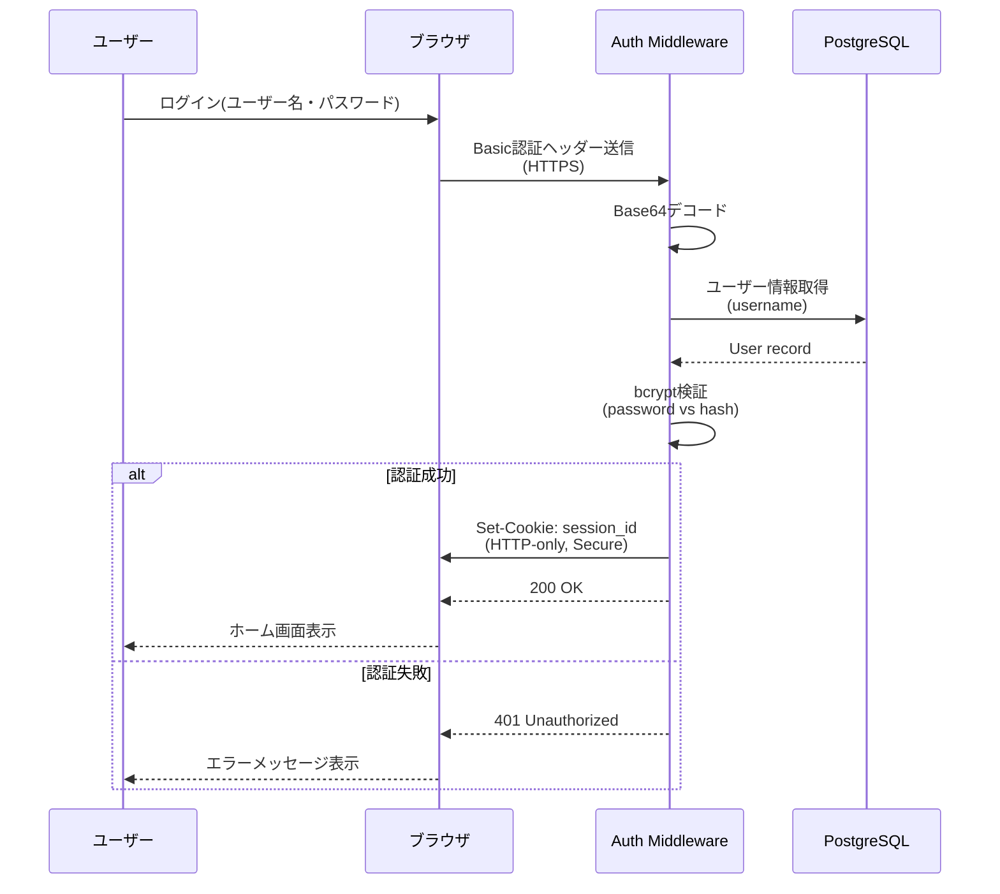
```mermaid
sequenceDiagram
    participant User as ユーザー
    participant Browser as ブラウザ
    participant Auth as Auth Middleware
    participant DB as PostgreSQL

    User->>Browser: ログイン(ユーザー名・パスワード)
    Browser->>Auth: Basic認証ヘッダー送信<br/>(HTTPS)
    Auth->>Auth: Base64デコード
    Auth->>DB: ユーザー情報取得<br/>(username)
    DB-->>Auth: User record
    Auth->>Auth: bcrypt検証<br/>(password vs hash)

    alt 認証成功
        Auth->>Browser: Set-Cookie: session_id<br/>(HTTP-only, Secure)
        Auth-->>Browser: 200 OK
        Browser-->>User: ホーム画面表示
    else 認証失敗
        Auth-->>Browser: 401 Unauthorized
        Browser-->>User: エラーメッセージ表示
    end
```

### データ登録フロー

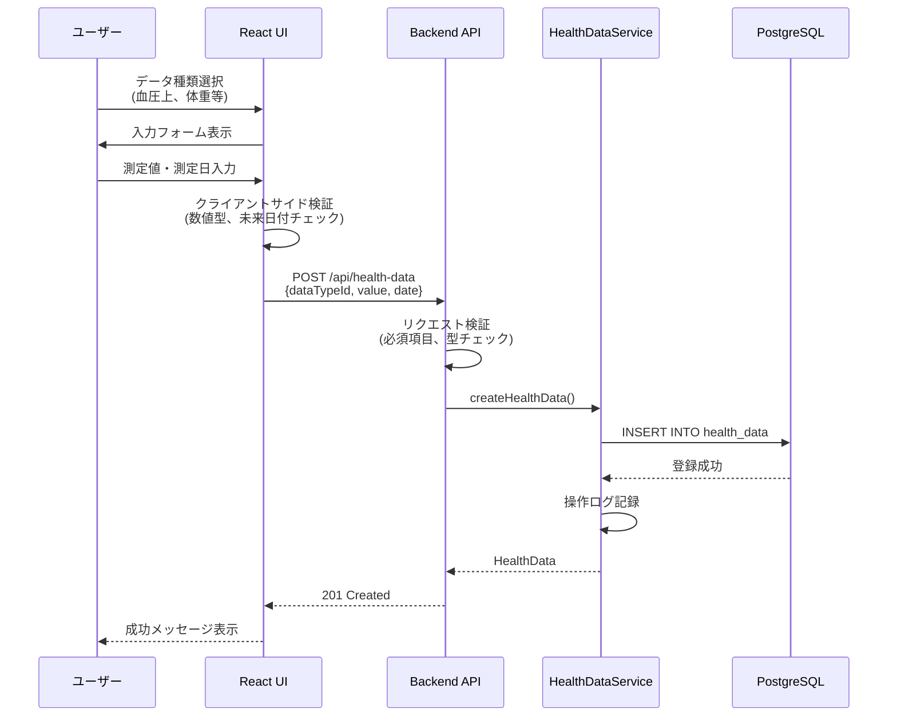
```mermaid
sequenceDiagram
    participant User as ユーザー
    participant UI as React UI
    participant API as Backend API
    participant Service as HealthDataService
    participant DB as PostgreSQL

    User->>UI: データ種類選択<br/>(血圧上、体重等)
    UI->>User: 入力フォーム表示
    User->>UI: 測定値・測定日入力
    UI->>UI: クライアントサイド検証<br/>(数値型、未来日付チェック)
    UI->>API: POST /api/health-data<br/>{dataTypeId, value, date}
    API->>API: リクエスト検証<br/>(必須項目、型チェック)
    API->>Service: createHealthData()
    Service->>DB: INSERT INTO health_data
    DB-->>Service: 登録成功
    Service->>Service: 操作ログ記録
    Service-->>API: HealthData
    API-->>UI: 201 Created
    UI-->>User: 成功メッセージ表示
```

### データ分析フロー

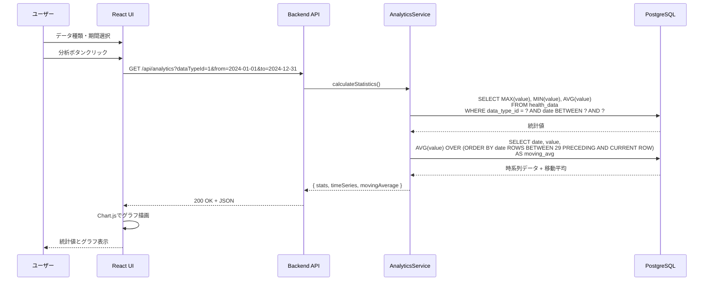
```mermaid
sequenceDiagram
    participant User as ユーザー
    participant UI as React UI
    participant API as Backend API
    participant Service as AnalyticsService
    participant DB as PostgreSQL

    User->>UI: データ種類・期間選択
    User->>UI: 分析ボタンクリック
    UI->>API: GET /api/analytics?dataTypeId=1&from=2024-01-01&to=2024-12-31
    API->>Service: calculateStatistics()
    Service->>DB: SELECT MAX(value), MIN(value), AVG(value)<br/>FROM health_data<br/>WHERE data_type_id = ? AND date BETWEEN ? AND ?
    DB-->>Service: 統計値
    Service->>DB: SELECT date, value,<br/>AVG(value) OVER (ORDER BY date ROWS BETWEEN 29 PRECEDING AND CURRENT ROW)<br/>AS moving_avg
    DB-->>Service: 時系列データ + 移動平均
    Service-->>API: { stats, timeSeries, movingAverage }
    API-->>UI: 200 OK + JSON
    UI->>UI: Chart.jsでグラフ描画
    UI-->>User: 統計値とグラフ表示
```

### グラフ印刷フロー

本システムでは、2つの印刷方法を提供します。

#### 印刷方法1: PDF出力による印刷 (推奨)

**用途**: 医療機関への提出、長期保存用の正式な印刷物

**特徴**:
- 高品質で一貫性のある印刷出力
- グラフ、統計値、データ一覧を含む包括的なレポート
- ブラウザ・OS・プリンタに依存しない出力品質
- 医療機関が要求するフォーマットに対応

**技術実装**:
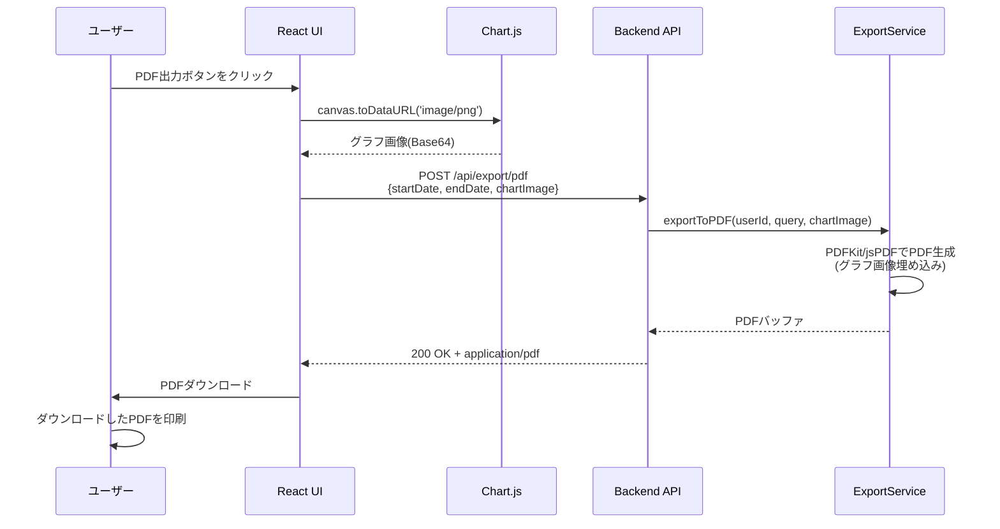
```mermaid
sequenceDiagram
    participant User as ユーザー
    participant UI as React UI
    participant ChartJS as Chart.js
    participant API as Backend API
    participant ExportService as ExportService

    User->>UI: PDF出力ボタンをクリック
    UI->>ChartJS: canvas.toDataURL('image/png')
    ChartJS-->>UI: グラフ画像(Base64)
    UI->>API: POST /api/export/pdf<br/>{startDate, endDate, chartImage}
    API->>ExportService: exportToPDF(userId, query, chartImage)
    ExportService->>ExportService: PDFKit/jsPDFでPDF生成<br/>(グラフ画像埋め込み)
    ExportService-->>API: PDFバッファ
    API-->>UI: 200 OK + application/pdf
    UI->>User: PDFダウンロード
    User->>User: ダウンロードしたPDFを印刷
```

**実装詳細**:
- Chart.jsのcanvas要素を`canvas.toDataURL('image/png')`で画像化
- バックエンドでPDFライブラリ(PDFKit for Deno または jsPDF)を使用
- PDF内容: ヘッダー、統計サマリー、グラフ画像、データ表、フッター(日付、ページ番号)

---

#### 印刷方法2: ブラウザ直接印刷

**用途**: 個人用の簡易記録、即時印刷

**特徴**:
- PDF生成より高速(サーバー通信不要)
- 現在表示中の画面をそのまま印刷
- ブラウザの印刷機能(Ctrl+P / Cmd+P)を使用

**技術実装**:
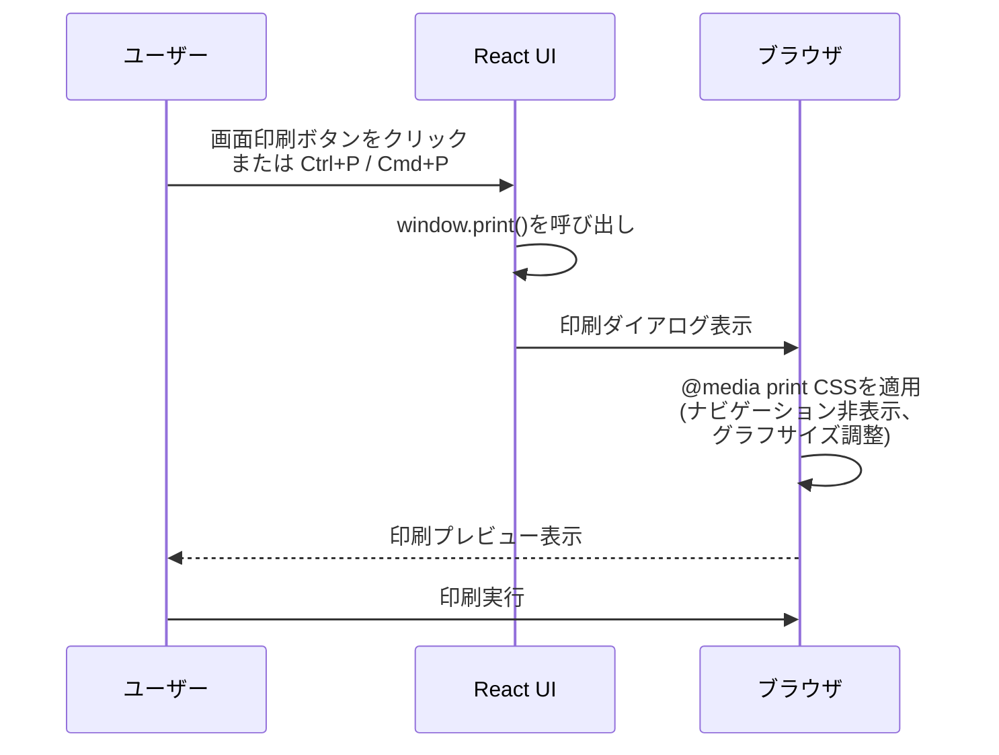
```mermaid
sequenceDiagram
    participant User as ユーザー
    participant UI as React UI
    participant Browser as ブラウザ

    User->>UI: 画面印刷ボタンをクリック<br/>または Ctrl+P / Cmd+P
    UI->>UI: window.print()を呼び出し
    UI->>Browser: 印刷ダイアログ表示
    Browser->>Browser: @media print CSSを適用<br/>(ナビゲーション非表示、<br/>グラフサイズ調整)
    Browser-->>User: 印刷プレビュー表示
    User->>Browser: 印刷実行
```

**実装詳細**:

1. **印刷用CSS** (`@media print`):
```css
@media print {
  /* ナビゲーション・ボタンを非表示 */
  nav, .no-print, button {
    display: none !important;
  }

  /* グラフコンテナのサイズ調整 */
  .chart-container {
    width: 100%;
    max-width: 800px;
    page-break-inside: avoid;
  }

  /* 統計カードの改ページ制御 */
  .stats-card {
    page-break-inside: avoid;
  }

  /* 背景色を削除(インク節約) */
  * {
    background: white !important;
    color: black !important;
  }
}
```

2. **Chart.js設定**:
```typescript
const chartOptions = {
  responsive: true,
  maintainAspectRatio: true,
  aspectRatio: 2, // 印刷時の縦横比
  // 印刷時にcanvasが正しくレンダリングされるように
  animation: {
    onComplete: function() {
      // 印刷時にアニメーションを無効化
    }
  }
};
```

3. **印刷ボタン実装**:
```typescript
const handlePrint = () => {
  window.print();
};

// UIコンポーネント
<button onClick={handlePrint} className="no-print">
  画面を印刷
</button>
```

**制限事項**:
- ブラウザ・プリンタによって出力品質が異なる場合がある
- ページ分割が自動で行われるため、レイアウト崩れの可能性
- カラー印刷の場合、背景色が印刷されない場合がある

---

#### 印刷機能の選択基準

| 項目 | PDF出力 | ブラウザ印刷 |
|------|---------|-------------|
| **用途** | 医療機関提出、公式記録 | 個人メモ、即時確認 |
| **品質** | 高品質・一貫性あり | ブラウザ依存 |
| **速度** | やや遅い(サーバー処理) | 高速 |
| **実装優先度** | Phase 1 (必須) | Phase 1 (推奨) |
| **対応要件** | 要件6(データ出力) | 要件6(補助機能) |

**Phase 1実装方針**:
- PDF出力機能: 必須実装(RDDD0103 G-04達成に必須)
- ブラウザ印刷機能: 推奨実装(ユーザビリティ向上、実装コスト低)

---

### データ更新フロー

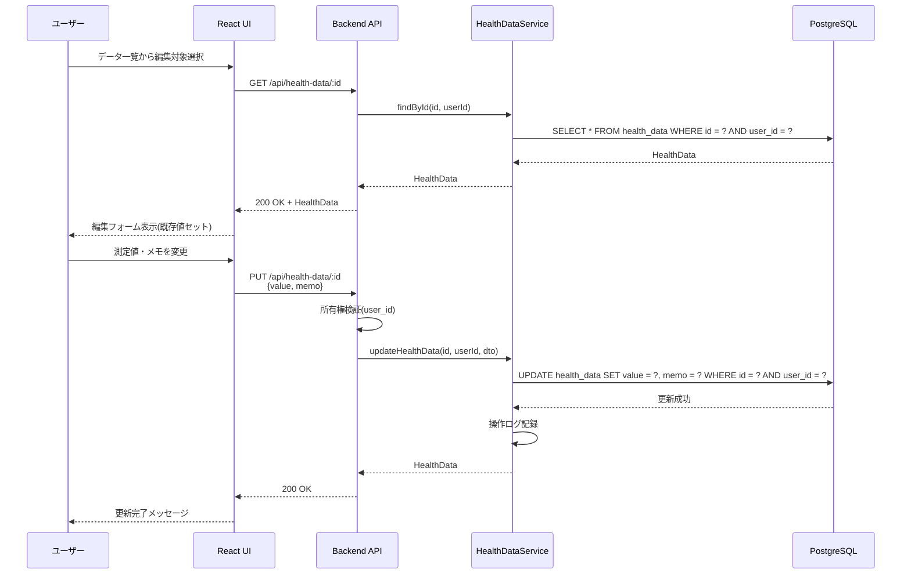
```mermaid
sequenceDiagram
    participant User as ユーザー
    participant UI as React UI
    participant API as Backend API
    participant Service as HealthDataService
    participant DB as PostgreSQL

    User->>UI: データ一覧から編集対象選択
    UI->>API: GET /api/health-data/:id
    API->>Service: findById(id, userId)
    Service->>DB: SELECT * FROM health_data WHERE id = ? AND user_id = ?
    DB-->>Service: HealthData
    Service-->>API: HealthData
    API-->>UI: 200 OK + HealthData
    UI-->>User: 編集フォーム表示(既存値セット)
    User->>UI: 測定値・メモを変更
    UI->>API: PUT /api/health-data/:id<br/>{value, memo}
    API->>API: 所有権検証(user_id)
    API->>Service: updateHealthData(id, userId, dto)
    Service->>DB: UPDATE health_data SET value = ?, memo = ? WHERE id = ? AND user_id = ?
    DB-->>Service: 更新成功
    Service->>Service: 操作ログ記録
    Service-->>API: HealthData
    API-->>UI: 200 OK
    UI-->>User: 更新完了メッセージ
```

### データ削除フロー

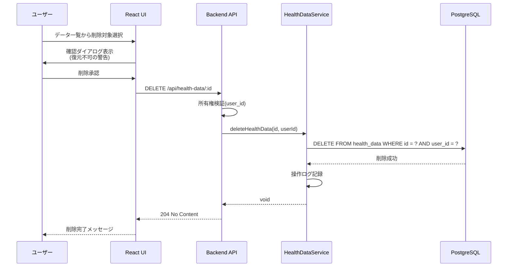
```mermaid
sequenceDiagram
    participant User as ユーザー
    participant UI as React UI
    participant API as Backend API
    participant Service as HealthDataService
    participant DB as PostgreSQL

    User->>UI: データ一覧から削除対象選択
    UI->>User: 確認ダイアログ表示<br/>(復元不可の警告)
    User->>UI: 削除承認
    UI->>API: DELETE /api/health-data/:id
    API->>API: 所有権検証(user_id)
    API->>Service: deleteHealthData(id, userId)
    Service->>DB: DELETE FROM health_data WHERE id = ? AND user_id = ?
    DB-->>Service: 削除成功
    Service->>Service: 操作ログ記録
    Service-->>API: void
    API-->>UI: 204 No Content
    UI-->>User: 削除完了メッセージ
```

### データ参照フロー

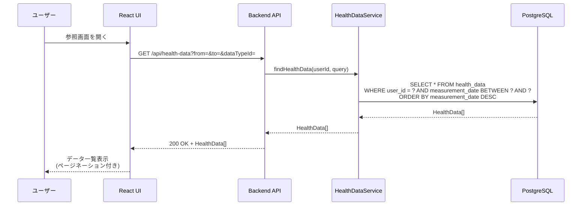
```mermaid
sequenceDiagram
    participant User as ユーザー
    participant UI as React UI
    participant API as Backend API
    participant Service as HealthDataService
    participant DB as PostgreSQL

    User->>UI: 参照画面を開く
    UI->>API: GET /api/health-data?from=&to=&dataTypeId=
    API->>Service: findHealthData(userId, query)
    Service->>DB: SELECT * FROM health_data<br/>WHERE user_id = ? AND measurement_date BETWEEN ? AND ?<br/>ORDER BY measurement_date DESC
    DB-->>Service: HealthData[]
    Service-->>API: HealthData[]
    API-->>UI: 200 OK + HealthData[]
    UI-->>User: データ一覧表示<br/>(ページネーション付き)
```

### PDF出力フロー

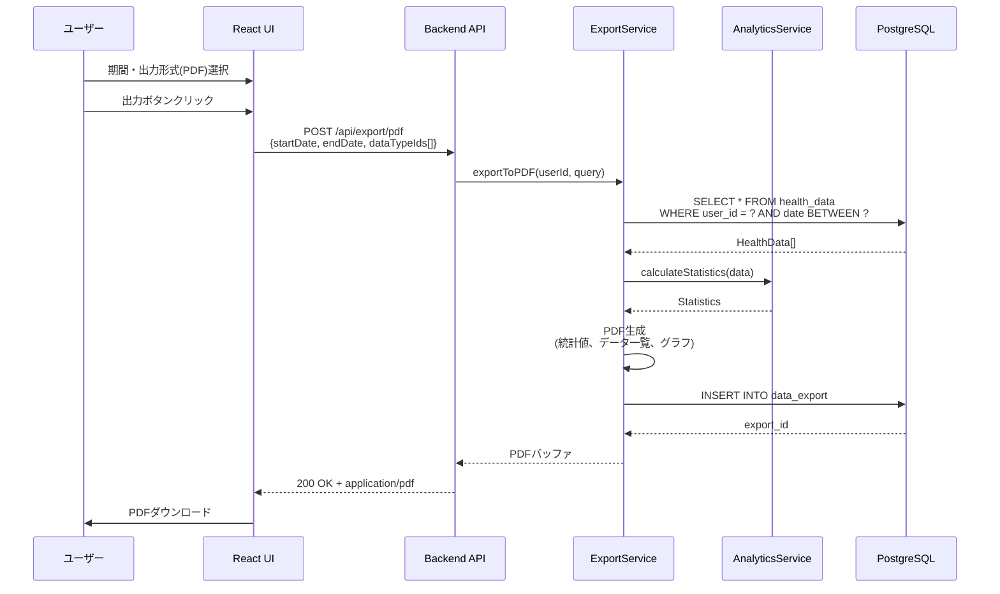
```mermaid
sequenceDiagram
    participant User as ユーザー
    participant UI as React UI
    participant API as Backend API
    participant ExportService as ExportService
    participant AnalyticsService as AnalyticsService
    participant DB as PostgreSQL

    User->>UI: 期間・出力形式(PDF)選択
    User->>UI: 出力ボタンクリック
    UI->>API: POST /api/export/pdf<br/>{startDate, endDate, dataTypeIds[]}
    API->>ExportService: exportToPDF(userId, query)
    ExportService->>DB: SELECT * FROM health_data<br/>WHERE user_id = ? AND date BETWEEN ?
    DB-->>ExportService: HealthData[]
    ExportService->>AnalyticsService: calculateStatistics(data)
    AnalyticsService-->>ExportService: Statistics
    ExportService->>ExportService: PDF生成<br/>(統計値、データ一覧、グラフ)
    ExportService->>DB: INSERT INTO data_export
    DB-->>ExportService: export_id
    ExportService-->>API: PDFバッファ
    API-->>UI: 200 OK + application/pdf
    UI->>User: PDFダウンロード
```

### CSV出力フロー

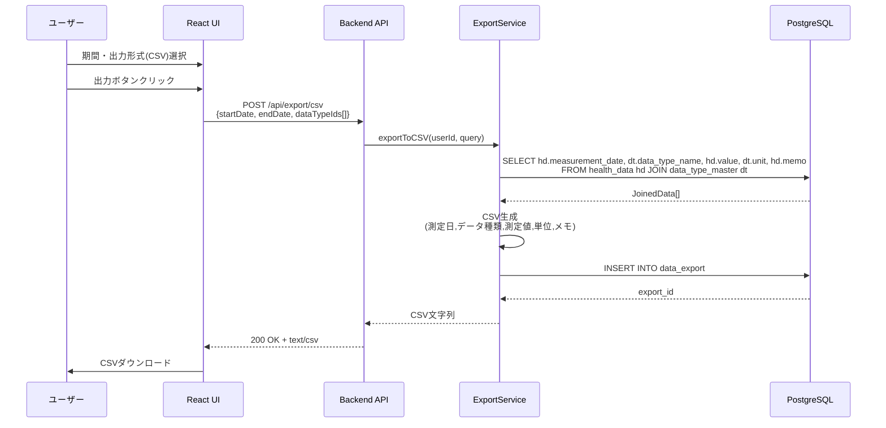
```mermaid
sequenceDiagram
    participant User as ユーザー
    participant UI as React UI
    participant API as Backend API
    participant ExportService as ExportService
    participant DB as PostgreSQL

    User->>UI: 期間・出力形式(CSV)選択
    User->>UI: 出力ボタンクリック
    UI->>API: POST /api/export/csv<br/>{startDate, endDate, dataTypeIds[]}
    API->>ExportService: exportToCSV(userId, query)
    ExportService->>DB: SELECT hd.measurement_date, dt.data_type_name, hd.value, dt.unit, hd.memo<br/>FROM health_data hd JOIN data_type_master dt
    DB-->>ExportService: JoinedData[]
    ExportService->>ExportService: CSV生成<br/>(測定日,データ種類,測定値,単位,メモ)
    ExportService->>DB: INSERT INTO data_export
    DB-->>ExportService: export_id
    ExportService-->>API: CSV文字列
    API-->>UI: 200 OK + text/csv
    UI->>User: CSVダウンロード
```

### CSVインポートフロー

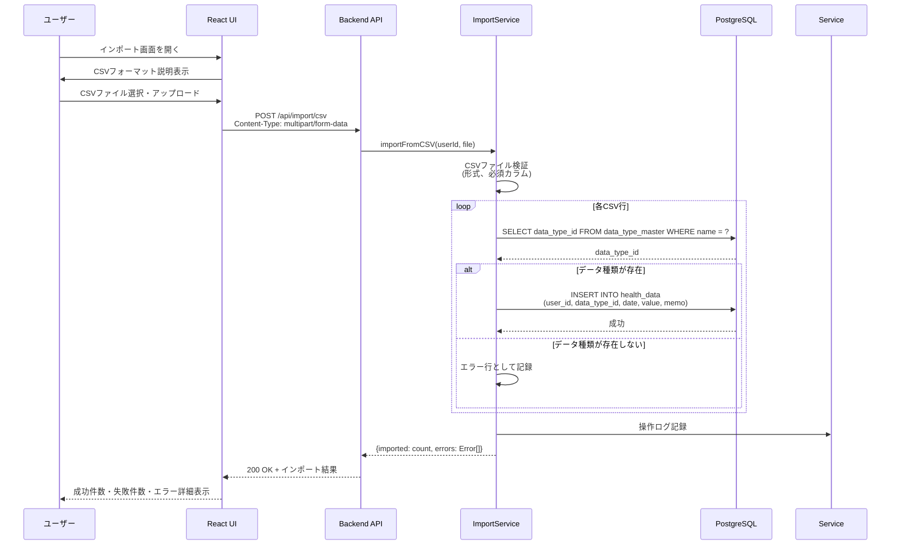
```mermaid
sequenceDiagram
    participant User as ユーザー
    participant UI as React UI
    participant API as Backend API
    participant ImportService as ImportService
    participant DB as PostgreSQL

    User->>UI: インポート画面を開く
    UI->>User: CSVフォーマット説明表示
    User->>UI: CSVファイル選択・アップロード
    UI->>API: POST /api/import/csv<br/>Content-Type: multipart/form-data
    API->>ImportService: importFromCSV(userId, file)
    ImportService->>ImportService: CSVファイル検証<br/>(形式、必須カラム)

    loop 各CSV行
        ImportService->>DB: SELECT data_type_id FROM data_type_master WHERE name = ?
        DB-->>ImportService: data_type_id
        alt データ種類が存在
            ImportService->>DB: INSERT INTO health_data<br/>(user_id, data_type_id, date, value, memo)
            DB-->>ImportService: 成功
        else データ種類が存在しない
            ImportService->>ImportService: エラー行として記録
        end
    end

    ImportService->>Service: 操作ログ記録
    ImportService-->>API: {imported: count, errors: Error[]}
    API-->>UI: 200 OK + インポート結果
    UI-->>User: 成功件数・失敗件数・エラー詳細表示
```

### データ種類登録フロー

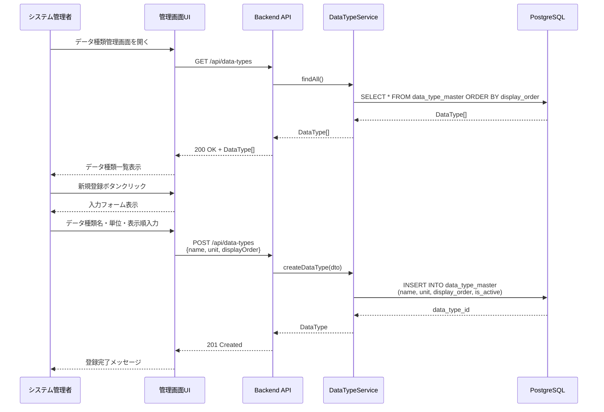
```mermaid
sequenceDiagram
    participant Admin as システム管理者
    participant UI as 管理画面UI
    participant API as Backend API
    participant Service as DataTypeService
    participant DB as PostgreSQL

    Admin->>UI: データ種類管理画面を開く
    UI->>API: GET /api/data-types
    API->>Service: findAll()
    Service->>DB: SELECT * FROM data_type_master ORDER BY display_order
    DB-->>Service: DataType[]
    Service-->>API: DataType[]
    API-->>UI: 200 OK + DataType[]
    UI-->>Admin: データ種類一覧表示
    Admin->>UI: 新規登録ボタンクリック
    UI-->>Admin: 入力フォーム表示
    Admin->>UI: データ種類名・単位・表示順入力
    UI->>API: POST /api/data-types<br/>{name, unit, displayOrder}
    API->>Service: createDataType(dto)
    Service->>DB: INSERT INTO data_type_master<br/>(name, unit, display_order, is_active)
    DB-->>Service: data_type_id
    Service-->>API: DataType
    API-->>UI: 201 Created
    UI-->>Admin: 登録完了メッセージ
```

### データ種類更新フロー

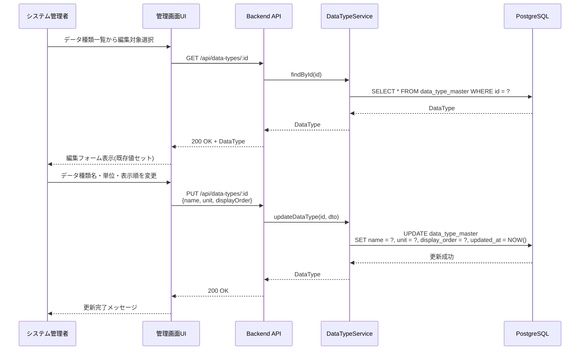
```mermaid
sequenceDiagram
    participant Admin as システム管理者
    participant UI as 管理画面UI
    participant API as Backend API
    participant Service as DataTypeService
    participant DB as PostgreSQL

    Admin->>UI: データ種類一覧から編集対象選択
    UI->>API: GET /api/data-types/:id
    API->>Service: findById(id)
    Service->>DB: SELECT * FROM data_type_master WHERE id = ?
    DB-->>Service: DataType
    Service-->>API: DataType
    API-->>UI: 200 OK + DataType
    UI-->>Admin: 編集フォーム表示(既存値セット)
    Admin->>UI: データ種類名・単位・表示順を変更
    UI->>API: PUT /api/data-types/:id<br/>{name, unit, displayOrder}
    API->>Service: updateDataType(id, dto)
    Service->>DB: UPDATE data_type_master<br/>SET name = ?, unit = ?, display_order = ?, updated_at = NOW()
    DB-->>Service: 更新成功
    Service-->>API: DataType
    API-->>UI: 200 OK
    UI-->>Admin: 更新完了メッセージ
```

### データ種類無効化フロー

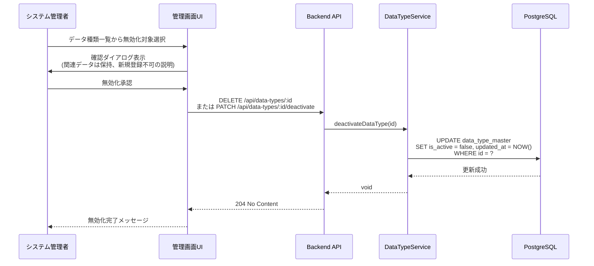
```mermaid
sequenceDiagram
    participant Admin as システム管理者
    participant UI as 管理画面UI
    participant API as Backend API
    participant Service as DataTypeService
    participant DB as PostgreSQL

    Admin->>UI: データ種類一覧から無効化対象選択
    UI->>Admin: 確認ダイアログ表示<br/>(関連データは保持、新規登録不可の説明)
    Admin->>UI: 無効化承認
    UI->>API: DELETE /api/data-types/:id<br/>または PATCH /api/data-types/:id/deactivate
    API->>Service: deactivateDataType(id)
    Service->>DB: UPDATE data_type_master<br/>SET is_active = false, updated_at = NOW()<br/>WHERE id = ?
    DB-->>Service: 更新成功
    Service-->>API: void
    API-->>UI: 204 No Content
    UI-->>Admin: 無効化完了メッセージ
```

### ユーザー登録フロー

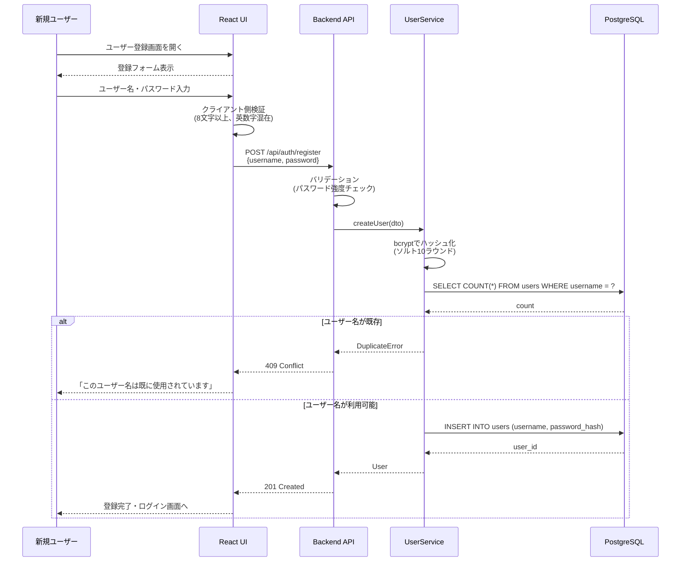
```mermaid
sequenceDiagram
    participant User as 新規ユーザー
    participant UI as React UI
    participant API as Backend API
    participant Service as UserService
    participant DB as PostgreSQL

    User->>UI: ユーザー登録画面を開く
    UI-->>User: 登録フォーム表示
    User->>UI: ユーザー名・パスワード入力
    UI->>UI: クライアント側検証<br/>(8文字以上、英数字混在)
    UI->>API: POST /api/auth/register<br/>{username, password}
    API->>API: バリデーション<br/>(パスワード強度チェック)
    API->>Service: createUser(dto)
    Service->>Service: bcryptでハッシュ化<br/>(ソルト10ラウンド)
    Service->>DB: SELECT COUNT(*) FROM users WHERE username = ?
    DB-->>Service: count

    alt ユーザー名が既存
        Service-->>API: DuplicateError
        API-->>UI: 409 Conflict
        UI-->>User: 「このユーザー名は既に使用されています」
    else ユーザー名が利用可能
        Service->>DB: INSERT INTO users (username, password_hash)
        DB-->>Service: user_id
        Service-->>API: User
        API-->>UI: 201 Created
        UI-->>User: 登録完了・ログイン画面へ
    end
```

### パスワード変更フロー

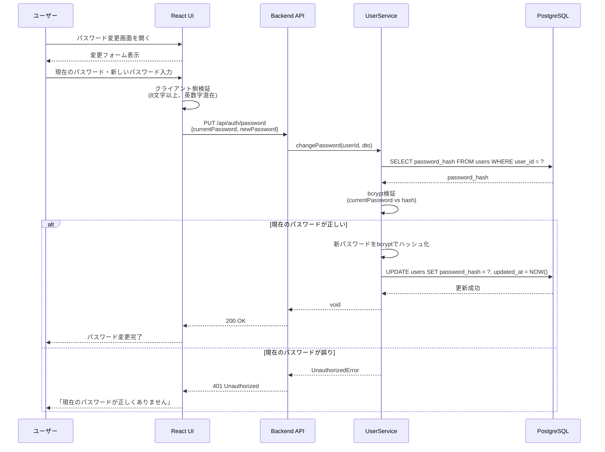
```mermaid
sequenceDiagram
    participant User as ユーザー
    participant UI as React UI
    participant API as Backend API
    participant Service as UserService
    participant DB as PostgreSQL

    User->>UI: パスワード変更画面を開く
    UI-->>User: 変更フォーム表示
    User->>UI: 現在のパスワード・新しいパスワード入力
    UI->>UI: クライアント側検証<br/>(8文字以上、英数字混在)
    UI->>API: PUT /api/auth/password<br/>{currentPassword, newPassword}
    API->>Service: changePassword(userId, dto)
    Service->>DB: SELECT password_hash FROM users WHERE user_id = ?
    DB-->>Service: password_hash
    Service->>Service: bcrypt検証<br/>(currentPassword vs hash)

    alt 現在のパスワードが正しい
        Service->>Service: 新パスワードをbcryptでハッシュ化
        Service->>DB: UPDATE users SET password_hash = ?, updated_at = NOW()
        DB-->>Service: 更新成功
        Service-->>API: void
        API-->>UI: 200 OK
        UI-->>User: パスワード変更完了
    else 現在のパスワードが誤り
        Service-->>API: UnauthorizedError
        API-->>UI: 401 Unauthorized
        UI-->>User: 「現在のパスワードが正しくありません」
    end
```

### ユーザー削除フロー

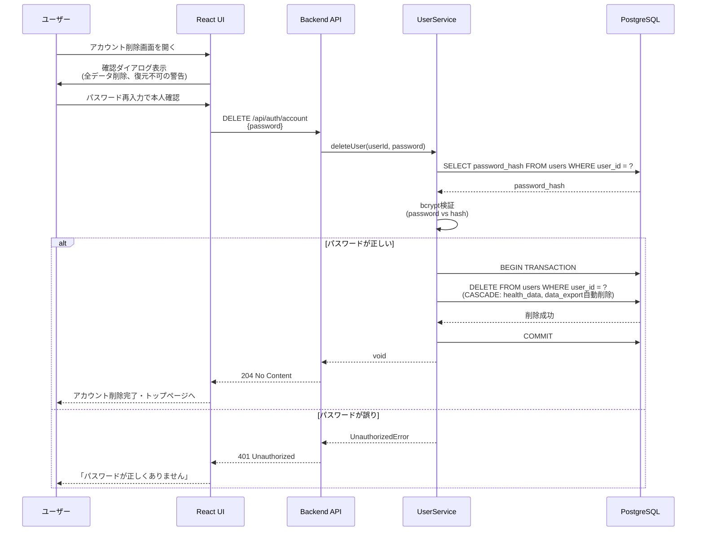
```mermaid
sequenceDiagram
    participant User as ユーザー
    participant UI as React UI
    participant API as Backend API
    participant Service as UserService
    participant DB as PostgreSQL

    User->>UI: アカウント削除画面を開く
    UI->>User: 確認ダイアログ表示<br/>(全データ削除、復元不可の警告)
    User->>UI: パスワード再入力で本人確認
    UI->>API: DELETE /api/auth/account<br/>{password}
    API->>Service: deleteUser(userId, password)
    Service->>DB: SELECT password_hash FROM users WHERE user_id = ?
    DB-->>Service: password_hash
    Service->>Service: bcrypt検証<br/>(password vs hash)

    alt パスワードが正しい
        Service->>DB: BEGIN TRANSACTION
        Service->>DB: DELETE FROM users WHERE user_id = ?<br/>(CASCADE: health_data, data_export自動削除)
        DB-->>Service: 削除成功
        Service->>DB: COMMIT
        Service-->>API: void
        API-->>UI: 204 No Content
        UI-->>User: アカウント削除完了・トップページへ
    else パスワードが誤り
        Service-->>API: UnauthorizedError
        API-->>UI: 401 Unauthorized
        UI-->>User: 「パスワードが正しくありません」
    end
```

---

## 要件トレーサビリティ

### 機能要件とアクティビティのマッピング

| アクティビティID | アクティビティ名 | 要件ID | コンポーネント | インターフェース | フロー |
|-----------------|----------------|--------|----------------|------------------|--------|
| CBP-01-01-01 | 健康情報登録依頼 | 要件2 | HealthDataService, HealthDataModel | POST /api/health-data | データ登録フロー |
| CBP-01-02-01 | 健康情報変更依頼 | 要件2 | HealthDataService, HealthDataModel | PUT /api/health-data/:id | データ更新フロー |
| CBP-01-03-01 | 健康情報削除依頼 | 要件2 | HealthDataService, HealthDataModel | DELETE /api/health-data/:id | データ削除フロー |
| CBP-01-04-01 | 健康情報検索 | 要件3 | HealthDataService, HealthDataModel | GET /api/health-data?from&to&dataTypeId | データ参照フロー |
| CBP-02-01-01 | 統計値計算依頼 | 要件5 | AnalyticsService, HealthDataModel | GET /api/analytics/stats?dataTypeId&from&to | データ分析フロー |
| CBP-02-02-01 | グラフ描画依頼 | 要件5 | AnalyticsService, HealthDataModel | GET /api/analytics/chart?dataTypeId&from&to | データ分析フロー |
| CBP-02-03-01 | 移動平均計算依頼 | 要件5 | AnalyticsService, HealthDataModel | GET /api/analytics/chart?dataTypeId&from&to | データ分析フロー |
| CBP-03-01-01 | データ出力依頼 | 要件6 | ExportService, HealthDataModel, DataExportModel | POST /api/export/pdf, POST /api/export/csv | PDF出力フロー, CSV出力フロー |
| CBP-03-02-01 | 出力データ準備 | 要件6 | ExportService | (フロントエンド処理) | - |
| CBP-03-02-02 | データ提供 | 要件6 | - | (システム外処理) | - |
| CBP-03-02-03 | データ確認・保管 | 要件6 | - | (医療機関側処理) | - |
| CBP-04-01-01 | データ種類登録依頼 | 要件4 | DataTypeService, DataTypeModel | POST /api/data-types | データ種類登録フロー |
| CBP-04-02-01 | データ種類更新依頼 | 要件4 | DataTypeService, DataTypeModel | PUT /api/data-types/:id | データ種類更新フロー |
| CBP-04-03-01 | データ種類無効化依頼 | 要件4 | DataTypeService, DataTypeModel | PATCH /api/data-types/:id/deactivate | データ種類無効化フロー |
| CBP-05-01-01 | ユーザー登録依頼 | 要件1 | UserService, UserModel | POST /api/auth/register | ユーザー登録フロー |
| CBP-05-02-01 | パスワード変更依頼 | 要件1 | UserService, UserModel | PUT /api/auth/password | パスワード変更フロー |
| CBP-05-03-01 | ユーザー削除依頼 | 要件1 | UserService, UserModel | DELETE /api/auth/account | ユーザー削除フロー |
| CBP-06-01-01 | CSVファイルアップロード | 要件7 | ImportService | POST /api/import/csv (multipart/form-data) | CSVインポートフロー |
| CBP-06-01-02 | CSVデータ検証 | 要件7 | ImportService | (内部処理) | CSVインポートフロー |
| CBP-06-01-03 | データ一括登録 | 要件7 | ImportService, HealthDataModel | (内部処理: バルクINSERT) | CSVインポートフロー |
| - | 認証処理 | 要件1 | AuthMiddleware, UserService | POST /api/auth/login | ユーザー認証フロー |
| - | アクセス制御 | 要件1 | AuthMiddleware | (全APIエンドポイント) | 全フロー |

### 非機能要件のマッピング

| 非機能要件ID | 要件概要 | コンポーネント | 実装方法 | フロー |
|-------------|----------|----------------|----------|--------|
| NFR-1 | 性能 | 全コンポーネント | データベースインデックス(user_id, measurement_date, data_type_id)、SQLクエリ最適化 | 全フロー |
| NFR-2 | セキュリティ | AuthMiddleware, すべてのController | Basic認証、TLS 1.2+、bcryptハッシュ化、プリペアドステートメント、CSRF対策 | ユーザー認証フロー、全フロー |
| NFR-3 | 可用性 | Infrastructure | Docker Compose、日次バックアップ、稼働監視、RTO 4時間、RPO 24時間 | バックアップフロー |
| NFR-4 | 拡張性 | 全コンポーネント | 垂直スケーリング対応(2-4 vCPU)、レイヤードアーキテクチャ | - |
| NFR-5 | 保守性 | 全コンポーネント | TypeScript型安全性、レイヤードアーキテクチャ、操作ログ記録 | 全フロー |
| NFR-6 | ユーザビリティ | React UI | レスポンシブデザイン、エラーメッセージの明確化、操作フィードバック | 全フロー |

---

## コンポーネントとインターフェース

### バックエンド - レイヤードアーキテクチャ

#### Routes層

**責務**: HTTPエンドポイントの定義、リクエストのルーティング

**主要ルート**:
- `/api/auth/*` - 認証関連
- `/api/health-data/*` - 健康データCRUD
- `/api/data-types/*` - データ種類マスタ管理
- `/api/analytics/*` - データ分析・統計
- `/api/export/*` - PDF/CSV出力
- `/api/import/*` - CSVインポート

#### Controllers層

**責務**: リクエスト検証、Serviceへの委譲、レスポンス整形、HTTPステータスコード決定

**主要コントローラー**:
- `AuthController`: ログイン、ログアウト
- `HealthDataController`: 健康データのCRUD操作
- `DataTypeController`: データ種類マスタのCRUD
- `AnalyticsController`: 統計計算、グラフデータ生成
- `ExportController`: PDF/CSV出力
- `ImportController`: CSVインポート

#### Services層

**責務**: ビジネスロジック実装、トランザクション管理、ドメインルール適用

**主要サービス**:
- `UserService`: ユーザー管理、パスワード検証
- `HealthDataService`: 健康データのビジネスロジック
- `DataTypeService`: データ種類マスタの管理、**状態遷移管理**
- `AnalyticsService`: 統計計算(最大・最小・平均)、30日移動平均計算
- `ExportService`: PDF/CSV生成
- `ImportService`: CSVパース、データ検証、一括登録

##### DataTypeServiceの状態遷移管理

`DataTypeService`は、DATA_TYPE_MASTERエンティティの状態遷移(有効⇄無効)を管理します。

**状態定義**:
- **有効状態 (is_active = true)**: ユーザーが健康情報登録時にデータ種類として選択可能
- **無効状態 (is_active = false)**: 新規登録時の選択肢に表示されないが、既存データは保持

**状態遷移メソッド**:

```typescript
interface DataTypeService {
  /**
   * データ種類を新規登録する(初期状態: 有効)
   */
  createDataType(dto: CreateDataTypeDto): Promise<DataType>;

  /**
   * データ種類の属性を更新する(状態は変更しない)
   */
  updateDataType(id: number, dto: UpdateDataTypeDto): Promise<DataType>;

  /**
   * データ種類を無効化する(論理削除)
   * @precondition データ種類が有効状態であること
   * @postcondition is_active = false に設定される
   * @invariant 関連するHEALTH_DATAレコードは削除されない
   */
  deactivateDataType(id: number): Promise<void>;

  /**
   * 有効なデータ種類のみを取得する
   */
  findActiveDataTypes(): Promise<DataType[]>;

  /**
   * すべてのデータ種類を取得する(管理画面用)
   */
  findAllDataTypes(): Promise<DataType[]>;
}
```

**状態遷移のビジネスルール**:

1. **新規登録時**: データ種類は必ず`is_active = true`(有効状態)で作成される
2. **無効化の条件**: 有効状態のデータ種類のみ無効化可能
3. **無効化の影響**:
   - 新規データ登録時の選択肢から除外される
   - 既存のHEALTH_DATAレコードは削除されず、参照可能
   - 再有効化は想定しない(必要であれば新規登録する)
4. **物理削除の禁止**: データ整合性維持のため、物理削除は実施しない

**状態遷移図**:

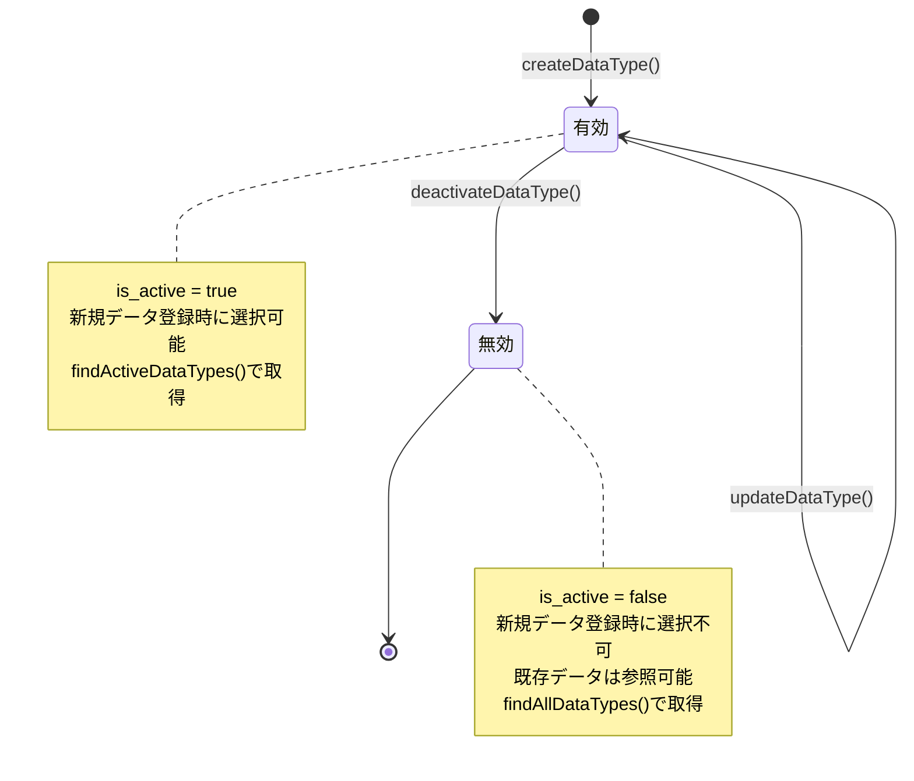
```mermaid
stateDiagram-v2
    [*] --> 有効: createDataType()
    有効 --> 有効: updateDataType()
    有効 --> 無効: deactivateDataType()
    無効 --> [*]

    note right of 有効
        is_active = true
        新規データ登録時に選択可能
        findActiveDataTypes()で取得
    end note

    note right of 無効
        is_active = false
        新規データ登録時に選択不可
        既存データは参照可能
        findAllDataTypes()で取得
    end note
```

**バリデーション**:

- `deactivateDataType(id)`実行時:
  - データ種類が存在することを確認
  - 既に無効状態の場合はエラー(409 Conflict)を返す
- `updateDataType(id, dto)`実行時:
  - `is_active`フィールドは更新不可(状態遷移は専用メソッドで管理)

**テスト観点**:

- 有効なデータ種類を無効化できること
- 無効化されたデータ種類に関連する既存データが削除されないこと
- 無効化されたデータ種類が新規登録時の選択肢に表示されないこと
- 無効化されたデータ種類を再度無効化しようとすると409エラーになること

#### Models層

**責務**: データベースアクセス、SQLクエリ実行、ORMマッピング

**主要モデル**:
- `UserModel`: USERテーブルへのアクセス
- `HealthDataModel`: HEALTH_DATAテーブルへのアクセス
- `DataTypeModel`: DATA_TYPE_MASTERテーブルへのアクセス
- `DataExportModel`: DATA_EXPORTテーブルへのアクセス

### フロントエンド - Reactコンポーネント

#### ページコンポーネント

- `LoginPage`: ログイン画面
- `DashboardPage`: ダッシュボード(最近のデータ一覧)
- `DataEntryPage`: データ登録フォーム
- `DataListPage`: データ一覧・検索
- `AnalyticsPage`: データ分析・グラフ表示
- `ExportPage`: データ出力(PDF/CSV)
- `SettingsPage`: 設定画面(データ種類マスタ管理)

#### UIコンポーネント

- `HealthDataForm`: 健康データ入力フォーム
- `DataTypeSelector`: データ種類選択ドロップダウン
- `DatePicker`: 日付選択カレンダー
- `StatisticsCard`: 統計値表示カード(最大・最小・平均)
- `LineChart`: 折れ線グラフ(Chart.js/Recharts)
- `DataTable`: データ一覧テーブル

### データベーススキーマ

#### USERテーブル

```sql
CREATE TABLE users (
  user_id BIGSERIAL PRIMARY KEY,
  username VARCHAR(50) NOT NULL UNIQUE,
  password_hash VARCHAR(255) NOT NULL,
  created_at TIMESTAMP NOT NULL DEFAULT CURRENT_TIMESTAMP,
  updated_at TIMESTAMP NOT NULL DEFAULT CURRENT_TIMESTAMP
);
```

#### DATA_TYPE_MASTERテーブル

```sql
CREATE TABLE data_type_master (
  data_type_id BIGSERIAL PRIMARY KEY,
  data_type_name VARCHAR(100) NOT NULL,
  unit VARCHAR(20) NOT NULL,
  display_order INT NOT NULL DEFAULT 0,
  is_active BOOLEAN NOT NULL DEFAULT TRUE,
  created_at TIMESTAMP NOT NULL DEFAULT CURRENT_TIMESTAMP,
  updated_at TIMESTAMP NOT NULL DEFAULT CURRENT_TIMESTAMP
);
```

**初期データ**:
```sql
INSERT INTO data_type_master (data_type_name, unit, display_order) VALUES
  ('血圧(上)', 'mmHg', 1),
  ('血圧(下)', 'mmHg', 2),
  ('脈拍', 'bpm', 3),
  ('体重', 'kg', 4);
```

#### HEALTH_DATAテーブル

```sql
CREATE TABLE health_data (
  health_data_id BIGSERIAL PRIMARY KEY,
  user_id BIGINT NOT NULL REFERENCES users(user_id) ON DELETE CASCADE,
  data_type_id BIGINT NOT NULL REFERENCES data_type_master(data_type_id),
  measurement_date DATE NOT NULL,
  value DECIMAL(10, 2) NOT NULL,
  memo TEXT,
  created_at TIMESTAMP NOT NULL DEFAULT CURRENT_TIMESTAMP,
  updated_at TIMESTAMP NOT NULL DEFAULT CURRENT_TIMESTAMP,
  UNIQUE(user_id, data_type_id, measurement_date)
);

CREATE INDEX idx_health_data_user_date ON health_data(user_id, measurement_date DESC);
CREATE INDEX idx_health_data_user_type_date ON health_data(user_id, data_type_id, measurement_date DESC);
```

#### DATA_EXPORTテーブル

```sql
CREATE TABLE data_export (
  export_id BIGSERIAL PRIMARY KEY,
  user_id BIGINT NOT NULL REFERENCES users(user_id) ON DELETE CASCADE,
  start_date DATE NOT NULL,
  end_date DATE NOT NULL,
  format VARCHAR(10) NOT NULL CHECK (format IN ('PDF', 'CSV')),
  exported_at TIMESTAMP NOT NULL DEFAULT CURRENT_TIMESTAMP
);

CREATE INDEX idx_data_export_user ON data_export(user_id, exported_at DESC);
```

---

## まとめ

本設計書は、個人ヘルスケアレコード管理システム(SPHR)の技術設計を定義しました。

**主要な設計判断**:
1. **レイヤードアーキテクチャ**: Routes → Controllers → Services → Modelsの4層構成により、責務分離とテスタビリティを実現
2. **Basic認証**: HTTPS上のBasic認証により、シンプルで安全な認証を提供
3. **同期的データ分析**: SQLの集計関数とウィンドウ関数により、リアルタイムな統計計算を実現

**技術スタック**:
- バックエンド: Deno 1.40+ + Hono 4.0+ + TypeScript
- フロントエンド: React 18+ + TypeScript
- データベース: PostgreSQL 15+
- インフラ: Docker Compose + Azure VM

**非機能要件の達成**:
- 性能: レスポンス時間1〜10秒以内

---

## 実装ロードマップ

本システムは、RDDD0103の業務目標達成戦略に基づき、段階的開発アプローチを採用します。各フェーズで明確な業務目標とKPIを設定し、ユーザー価値を段階的に提供します。

### Phase 1: MVPリリース (0-3ヶ月) ← 本設計書の対象範囲

**業務目標**:
- **G-02**: データ登録の利便性向上 (平均データ登録時間 30秒以内)
- **G-03**: データ分析機能の充実 (分析機能利用率 月1回以上70%以上)

**実装機能** (全16業務プロセスをカバー):

| カテゴリ | 業務プロセス | 実装コンポーネント | 優先度 |
|---------|-------------|-------------------|-------|
| CBP-01 | 健康情報のCRUD | HealthDataService, HealthDataModel | 最高 |
| CBP-02 | データ分析・可視化 | AnalyticsService, Chart.js | 最高 |
| CBP-03 | データ出力(PDF/CSV) | ExportService, DataExportModel | 高 |
| CBP-04 | データ種類マスタ管理 | DataTypeService, DataTypeModel | 高 |
| CBP-05 | ユーザー管理・認証 | UserService, AuthMiddleware | 最高 |
| CBP-06 | 過去データインポート | ImportService | 中 |

**非機能要件**: RDDD1201の全項目
- 性能: レスポンス時間1〜10秒以内、同時接続100ユーザー
- セキュリティ: Basic認証、TLS 1.2+、bcryptハッシュ化
- 可用性: 稼働率99%、RTO 4時間、RPO 24時間
- 拡張性: 垂直スケーリング対応(2-4 vCPU)
- 保守性: TypeScript型安全性、レイヤードアーキテクチャ
- ユーザビリティ: レスポンシブデザイン、明確なエラーメッセージ

**達成基準**:
- サービス開始時点でG-02を達成 (データ登録時間30秒以内)
- サービス開始後3ヶ月でG-03を達成 (分析機能利用率70%以上)

---

### Phase 2: 改善・拡張フェーズ (3-6ヶ月)

**業務目標**:
- **G-01**: ユーザーの継続利用促進 (月次アクティブユーザー率 80%以上)

**実装機能**:

1. **ユーザーフィードバック収集機能**
   - アプリ内フィードバックフォーム
   - 利用状況分析ダッシュボード(管理者向け)
   - NPS(Net Promoter Score)調査機能

2. **継続利用を促進する機能**
   - リマインダー・通知機能(Webプッシュ通知)
   - データ登録ストリーク表示(連続登録日数)
   - 登録状況カレンダービュー

3. **データ入力UI/UXの改善**
   - クイック入力モード(前回値の自動表示)
   - 音声入力対応(Web Speech API)
   - データ入力テンプレート機能

4. **高度な分析機能**
   - 傾向予測(線形回帰による将来予測)
   - 異常値検出(標準偏差ベース)
   - データ種類間の相関分析(血圧と体重など)
   - 週次・月次レポート自動生成

**技術的拡張**:
- Webプッシュ通知用のService Worker実装
- Web Speech API統合
- 機械学習モデル(TensorFlow.js)による予測機能

**達成基準**:
- サービス開始後6ヶ月でG-01を達成 (月次アクティブユーザー率80%以上)

---

### Phase 3: 連携拡張フェーズ (6-12ヶ月)

**業務目標**:
- **G-04**: 医師との情報共有の実現 (データ出力機能利用率 年1回以上50%以上)

**実装機能**:

1. **医療機関向けデータ共有API**
   - OAuth 2.0による認可フロー
   - FHIR(Fast Healthcare Interoperability Resources)形式対応
   - 医療機関専用ポータル画面

2. **アクセス権限管理の拡張**
   - ロールベースアクセス制御(RBAC)
   - データ共有の細かい権限設定(期間、データ種類単位)
   - 共有履歴の閲覧・取り消し機能

3. **外部デバイス連携**
   - Fitbit API連携
   - Apple Health連携(HealthKit)
   - Google Fit連携
   - Bluetooth血圧計連携(Web Bluetooth API)

4. **高度なレポート機能**
   - 医師向け診療レポート(検査値推移、服薬管理含む)
   - 多言語対応(英語レポート)
   - 複数期間比較レポート

**技術的拡張**:
- OAuth 2.0 Authorization Server実装
- FHIR R4仕様への準拠
- Web Bluetooth API統合
- 外部APIクライアント(Fitbit、Apple Health、Google Fit)

**達成基準**:
- サービス開始後1年でG-04を達成 (データ出力機能利用率50%以上)

---

## ロードマップと現仕様の関係

本設計書は**Phase 1: MVPリリース**の実装範囲を完全にカバーしています:

| 設計セクション | Phase 1対応範囲 | Phase 2以降への拡張性 |
|--------------|----------------|---------------------|
| システムフロー(16個) | CBP-01〜06の全業務プロセス | Phase 2で通知フロー、Phase 3で外部連携フロー追加 |
| 要件トレーサビリティ | 全22アクティビティ + 6非機能要件 | Phase 2/3の新機能を追加マッピング |
| コンポーネント設計 | レイヤードアーキテクチャ基盤 | Phase 2で新Serviceクラス、Phase 3でAPI Gateway追加 |
| データベーススキーマ | 4テーブル(USER, DATA_TYPE_MASTER, HEALTH_DATA, DATA_EXPORT) | Phase 2でNOTIFICATIONテーブル、Phase 3でSHARE_PERMISSIONテーブル追加 |
| 認証・認可 | Basic認証 | Phase 3でOAuth 2.0へ拡張 |

**設計判断の根拠**:

1. **Phase 1にフル機能を実装する理由**:
   - MVP段階でG-02とG-03を達成するには、全16業務プロセスが必須
   - 部分的実装ではユーザー価値が不十分で継続利用に繋がらない
   - 早期フィードバック収集のため、完全動作するシステムが必要

2. **Phase 2以降への拡張性確保**:
   - レイヤードアーキテクチャにより、新機能追加が容易
   - Basic認証からOAuth 2.0への移行パスを考慮
   - データベーススキーマは正規化済みで拡張可能

3. **段階的リリースの利点**:
   - Phase 1でコア機能を検証し、ユーザーフィードバックを収集
   - Phase 2でフィードバックに基づく改善を実施
   - Phase 3で医療機関連携という高度な機能を安定基盤上に構築

---

## まとめ

本実装ロードマップは、**ユーザー価値の段階的提供**と**技術的負債の最小化**を両立させる戦略です。

- **Phase 1 (0-3ヶ月)**: データ登録と分析のコア機能を完全実装 → 本設計書の対象範囲
- **Phase 2 (3-6ヶ月)**: 継続利用を促進する改善と高度分析機能
- **Phase 3 (6-12ヶ月)**: 医療機関連携と外部デバイス統合

各フェーズは明確なKPIで測定可能であり、ユーザーからのフィードバックを次フェーズに反映する継続的改善サイクルを実現します。
- セキュリティ: TLS、Basic認証、bcryptハッシュ化、各種攻撃対策
- 可用性: 稼働率99.5%、RTO 4時間、RPO 24時間
- 拡張性: 100〜1,000ユーザーへの段階的スケーリング

次のフェーズでは、本設計書に基づいて実装タスクを作成します。
