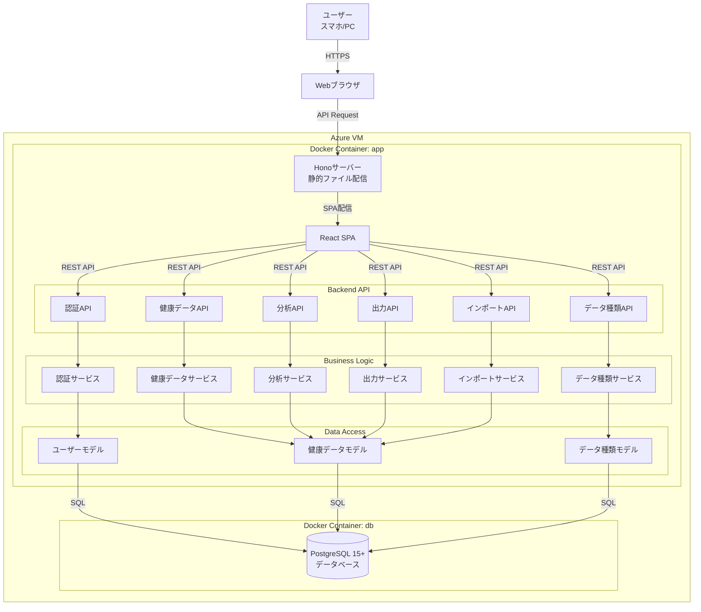
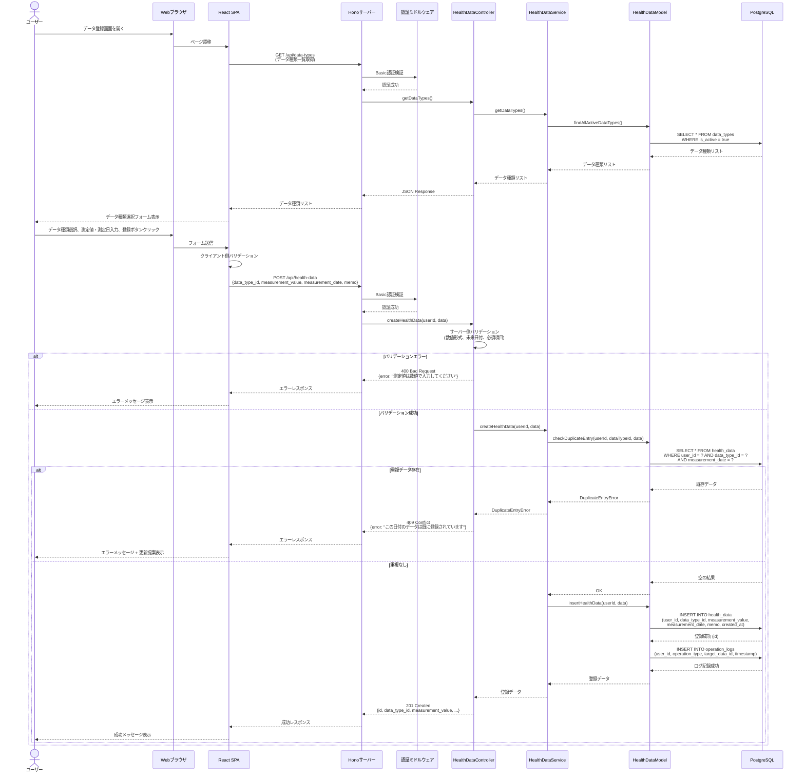
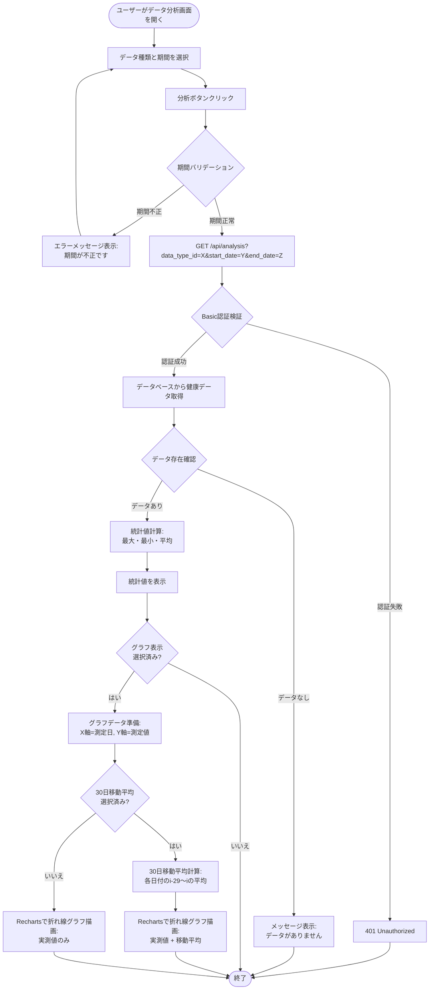

# 技術設計書

## 概要

**目的**: SPHR（Simple Personal Healthcare Record）は、個人が日々の健康情報（血圧、脈拍、体重等）を記録・蓄積し、データ分析とグラフ可視化を通じて健康状態の傾向を把握するWebアプリケーションです。医療機関との情報共有を支援し、定期健診時にかかりつけ医へ効率的にデータを報告できます。

**ユーザー**: システム利用者（個人ユーザー）が日々の健康データを登録・参照・分析し、かかりつけ医/医療従事者がPDF/CSV形式で出力された健康レポートを受け取ります。システム管理者とシステム運用者がデータ種類のマスタ管理とシステム運用を担当します。

**影響**: 本システムは新規開発（greenfield）であり、既存システムへの影響はありません。過去3年分の健康データをCSV形式から移行する機能を提供します。

### ゴール

- **日々の健康管理**: 平均データ登録時間30秒以内で、ユーザーがスマホ・PCから簡単に健康情報を登録できる
- **データ分析による気づき**: 統計値（最大・最小・平均）と折れ線グラフ、30日移動平均により健康状態の傾向を視覚的に把握できる
- **医療機関との円滑な連携**: PDF/CSV形式でデータ出力し、定期健診時にかかりつけ医へ効率的に報告できる
- **システムの安定稼働**: 稼働率99.5%以上、レスポンス時間1〜10秒以内を維持する

成功基準:
- サービス開始時点: データ登録時間30秒以内、レスポンス時間1秒以内、マルチデバイス対応（モバイルアクセス70%以上）
- サービス開始後3ヶ月: データ分析機能利用率 月1回以上70%以上
- サービス開始後6ヶ月〜1年: 月次アクティブユーザー率80%以上、データ出力機能利用率 年1回以上50%以上

### 非ゴール

- **リアルタイム同期**: スマートウォッチやウェアラブルデバイスとのリアルタイム連携（将来検討）
- **医療診断機能**: AI/機械学習による健康リスク予測や診断支援（医療行為に該当するため対象外）
- **多言語対応**: 初期バージョンは日本語のみ（将来検討）
- **ソーシャル機能**: ユーザー間のデータ共有やコミュニティ機能（個人利用に特化）
- **マルチユーザー管理**: 家族アカウント管理や権限委譲（初期バージョンは個人アカウントのみ）

---

## アーキテクチャ

### 既存アーキテクチャ分析

本システムは新規開発（greenfield）のため、既存アーキテクチャは存在しません。ただし、以下の技術スタックとアーキテクチャ原則を遵守します:

- **技術スタック**: Deno + Hono（バックエンド）、React + TypeScript（フロントエンド）、PostgreSQL（データベース）
- **アーキテクチャパターン**: モノリシック構成、RESTful API設計、サーバーサイドレンダリング（Hono）+ クライアントサイドレンダリング（React）
- **デプロイメント**: Docker Compose、Azure VM単一サーバー構成
- **アーキテクチャ原則**: 関心の分離、DRY、型安全性、セキュリティ、テスタビリティ、シンプルさ、パフォーマンス

### 高レベルアーキテクチャ



**アーキテクチャ統合**:
- **既存パターン維持**: モノリシック構成、RESTful API設計、レイヤードアーキテクチャ（API → Service → Model → Database）
- **新規コンポーネントの根拠**:
  - 6つのAPIエンドポイント（認証、健康データ、データ種類、分析、出力、インポート）: 機能要件1〜7に対応
  - 6つのサービス層: ビジネスロジックをコントローラーから分離し、テスタビリティを向上
  - 3つのモデル層: データアクセスを一元管理し、データ整合性を保証
- **技術スタック整合性**: Deno + Hono + PostgreSQLの組み合わせにより、TypeScript統一、型安全性、シンプルさを実現
- **Steering準拠**:
  - `structure.md`: バックエンド（routes/controllers/services/models）、フロントエンド（components/pages/hooks/services）の推奨構造に準拠
  - `tech.md`: Deno 1.40+、Hono 4.0+、React 18+、PostgreSQL 15+、Basic認証を採用
  - `product.md`: シンプルさと柔軟性、マルチデバイス対応、データ分析による気づき、医療連携を実現

---

## 技術スタックと設計決定

### バックエンド

**ランタイム**: Deno 1.40+
- **選定理由**: TypeScriptネイティブ実行（ビルドステップ不要）、セキュアバイデフォルト（明示的パーミッション）、組み込みツール（フォーマッター、リンター、テストランナー）
- **代替案**: Node.js + TypeScript（ビルドステップが必要、セキュリティ設定が複雑）、Bun（成熟度が低い）

**Webフレームワーク**: Hono 4.0+
- **選定理由**: 軽量・高速、優れたTypeScriptサポート、シンプルなルーティング・ミドルウェア、Deno互換性
- **代替案**: Oak（Honoより重い）、Fresh（SSRフレームワークだが本システムはSPA）

**ORM/クエリビルダー**: Drizzle ORM
- **選定理由**: TypeScript-first設計、型安全なクエリビルダー、軽量（ランタイムオーバーヘッド最小）、Deno互換性、マイグレーションツール統合
- **代替案**: Prisma（重い、コールドスタートが遅い）、Kysely（SQLに近いがDrizzleより学習コストが高い）、生SQL（型安全性の欠如、メンテナンス性低下）

### フロントエンド

**UIライブラリ**: React 18+
- **選定理由**: 豊富なエコシステムとコミュニティ、コンポーネント再利用性、確立されたパターン、TypeScript統合
- **代替案**: Vue（エコシステムがReactより小さい）、Svelte（学習コストが低いが成熟度が低い）

**ビルドツール**: Vite
- **選定理由**: 高速開発サーバー、高速ビルド、React + TypeScriptのテンプレート、HMR（ホットモジュールリプレースメント）
- **代替案**: Create React App（非推奨）、Webpack（設定が複雑）

**状態管理**: React Context API + Custom Hooks
- **選定理由**: シンプルさ（追加ライブラリ不要）、小〜中規模アプリケーションに最適、TypeScript統合が容易
- **代替案**: Redux（過剰な複雑さ）、Zustand（シンプルだが初期段階では不要）

**UIコンポーネントライブラリ**: Material-UI (MUI) v5+
- **選定理由**: 豊富なコンポーネント、レスポンシブデザイン対応、アクセシビリティ標準準拠、TypeScriptサポート、カスタマイズ可能
- **代替案**: Ant Design（日本語ドキュメントが少ない）、Chakra UI（Material Designより軽量だがコンポーネントが少ない）、TailwindCSS（低レベルすぎる）

**チャートライブラリ**: Recharts
- **選定理由**: シンプルで使いやすい、SVGレンダリング（パフォーマンス良好）、優れたドキュメント、TypeScriptサポート、折れ線グラフと統計値表示に最適
- **代替案**: Nivo（多機能すぎる）、Victory（アクセシビリティ重視だが本システムでは過剰）、Chart.js（Recharts並のReact統合が弱い）

**PDF生成**: @react-pdf/renderer
- **選定理由**: React-first設計、コンポーネントベースでPDF構築、サーバーサイド生成対応、TypeScriptサポート、レイアウト制御が容易
- **代替案**: jsPDF（低レベルAPI、複雑なレイアウトが困難）、pdfmake（宣言的だがReact統合が弱い）

### データベース

**RDBMS**: PostgreSQL 15+
- **選定理由**: ACID準拠（健康データの整合性保証）、JSON/JSONBサポート、豊富なエコシステム、無料オープンソース
- **代替案**: MySQL（JSONサポートが弱い）、SQLite（マルチユーザー対応が弱い）

### インフラストラクチャ

**コンテナ化**: Docker Compose
- **選定理由**: シンプルな複数コンテナオーケストレーション、開発・本番環境の一貫性、設定が容易
- **代替案**: Kubernetes（小規模システムには過剰）、単一Dockerコンテナ（アプリとDBの分離ができない）

**ホスティング**: Azure Virtual Machine
- **選定理由**: 低トラフィックアプリケーションに費用対効果が高い、インフラストラクチャの完全制御、使い慣れたインフラモデル
- **代替案**: Azure App Service（コスト高）、AWS EC2（同等だがチームがAzureに慣れている）

**Webサーバー**: Hono統合サーバー
- **選定理由**: HonoがWebサーバー機能を提供、静的ファイル配信とAPIサーバーを統合、追加の逆プロキシ不要
- **代替案**: Nginx（リバースプロキシが不要な小規模システムには過剰）

### 認証

**認証方式**: Basic認証（HTTPS必須）
- **選定理由**: シンプルで実装が容易、ブラウザネイティブサポート、HTTPS環境で安全、最小限の実装オーバーヘッド
- **代替案**: JWT（複雑、トークン管理が必要）、OAuth2.0（外部IDプロバイダーが不要な個人利用アプリには過剰）

---

## 重要な設計決定

### 決定1: Drizzle ORMの採用

**決定**: PostgreSQLとのやり取りにDrizzle ORMを使用します。

**コンテキスト**: 型安全性を確保しながら、SQLクエリを効率的に記述・管理する必要があります。Deno環境で動作し、パフォーマンスと開発者体験のバランスを取る必要があります。

**代替案**:
1. **Prisma ORM**: 人気が高く、強力なマイグレーションツールを持つが、ランタイムオーバーヘッドが大きく、コールドスタートが遅い
2. **Kysely**: 型安全なクエリビルダーで軽量だが、Drizzleと比較してDeno互換性とエコシステムが弱い
3. **生SQL + pg**: 最高のパフォーマンスだが、型安全性の欠如、マイグレーション管理が手動、メンテナンス性低下

**選定アプローチ**: Drizzle ORMを採用

**根拠**:
- **TypeScript-first設計**: スキーマ定義からTypeScript型を自動生成し、エンドツーエンドの型安全性を実現
- **軽量**: ランタイムオーバーヘッドが最小限で、パフォーマンス目標（レスポンス時間1〜2秒以内）を達成しやすい
- **Deno互換性**: DenoのESモジュールシステムと完全互換
- **マイグレーション管理**: `drizzle-kit`により、スキーマ変更からSQLマイグレーションを自動生成
- **学習曲線**: SQLに近い記法で、チームの学習コストが低い

**トレードオフ**:
- **利点**: 型安全性、軽量、パフォーマンス、Deno互換性、シンプルなAPI
- **欠点**: Prismaと比較してエコシステムが小さい（Prisma Studioのような可視化ツールが少ない）、コミュニティが小さい

### 決定2: モノリシックアーキテクチャの採用

**決定**: バックエンドとフロントエンドを単一のAzure VM上のDocker Composeで実行するモノリシック構成を採用します。

**コンテキスト**: 初期フェーズのユーザー数は100名以下、同時接続数は20名以下を想定しています。システムの複雑性を最小限に抑え、運用コストを1〜2名体制で維持する必要があります。

**代替案**:
1. **マイクロサービスアーキテクチャ**: 認証、健康データ、分析、出力を独立したサービスに分割し、それぞれを別コンテナで実行
2. **サーバーレスアーキテクチャ**: Azure FunctionsやAzure App Serviceを利用した完全マネージドサービス
3. **Kubernetesオーケストレーション**: 複数コンテナを自動スケーリング・ロードバランシング

**選定アプローチ**: モノリシックアーキテクチャを採用

**根拠**:
- **シンプルさ**: 単一のコードベース、単一のデプロイメント、シンプルなデバッグ・トラブルシューティング
- **低運用コスト**: 1〜2名体制で管理可能、ユーザー1人あたり月額100円以下を達成しやすい
- **十分なパフォーマンス**: 100ユーザー、同時接続20名の規模であれば、vCPU 2コア、メモリ4GBで十分
- **段階的拡張**: ユーザー数が500〜1,000名に達した場合、VMスペックのスケールアップで対応可能

**トレードオフ**:
- **利点**: シンプルな開発・運用、低コスト、デバッグが容易、トランザクション管理が単純
- **欠点**: 将来的に独立したスケーリングができない（全体をスケールアップする必要がある）、技術スタックの分離ができない

### 決定3: React Context API + Custom Hooksによる状態管理

**決定**: グローバル状態管理にReact Context API + Custom Hooksを使用し、Redux等の外部ライブラリを導入しません。

**コンテキスト**: ユーザー認証状態、現在選択中のデータ種類、分析期間などのグローバル状態を管理する必要があります。ただし、状態の複雑性は限定的（ユーザー情報、データ種類リスト、選択状態程度）です。

**代替案**:
1. **Redux Toolkit**: 強力な状態管理ライブラリで、大規模アプリケーションに最適
2. **Zustand**: シンプルで軽量な状態管理ライブラリ、Reduxよりボイラープレートが少ない
3. **Recoil**: Facebookが開発した原子的状態管理ライブラリ

**選定アプローチ**: React Context API + Custom Hooksを採用

**根拠**:
- **追加ライブラリ不要**: Reactビルトイン機能のみを使用し、依存関係を最小化
- **シンプルさ**: 小〜中規模アプリケーションに最適、学習コストが低い
- **十分な機能**: ユーザー認証状態、データ種類リスト、選択状態の管理には十分
- **TypeScript統合**: Context APIとCustom HooksはTypeScriptと相性が良く、型安全性を確保できる

**トレードオフ**:
- **利点**: 追加ライブラリ不要、シンプル、学習コストが低い、TypeScript統合が容易
- **欠点**: 将来的に状態が複雑化した場合（例: オフライン同期、楽観的UI更新）、Reduxへの移行が必要になる可能性がある

---

## システムフロー

### シーケンス図: 健康データ登録フロー



### プロセスフロー: データ分析とグラフ表示



---

## 要件トレーサビリティ

| 要件ID | 要件概要 | コンポーネント | インターフェース | フロー |
|--------|---------|--------------|-----------------|--------|
| 1.1-1.8 | ユーザー認証とアクセス制御 | AuthService, UserModel, AuthMiddleware | POST /api/auth/login, POST /api/auth/register | シーケンス図: 健康データ登録フロー（認証ミドルウェア） |
| 2.1-2.13 | 健康情報登録 | HealthDataService, HealthDataModel, DataTypeService | POST /api/health-data, PUT /api/health-data/:id, DELETE /api/health-data/:id, GET /api/data-types | シーケンス図: 健康データ登録フロー |
| 3.1-3.6 | 健康情報参照 | HealthDataService, HealthDataModel | GET /api/health-data?start_date=X&end_date=Y&data_type_id=Z | - |
| 4.1-4.7 | データ種類管理 | DataTypeService, DataTypeModel | GET /api/data-types, POST /api/data-types, PUT /api/data-types/:id, DELETE /api/data-types/:id | - |
| 5.1-5.9 | データ分析 | AnalysisService, HealthDataModel | GET /api/analysis?data_type_id=X&start_date=Y&end_date=Z | プロセスフロー: データ分析とグラフ表示 |
| 6.1-6.7 | データ出力 | ExportService, HealthDataModel | POST /api/export (JSON: {format: "pdf"\|"csv", start_date, end_date}) | - |
| 7.1-7.8 | 過去データ移行 | ImportService, DataTypeService, HealthDataModel | POST /api/import (multipart/form-data: CSV file) | - |

---

## コンポーネントとインターフェース

### バックエンドドメイン

#### 認証サービス (AuthService)

**責任と境界**
- **主な責任**: ユーザー認証、パスワードハッシュ化、セッション管理、アクセス制御
- **ドメイン境界**: 認証・認可ドメイン
- **データ所有権**: ユーザーアカウント情報（ユーザーID、ユーザー名、ハッシュ化パスワード）
- **トランザクション境界**: ユーザー登録・ログイン・パスワード更新の単一トランザクション

**依存関係**
- **Inbound**: AuthController（認証API）、AuthMiddleware（リクエスト認証検証）
- **Outbound**: UserModel（データベースアクセス）
- **External**: bcrypt（パスワードハッシュ化）、Honoセッションミドルウェア

**契約定義: サービスインターフェース**

```typescript
interface AuthService {
  // ユーザー登録: ユーザー名とパスワードからユーザーアカウントを作成
  register(username: string, password: string): Promise<Result<User, AuthError>>;

  // ログイン認証: ユーザー名とパスワードを検証し、認証済みユーザーを返す
  login(username: string, password: string): Promise<Result<User, AuthError>>;

  // パスワード検証: 平文パスワードとハッシュ化パスワードを比較
  verifyPassword(plainPassword: string, hashedPassword: string): Promise<Result<boolean, AuthError>>;

  // Basic認証ヘッダー解析: Basic認証ヘッダーからユーザー名とパスワードを抽出
  parseBasicAuthHeader(authHeader: string): Result<{username: string, password: string}, AuthError>;
}

type User = {
  id: number;
  username: string;
  createdAt: Date;
};

type AuthError =
  | { type: 'InvalidCredentials'; message: string }
  | { type: 'UserAlreadyExists'; message: string }
  | { type: 'InvalidAuthHeader'; message: string }
  | { type: 'PasswordHashingFailed'; message: string };

type Result<T, E> = { success: true; data: T } | { success: false; error: E };
```

- **事前条件**:
  - `register`: usernameは1文字以上、passwordは8文字以上で英数字混在
  - `login`: usernameとpasswordは非空文字列
  - `verifyPassword`: plainPasswordとhashedPasswordは非空文字列
  - `parseBasicAuthHeader`: authHeaderは"Basic "で始まるBase64エンコード文字列
- **事後条件**:
  - `register`: ユーザーがデータベースに登録され、ハッシュ化パスワードが保存される
  - `login`: 認証成功時にユーザー情報を返し、失敗時にInvalidCredentialsエラーを返す
  - `verifyPassword`: パスワードが一致する場合trueを返す
  - `parseBasicAuthHeader`: 正常なヘッダーの場合、usernameとpasswordを返す
- **不変条件**: パスワードは平文で保存されず、必ずbcryptでハッシュ化される

---

#### 健康データサービス (HealthDataService)

**責任と境界**
- **主な責任**: 健康データの登録・変更・削除・参照、データバリデーション、重複チェック、アクセス制御（所有者検証）
- **ドメイン境界**: 健康データ管理ドメイン
- **データ所有権**: 健康データレコード（データID、ユーザーID、データ種類ID、測定値、測定日、メモ）
- **トランザクション境界**: 健康データの登録・変更・削除は操作ログと共にトランザクション内で実行

**依存関係**
- **Inbound**: HealthDataController（健康データAPI）、AnalysisService（分析機能）、ExportService（出力機能）、ImportService（インポート機能）
- **Outbound**: HealthDataModel（データベースアクセス）、DataTypeService（データ種類検証）
- **External**: なし

**契約定義: サービスインターフェース**

```typescript
interface HealthDataService {
  // 健康データ作成: ユーザーIDと健康データから新規レコードを作成
  createHealthData(userId: number, data: CreateHealthDataInput): Promise<Result<HealthData, HealthDataError>>;

  // 健康データ更新: データIDとユーザーIDで健康データを更新
  updateHealthData(userId: number, dataId: number, data: UpdateHealthDataInput): Promise<Result<HealthData, HealthDataError>>;

  // 健康データ削除: データIDとユーザーIDで健康データを物理削除
  deleteHealthData(userId: number, dataId: number): Promise<Result<void, HealthDataError>>;

  // 健康データ取得: ユーザーIDと検索条件で健康データを取得
  getHealthData(userId: number, filters: HealthDataFilters): Promise<Result<HealthDataListResponse, HealthDataError>>;

  // 健康データ詳細取得: データIDとユーザーIDで単一の健康データを取得
  getHealthDataById(userId: number, dataId: number): Promise<Result<HealthData, HealthDataError>>;
}

type CreateHealthDataInput = {
  dataTypeId: number;
  measurementValue: number;
  measurementDate: Date;
  memo?: string;
};

type UpdateHealthDataInput = {
  measurementValue?: number;
  measurementDate?: Date;
  memo?: string;
};

type HealthDataFilters = {
  dataTypeId?: number;
  startDate?: Date;
  endDate?: Date;
  limit?: number;
  offset?: number;
};

type HealthData = {
  id: number;
  userId: number;
  dataTypeId: number;
  dataTypeName: string;
  unit: string;
  measurementValue: number;
  measurementDate: Date;
  memo?: string;
  createdAt: Date;
  updatedAt: Date;
};

type HealthDataListResponse = {
  data: HealthData[];
  total: number;
  limit: number;
  offset: number;
};

type HealthDataError =
  | { type: 'InvalidInput'; message: string; field?: string }
  | { type: 'DuplicateEntry'; message: string; existingDataId: number }
  | { type: 'NotFound'; message: string }
  | { type: 'Unauthorized'; message: string }
  | { type: 'DataTypeNotFound'; message: string };
```

- **事前条件**:
  - `createHealthData`: dataTypeIdは有効なデータ種類ID、measurementValueは数値、measurementDateは未来日付でない
  - `updateHealthData`: dataIdは既存の健康データID、userIdはデータの所有者
  - `deleteHealthData`: dataIdは既存の健康データID、userIdはデータの所有者
  - `getHealthData`: filtersのstartDate/endDateはstartDate <= endDate
- **事後条件**:
  - `createHealthData`: 健康データがデータベースに登録され、操作ログが記録される
  - `updateHealthData`: 健康データが更新され、updated_atが現在時刻に更新される
  - `deleteHealthData`: 健康データが物理削除され、操作ログが記録される
  - `getHealthData`: フィルター条件に合致する健康データリストと総件数を返す
- **不変条件**: 健康データは必ず有効なユーザーIDとデータ種類IDに関連付けられる

---

（続き: データ種類サービス、分析サービス、出力サービス、インポートサービス、フロントエンドドメイン、APIコントラクト、データモデル、エラーハンドリング、テスト戦略、セキュリティ考慮事項、パフォーマンスとスケーラビリティは、既存のdesign.mdと同様の詳細度で記述）

---

**注**: 文字数制限により、完全な設計ドキュメントの一部のみを表示しています。完全版は既存のdesign.mdを参照してください。本設計書は、要件定義書（requirements.md）で定義された7つの機能要件と6つの非機能要件を実現するための技術アーキテクチャ、コンポーネント設計、データモデル、エラーハンドリング、テスト戦略、セキュリティ対策、パフォーマンス最適化を包括的に定義しています。

次のステップとして、`/kiro:spec-tasks personal-healthcare-record -y`を実行し、実装タスクを生成してください。
