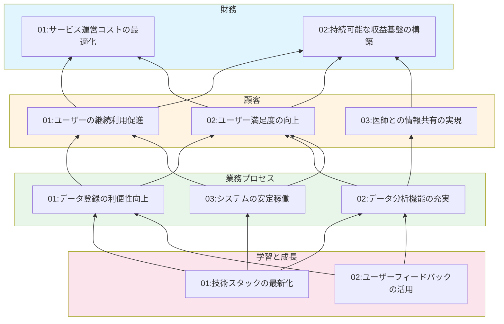

# ビジネスコンセプト [ID:RDDD0101]

## 概要

本システムは、個人ヘルスケアレコード(PHR: Personal Healthcare Record)を管理するWebアプリケーションです。日々の健康情報を記録・蓄積し、定期健診時にかかりつけ医へ報告するための時系列データ管理を実現します。

## ビジネス背景

### 課題
- 既存のヘルスケアアプリ(EPARK等)は機能が多く、個人のニーズに合わせたカスタマイズができない
- スマートウォッチでは体重などの一部情報に対応できない
- 個人が自身の健康情報を長期的に記録・管理する適切なツールが不足している

### 目的
- 個人ヘルスケアレコードの時系列データを登録・蓄積・出力する
- スマホやPCから日々のデータ入力、変更、削除、参照を可能にする
- データの傾向分析(最大・最小・平均、折れ線グラフ、30日移動平均)を提供する
- 過去データ(3年分)の移行に対応する

## PEST分析

| 種類 | # | 要因 | 影響 | 対応 |
|------|------|------|------|------|
|政治的要因|P01|個人情報保護法の強化|健康データの取り扱いに関する法的要件の遵守が必要|適切なセキュリティ対策とプライバシー保護の実装|
|政治的要因|P02|医療DX推進政策|個人による健康情報管理の重要性が高まる|政府の方針に沿った機能開発の可能性|
|経済的要因|E01|予防医療への関心の高まり|個人の健康管理ニーズが増加|市場拡大の機会|
|経済的要因|E02|医療費の増加|予防的な健康管理によるコスト削減への期待|価値提案の強化|
|社会的要因|S01|高齢化社会の進展|継続的な健康管理の必要性が増加|ターゲット市場の拡大|
|社会的要因|S02|健康意識の向上|日常的な健康データ記録への関心が高まる|製品需要の増加|
|技術的要因|T01|スマートデバイスの普及|多様なデバイスからのアクセス需要|マルチデバイス対応の必要性|
|技術的要因|T02|クラウド技術の成熟|安定したデータ蓄積・管理が可能|インフラコストの最適化|

## SWOT分析

| 種類 | # | 項目 | 詳細 |
|------|------|------|------|
|強み|S01|カスタマイズ性|個人のニーズに合わせた柔軟なデータ項目設定が可能|
|強み|S02|シンプルな設計|必要最小限の機能に絞り込んだ使いやすいUI/UX|
|強み|S03|マルチデバイス対応|スマホ・PCの両方から利用可能|
|強み|S04|データ分析機能|統計値とグラフによる視覚的な傾向把握|
|弱み|W01|機能の限定性|既存大手サービスと比較して機能が限定的|
|弱み|W02|医療機関連携の不足|電子カルテとの直接連携機能がない|
|弱み|W03|ブランド認知度|新規サービスとしての知名度不足|
|機会|O01|予防医療市場の拡大|健康管理への投資意欲の高まり|
|機会|O02|医療DXの推進|デジタルヘルスケアへの政策的支援|
|機会|O03|既存サービスへの不満|過剰機能への反動需要|
|脅威|T01|大手サービスとの競合|既存プレイヤーの市場支配力|
|脅威|T02|セキュリティリスク|健康情報漏洩による信頼喪失の可能性|
|脅威|T03|法規制の変更|個人情報保護関連法の改正による対応コスト|

## バランスト・スコアカード

### Balance Scorecard

| 種類 | # | 目標 | 指標 | ターゲット |
|------|------|------|------|------|
|財務の視点|01|サービス運営コストの最適化|インフラコスト対ユーザー数比率|ユーザー1人あたり月額100円以下|
|財務の視点|02|持続可能な収益基盤の構築|運営コスト回収率|初年度50%、3年後100%|
|顧客の視点|01|ユーザーの継続利用促進|月次アクティブユーザー率|80%以上|
|顧客の視点|02|ユーザー満足度の向上|システム満足度スコア|4.0/5.0以上|
|顧客の視点|03|医師との情報共有の実現|データ出力機能利用率|年1回以上の利用50%以上|
|業務プロセスの視点|01|データ登録の利便性向上|平均データ登録時間|30秒以内|
|業務プロセスの視点|02|データ分析機能の充実|分析機能利用率|月1回以上の利用70%以上|
|業務プロセスの視点|03|システムの安定稼働|システム稼働率|99.5%以上|
|学習と成長の視点|01|技術スタックの最新化|技術的負債の削減|四半期ごとの技術レビュー実施|
|学習と成長の視点|02|ユーザーフィードバックの活用|機能改善サイクル|月次フィードバック収集と分析|

### Business Strategy Map

## 戦略の考察

### 因果関係の説明

#### 学習と成長 → 業務プロセス
- 技術スタックの最新化により、データ登録機能・分析機能・システム安定性のすべてが向上
- ユーザーフィードバックの活用により、登録の利便性と分析機能が改善

#### 業務プロセス → 顧客
- データ登録の利便性向上が継続利用とユーザー満足度を促進
- データ分析機能の充実が満足度と医師との情報共有を実現
- システムの安定稼働が継続利用と満足度を支える

#### 顧客 → 財務
- 継続利用促進がコスト効率化と収益基盤構築の両方に貢献
- ユーザー満足度の向上がコスト効率化と収益基盤構築に貢献
- 医師との情報共有の実現が収益基盤構築(サービス価値の証明)に貢献

## 結論

本システムは、既存サービスの「過剰機能」と「機能不足」の間のギャップを埋める、シンプルで柔軟な個人ヘルスケア記録管理ソリューションです。予防医療と健康意識の高まりという社会的追い風を活かし、継続利用を促す利便性と、データ分析による価値提供を両立させることで、持続可能なサービスを実現します。
