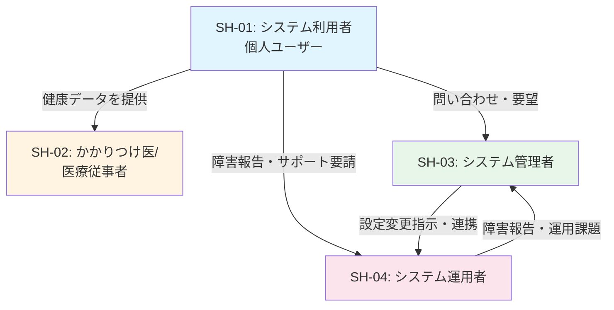

# ステークホルダ一覧 [ID:RDDD0102]

## 概要

本ドキュメントでは、個人ヘルスケアレコード(PHR)管理システムに関わるすべてのステークホルダーを特定し、各ステークホルダーが直面している課題を明確にします。

## ステークホルダ一覧表

| # | ステークホルダ名 | 組織名 | 役割 | 権限範囲 | 影響度 | 重要度 |
|---|---|---|---|---|---|---|
| SH-01 | システム利用者(個人ユーザー) | - | 自身の健康情報を記録・管理し、医療機関との情報共有を行う | 自身のデータの登録・更新・削除・参照・出力 | 高 | 高 |
| SH-02 | かかりつけ医/医療従事者 | 医療機関 | 患者から提供された健康データを参照し、診療や健康指導に活用する | 患者から提供されたデータの参照のみ | 中 | 高 |
| SH-03 | システム管理者 | 運営組織 | システム全体の設定管理、マスタデータ管理、セキュリティ管理を担当 | システム設定変更、マスタデータ管理、ユーザー管理、セキュリティ設定 | 高 | 高 |
| SH-04 | システム運用者 | 運営組織/運用部門 | システムの日常運用、監視、バックアップ、障害対応を担当 | システム稼働監視、バックアップ実行、障害対応、ログ管理 | 高 | 中 |

## ステークホルダ詳細

### SH-01: システム利用者(個人ユーザー)

#### プロフィール
- **ステークホルダ名**: システム利用者(個人ユーザー)
- **組織名**: -
- **役割**: 自身の健康情報(血圧、脈拍、体重等)を日々記録し、定期健診時にかかりつけ医へ報告するためのデータ管理を行う

#### プロジェクトへの関与
- **承認権限範囲**: 自身のデータの登録・更新・削除・参照・出力
- **影響度**: 高(システムの主要利用者であり、システムの価値を直接享受する)
- **重要度**: 高(システムの存在意義そのものである)

#### 関係する他のステークホルダ
- **SH-02(かかりつけ医/医療従事者)**: データ出力機能を通じて健康情報を提供し、診療や健康指導を受ける
- **SH-03(システム管理者)**: システム利用に関する問い合わせや要望を伝える
- **SH-04(システム運用者)**: システム障害時にサポートを受ける

#### ステークホルダが解決すべき課題
1. **既存ツールの過剰機能**: EPARKなどの既存ヘルスケアアプリは機能が多すぎて使いづらく、個人のニーズに合わせたカスタマイズができない
2. **スマートウォッチの機能不足**: スマートウォッチでは体重など一部の健康情報に対応できない
3. **長期的データ管理の困難**: 個人が自身の健康情報を長期的に記録・管理する適切なツールが不足している
4. **医療機関との情報共有の煩雑さ**: 定期健診時に医師へ健康データを効率的に報告する方法がない
5. **データ傾向の把握困難**: 日々のデータから健康状態の傾向を把握するための分析ツールが不足している
6. **過去データの移行**: 既存の3年分のデータを新システムへ移行する必要がある

---

### SH-02: かかりつけ医/医療従事者

#### プロフィール
- **ステークホルダ名**: かかりつけ医/医療従事者
- **組織名**: 医療機関(クリニック、病院等)
- **役割**: 患者から提供された日々の健康データを参照し、診療や健康指導に活用する

#### プロジェクトへの関与
- **承認権限範囲**: 患者から提供されたデータの参照のみ(書き込み権限なし)
- **影響度**: 中(患者の健康管理の質に影響するが、システムの直接利用者ではない)
- **重要度**: 高(システムの価値提案の重要な要素である)

#### 関係する他のステークホルダ
- **SH-01(システム利用者)**: 患者から健康データの提供を受け、診療や健康指導に活用する

#### ステークホルダが解決すべき課題
1. **患者の日常健康データ不足**: 診療時のみの情報では患者の日常的な健康状態を把握しきれない
2. **データの信頼性と継続性**: 患者が自己申告する健康データの正確性と継続性の確保
3. **データ形式の標準化**: 患者から提供されるデータが読みやすく、分析しやすい形式である必要がある
4. **診療時間の効率化**: 限られた診療時間内で患者の健康データを効率的に確認する必要がある

---

### SH-03: システム管理者

#### プロフィール
- **ステークホルダ名**: システム管理者
- **組織名**: 運営組織(企業またはサービス提供主体)
- **役割**: システム全体の設定管理、マスタデータ管理、セキュリティ管理を担当する

#### プロジェクトへの関与
- **承認権限範囲**: システム設定変更、マスタデータ管理、ユーザー管理、セキュリティ設定
- **影響度**: 高(システムの設定や機能に直接影響を与える)
- **重要度**: 高(システムの適切な運用に不可欠)

#### 関係する他のステークホルダ
- **SH-01(システム利用者)**: ユーザーからの問い合わせ対応、要望収集、マスタデータ設定の調整
- **SH-04(システム運用者)**: システム設定の変更指示、障害時の連携

#### ステークホルダが解決すべき課題
1. **データ項目の柔軟な管理**: 血圧、脈拍、体重などのデータ種類をマスタで設定・管理する必要がある
2. **セキュリティとプライバシー保護**: 個人の健康情報という機密性の高いデータを適切に保護する必要がある
3. **ユーザーニーズへの対応**: ユーザーからの機能追加要望やカスタマイズ要求に対応する
4. **コスト最適化**: システム運営コストをユーザー1人あたり月額100円以下に抑える
5. **認証管理**: Basic認証による簡易的かつ安全な認証方式の運用

---

### SH-04: システム運用者

#### プロフィール
- **ステークホルダ名**: システム運用者
- **組織名**: 運営組織/運用部門(または運用委託先)
- **役割**: システムの日常運用、監視、バックアップ、障害対応を担当する

#### プロジェクトへの関与
- **承認権限範囲**: システム稼働監視、バックアップ実行、障害対応、ログ管理
- **影響度**: 高(システムの可用性と安定性に直接影響する)
- **重要度**: 中(システムの安定稼働に必要だが、ビジネス価値への影響は間接的)

#### 関係する他のステークホルダ
- **SH-01(システム利用者)**: システム障害時のサポート、問い合わせ対応
- **SH-03(システム管理者)**: 障害報告、システム設定変更の実施、運用上の課題報告

#### ステークホルダが解決すべき課題
1. **システム稼働率の確保**: 99.5%以上のシステム稼働率を維持する必要がある
2. **データバックアップの確実性**: 重要な健康データを確実にバックアップし、災害時にも復旧できる体制
3. **障害時の迅速な対応**: システム障害発生時に迅速に検知し、復旧する
4. **セキュリティ監視**: 不正アクセスやセキュリティインシデントを監視・対応する
5. **運用コストの最適化**: 限られたリソースで効率的にシステムを運用する

---

## ステークホルダ関係図

## 課題の優先順位

### 高優先度
1. **個人の健康情報管理の簡素化** (SH-01): システムの中核的価値提案
2. **データのセキュリティとプライバシー保護** (SH-03): 法的要件および信頼性の基盤
3. **医療機関との情報共有の実現** (SH-01, SH-02): システムの主要な利用シーン

### 中優先度
4. **システムの安定稼働** (SH-04): ユーザー体験の基礎
5. **過去データの移行** (SH-01): 初期導入時の重要課題
6. **運営コストの最適化** (SH-03, SH-04): 持続可能性の確保

### 低優先度(継続的改善)
7. **ユーザーフィードバックの収集と機能改善** (SH-03): 長期的な価値向上
8. **データ分析機能の充実** (SH-01): ユーザーエンゲージメントの向上

## まとめ

本システムは、4つの主要なステークホルダー(システム利用者、かかりつけ医、システム管理者、システム運用者)によって支えられています。最も重要なステークホルダーはシステム利用者(個人ユーザー)であり、このシステムは彼らの「既存ツールの過剰機能」と「スマートウォッチの機能不足」という2つのギャップを埋めることを目的としています。

また、かかりつけ医との情報共有を実現することで、個人の健康管理だけでなく、医療の質の向上にも貢献します。システムの成功には、セキュリティとプライバシーの確保、安定した運用、そして継続的なユーザーフィードバックに基づく改善が不可欠です。
