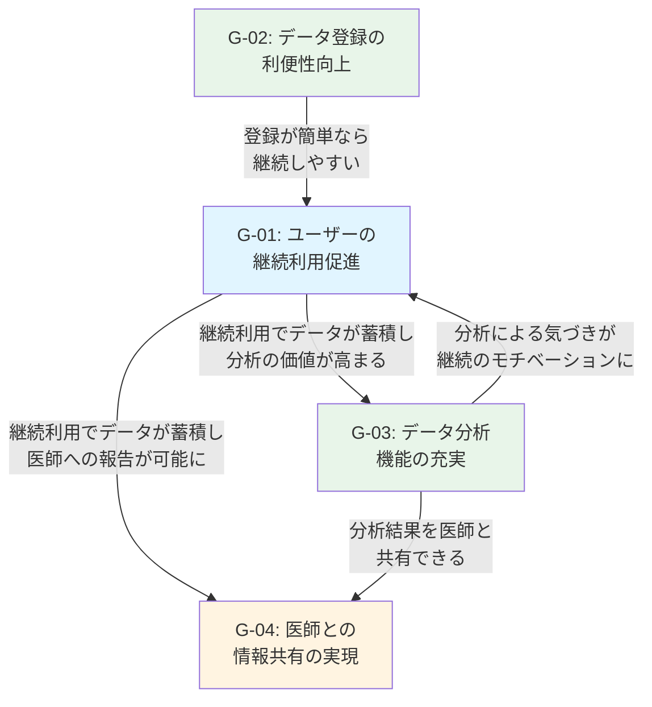

# 業務目標一覧 [ID:RDDD0103]

## 概要

本ドキュメントでは、個人ヘルスケアレコード(PHR)管理システムのシステム化により達成すべき業務目標を特定します。業務目標は、システム化された業務により経営または業務の価値を挙げることであり、達成すべき結果の状態です。

## 業務目標一覧表

| # | 業務目標 | 優先度 | KPI | 達成時期 | 関連するステークホルダ |
|------|------|------|------|------|------|
|G-01|顧客-01:ユーザーの継続利用促進|高|月次アクティブユーザー率 80%以上|サービス開始後6ヶ月|SH-01:システム利用者(個人ユーザー)|
|G-02|業務プロセス-01:データ登録の利便性向上|高|平均データ登録時間 30秒以内|サービス開始時点|SH-01:システム利用者(個人ユーザー)|
|G-03|業務プロセス-02:データ分析機能の充実|高|分析機能利用率 月1回以上の利用70%以上|サービス開始後3ヶ月|SH-01:システム利用者(個人ユーザー)|
|G-04|顧客-03:医師との情報共有の実現|中|データ出力機能利用率 年1回以上の利用50%以上|サービス開始後1年|SH-01:システム利用者(個人ユーザー), SH-02:かかりつけ医/医療従事者|

## 業務目標詳細

### G-01: 顧客-01:ユーザーの継続利用促進

#### 概要
システムの使いやすさとシンプルさを活かし、ユーザーが日々の健康情報を継続的に記録し続けることを促進します。既存ツールの「過剰機能」や「機能不足」という課題を解決することで、ユーザーが挫折せずに長期的に利用できることが目標です。

#### KPI
- **指標**: 月次アクティブユーザー率
- **目標値**: 80%以上
- **測定方法**: 登録ユーザーのうち、月に1回以上ログインし、データ登録を行ったユーザーの割合

#### 達成時期
サービス開始後6ヶ月

#### 関連するステークホルダ
- **SH-01:システム利用者(個人ユーザー)**: システムを継続的に利用し、健康情報を記録する主体

#### 優先度
**高**: システムの存在価値の根幹であり、継続利用がなければデータの蓄積も分析も意味をなさないため

#### システム化による実現方法
- シンプルで直感的なUI/UXの提供
- スマホ・PCの両方からアクセス可能なマルチデバイス対応
- データ登録の手間を最小化する設計
- 個人のニーズに合わせた柔軟なデータ項目設定

---

### G-02: 業務プロセス-01:データ登録の利便性向上

#### 概要
日々のデータ登録が短時間で完了できることで、ユーザーの継続利用の心理的ハードルを下げます。データ登録が面倒だとユーザーは使わなくなるため、登録作業の効率化は最重要課題です。

#### KPI
- **指標**: 平均データ登録時間
- **目標値**: 30秒以内
- **測定方法**: ユーザーが1回のデータ登録(例: 血圧、脈拍、体重の3項目を入力)に要する平均時間

#### 達成時期
サービス開始時点

#### 関連するステークホルダ
- **SH-01:システム利用者(個人ユーザー)**: データ登録を日常的に行う主体

#### 優先度
**高**: 利便性が低いと継続利用に直結するため、最初から実現すべき目標

#### システム化による実現方法
- 入力フォームの最適化(必要最小限の項目)
- データ入力の簡素化(数値入力のみ、デフォルト値の設定等)
- レスポンシブデザインによるモバイル最適化
- 過去データの自動補完やテンプレート機能

---

### G-03: 業務プロセス-02:データ分析機能の充実

#### 概要
蓄積された健康データから傾向を把握し、ユーザー自身や医師が健康状態を理解できるようにします。単なるデータ記録ではなく、分析による「気づき」がユーザーの継続利用のモチベーションとなります。

#### KPI
- **指標**: 分析機能利用率
- **目標値**: 月1回以上の利用70%以上
- **測定方法**: アクティブユーザーのうち、月に1回以上データ分析機能(統計値表示、グラフ表示等)を利用したユーザーの割合

#### 達成時期
サービス開始後3ヶ月

#### 関連するステークホルダ
- **SH-01:システム利用者(個人ユーザー)**: 自身の健康データの傾向を把握する主体

#### 優先度
**高**: データ登録だけでは価値が限定的であり、分析機能によってユーザーエンゲージメントを高めるため

#### システム化による実現方法
- 年月日範囲指定による統計値(最大・最小・平均)の表示
- 折れ線グラフによる視覚的な傾向表示
- 30日移動平均によるノイズ除去と傾向の明確化
- データ種類ごとの個別分析機能

---

### G-04: 顧客-03:医師との情報共有の実現

#### 概要
定期健診時にかかりつけ医へ健康データを効率的に報告できるようにします。これにより、医師は患者の日常的な健康状態を把握でき、より質の高い診療や健康指導が可能になります。

#### KPI
- **指標**: データ出力機能利用率
- **目標値**: 年1回以上の利用50%以上
- **測定方法**: アクティブユーザーのうち、年に1回以上データ出力機能(PDF、CSV等)を利用したユーザーの割合

#### 達成時期
サービス開始後1年

#### 関連するステークホルダ
- **SH-01:システム利用者(個人ユーザー)**: 健康データを医師に提供する主体
- **SH-02:かかりつけ医/医療従事者**: 患者の健康データを受け取り、診療や健康指導に活用する主体

#### 優先度
**中**: 重要な機能だが、年1回の利用頻度であり、データ登録と分析機能の充実が先決のため

#### システム化による実現方法
- 年月日範囲指定によるデータ出力機能(PDF、CSV等)
- 医師が読みやすいレポート形式の提供
- 統計値とグラフを含む包括的なサマリー
- プリント可能なフォーマット

---

## 業務目標の相互関係

## 業務目標達成のための戦略

### 短期戦略(サービス開始〜3ヶ月)
1. **G-02の達成**: データ登録の利便性を最優先で実現し、ユーザーの心理的ハードルを下げる
2. **G-03の達成**: 基本的な分析機能を提供し、ユーザーに「気づき」を与える

### 中期戦略(3ヶ月〜6ヶ月)
3. **G-01の達成**: 継続利用を促進し、月次アクティブユーザー率80%を達成する
4. **ユーザーフィードバック収集**: 継続的な改善のための情報を収集

### 長期戦略(6ヶ月〜1年)
5. **G-04の達成**: 医師との情報共有機能を充実させ、システムの価値提案を完成させる
6. **継続的改善**: ユーザーフィードバックに基づく機能改善

## まとめ

本システムは、4つの業務目標を段階的に達成することで、個人ヘルスケアレコード管理の価値を最大化します。

**最優先目標**は、**データ登録の利便性向上(G-02)**と**データ分析機能の充実(G-03)**です。これらが達成されなければ、ユーザーの継続利用(G-01)も医師との情報共有(G-04)も実現できません。

システム化の成功は、ユーザーが「使い続けたい」と思える体験を提供することにかかっています。
