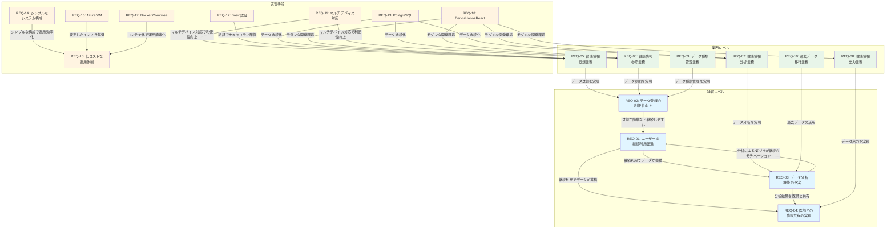

# 要求一覧 [ID:RDDD0301]

## 概要

本ドキュメントでは、個人ヘルスケアレコード(PHR)管理システムの要求を経営レベル、業務レベル、実現手段の3つのレベルに分類し、体系的に整理します。これらの要求は、ステークホルダ一覧(RDDD0102)および業務目標一覧(RDDD0103)を基に構造化されています。

## 要求一覧表

| # | 分類 | 表題 | 優先度 | 達成時期 |
|------|------|------|------|------|
|REQ-01|経営レベル|ユーザーの継続利用促進|高|サービス開始後6ヶ月|
|REQ-02|経営レベル|データ登録の利便性向上|高|サービス開始時点|
|REQ-03|経営レベル|データ分析機能の充実|高|サービス開始後3ヶ月|
|REQ-04|経営レベル|医師との情報共有の実現|中|サービス開始後1年|
|REQ-05|業務レベル|健康情報登録業務の実現|高|サービス開始時点|
|REQ-06|業務レベル|健康情報参照業務の実現|高|サービス開始時点|
|REQ-07|業務レベル|健康情報分析業務の実現|高|サービス開始後3ヶ月|
|REQ-08|業務レベル|健康情報出力業務の実現|中|サービス開始後1年|
|REQ-09|業務レベル|データ種類管理業務の実現|高|サービス開始時点|
|REQ-10|業務レベル|過去データ移行業務の実現|中|サービス開始時点|
|REQ-11|実現手段|マルチデバイス対応|高|サービス開始時点|
|REQ-12|実現手段|Basic認証の実装|高|サービス開始時点|
|REQ-13|実現手段|PostgreSQLによるデータ永続化|高|サービス開始時点|
|REQ-14|実現手段|シンプルなシステム構成|中|サービス開始時点|
|REQ-15|実現手段|低コストな運用体制|中|サービス開始時点|
|REQ-16|実現手段|Azure VMによるホスティング|中|サービス開始時点|
|REQ-17|実現手段|Docker Composeによるコンテナ管理|中|サービス開始時点|
|REQ-18|実現手段|Deno + Hono + Reactによる開発|中|サービス開始時点|

## 要求詳細

### 経営レベルの要求

#### REQ-01: ユーザーの継続利用促進

- **要求分類**: 経営レベル
- **内容**: システムの使いやすさとシンプルさを活かし、ユーザーが日々の健康情報を継続的に記録し続けることを促進する。既存ツールの「過剰機能」や「機能不足」という課題を解決することで、ユーザーが挫折せずに長期的に利用できることを目指す。
- **優先度**: 高
- **優先度に関する考察**:
  - 有効性: システムの存在価値の根幹であり、継続利用がなければデータの蓄積も分析も意味をなさない(★★★)
  - 必要性: システムの主目的であり必須(★★★)
  - 緊急性: サービス開始時から継続利用を促す必要がある(★★★)
  - 費用: 主にUI/UX設計の品質に依存し、追加コストは限定的(★★)
  - 実現性: 技術的に実現可能(★★★)
  - 新たな問題: 特になし
- **測定尺度**: 月次アクティブユーザー率
- **現状値**: 0%(新規サービス)
- **目標値**: 80%以上
- **達成時期**: サービス開始後6ヶ月
- **責任組織及び関連組織**:
  - 責任組織: 運営組織(企画・開発部門)
  - 関連組織: システム利用者(SH-01)

---

#### REQ-02: データ登録の利便性向上

- **要求分類**: 経営レベル
- **内容**: 日々のデータ登録が短時間で完了できることで、ユーザーの継続利用の心理的ハードルを下げる。データ登録が面倒だとユーザーは使わなくなるため、登録作業の効率化は最重要課題である。
- **優先度**: 高
- **優先度に関する考察**:
  - 有効性: 利便性が低いと継続利用(REQ-01)に直結するため、最初から実現すべき目標(★★★)
  - 必要性: システムの基本価値提供に必須(★★★)
  - 緊急性: サービス開始時点から必要(★★★)
  - 費用: UI/UX設計とフロントエンド実装のみで実現可能(★★)
  - 実現性: 技術的に実現可能(★★★)
  - 新たな問題: 特になし
- **測定尺度**: 平均データ登録時間
- **現状値**: 測定不可(新規サービス)
- **目標値**: 30秒以内
- **達成時期**: サービス開始時点
- **責任組織及び関連組織**:
  - 責任組織: 運営組織(開発部門)
  - 関連組織: システム利用者(SH-01)

---

#### REQ-03: データ分析機能の充実

- **要求分類**: 経営レベル
- **内容**: 蓄積された健康データから傾向を把握し、ユーザー自身や医師が健康状態を理解できるようにする。単なるデータ記録ではなく、分析による「気づき」がユーザーの継続利用のモチベーションとなる。
- **優先度**: 高
- **優先度に関する考察**:
  - 有効性: データ登録だけでは価値が限定的であり、分析機能によってユーザーエンゲージメントを高める(★★★)
  - 必要性: システムの差別化要因として重要(★★★)
  - 緊急性: サービス開始後3ヶ月以内に提供すべき(★★)
  - 費用: データ集計とグラフ描画のロジック実装が必要(★★)
  - 実現性: 技術的に実現可能(★★★)
  - 新たな問題: 特になし
- **測定尺度**: 分析機能利用率
- **現状値**: 0%(新規サービス)
- **目標値**: 月1回以上の利用70%以上
- **達成時期**: サービス開始後3ヶ月
- **責任組織及び関連組織**:
  - 責任組織: 運営組織(開発部門)
  - 関連組織: システム利用者(SH-01)

---

#### REQ-04: 医師との情報共有の実現

- **要求分類**: 経営レベル
- **内容**: 定期健診時にかかりつけ医へ健康データを効率的に報告できるようにする。これにより、医師は患者の日常的な健康状態を把握でき、より質の高い診療や健康指導が可能になる。
- **優先度**: 中
- **優先度に関する考察**:
  - 有効性: システムの主要な利用シーンであり、価値提案の重要な要素(★★★)
  - 必要性: システムの目的の一つである(★★★)
  - 緊急性: 年1回の利用頻度であり、データ登録と分析機能の充実が先決(★)
  - 費用: PDF/CSV出力機能の実装が必要(★★)
  - 実現性: 技術的に実現可能(★★★)
  - 新たな問題: 医療機関側のデータ受け入れ体制が必要
- **測定尺度**: データ出力機能利用率
- **現状値**: 0%(新規サービス)
- **目標値**: 年1回以上の利用50%以上
- **達成時期**: サービス開始後1年
- **責任組織及び関連組織**:
  - 責任組織: 運営組織(開発部門)
  - 関連組織: システム利用者(SH-01)、かかりつけ医/医療従事者(SH-02)

---

### 業務レベルの要求

#### REQ-05: 健康情報登録業務の実現

- **要求分類**: 業務レベル
- **内容**: ユーザーが日々の健康情報(血圧、脈拍、体重等)をスマホやPCから登録、変更、削除できる業務機能を提供する。
- **優先度**: 高
- **優先度に関する考察**:
  - 有効性: REQ-01(継続利用促進)、REQ-02(利便性向上)の達成に直結(★★★)
  - 必要性: システムの基本機能として必須(★★★)
  - 緊急性: サービス開始時点から必要(★★★)
  - 費用: CRUD機能の実装コスト(★★)
  - 実現性: 技術的に実現可能(★★★)
  - 新たな問題: 特になし
- **測定尺度**: データ登録成功率、登録操作完了時間
- **現状値**: 測定不可(新規サービス)
- **目標値**: 登録成功率99%以上、平均登録時間30秒以内
- **達成時期**: サービス開始時点
- **責任組織及び関連組織**:
  - 責任組織: 運営組織(開発部門)
  - 関連組織: システム利用者(SH-01)

---

#### REQ-06: 健康情報参照業務の実現

- **要求分類**: 業務レベル
- **内容**: ユーザーが過去に登録した健康情報を日付や期間を指定して参照できる業務機能を提供する。
- **優先度**: 高
- **優先度に関する考察**:
  - 有効性: REQ-01(継続利用促進)、REQ-03(分析機能)の基礎機能(★★★)
  - 必要性: データ確認のために必須(★★★)
  - 緊急性: サービス開始時点から必要(★★★)
  - 費用: データ取得と表示機能の実装コスト(★★)
  - 実現性: 技術的に実現可能(★★★)
  - 新たな問題: 特になし
- **測定尺度**: 参照機能の利用率、参照レスポンス時間
- **現状値**: 測定不可(新規サービス)
- **目標値**: 月次利用率90%以上、レスポンス1秒以内
- **達成時期**: サービス開始時点
- **責任組織及び関連組織**:
  - 責任組織: 運営組織(開発部門)
  - 関連組織: システム利用者(SH-01)

---

#### REQ-07: 健康情報分析業務の実現

- **要求分類**: 業務レベル
- **内容**: 蓄積された健康データから統計値(最大、最小、平均)を計算し、折れ線グラフおよび30日移動平均を描画する業務機能を提供する。
- **優先度**: 高
- **優先度に関する考察**:
  - 有効性: REQ-03(分析機能の充実)の達成に直結(★★★)
  - 必要性: ユーザーエンゲージメント向上に必須(★★★)
  - 緊急性: サービス開始後3ヶ月以内に提供すべき(★★)
  - 費用: データ集計とグラフ描画の実装コスト(★★)
  - 実現性: 技術的に実現可能(★★★)
  - 新たな問題: 特になし
- **測定尺度**: 分析機能利用率、分析機能満足度
- **現状値**: 測定不可(新規サービス)
- **目標値**: 月1回以上の利用70%以上
- **達成時期**: サービス開始後3ヶ月
- **責任組織及び関連組織**:
  - 責任組織: 運営組織(開発部門)
  - 関連組織: システム利用者(SH-01)

---

#### REQ-08: 健康情報出力業務の実現

- **要求分類**: 業務レベル
- **内容**: 指定期間の健康データをPDF、CSV等の形式で出力し、医療機関へ提供できる業務機能を提供する。
- **優先度**: 中
- **優先度に関する考察**:
  - 有効性: REQ-04(医師との情報共有)の達成に直結(★★★)
  - 必要性: システムの主要利用シーンの一つ(★★★)
  - 緊急性: 年1回の利用頻度であり、優先度は中程度(★)
  - 費用: PDF/CSV生成機能の実装コスト(★★)
  - 実現性: 技術的に実現可能(★★★)
  - 新たな問題: 医療機関側のデータ受け入れ体制が必要
- **測定尺度**: データ出力機能利用率
- **現状値**: 0%(新規サービス)
- **目標値**: 年1回以上の利用50%以上
- **達成時期**: サービス開始後1年
- **責任組織及び関連組織**:
  - 責任組織: 運営組織(開発部門)
  - 関連組織: システム利用者(SH-01)、かかりつけ医/医療従事者(SH-02)

---

#### REQ-09: データ種類管理業務の実現

- **要求分類**: 業務レベル
- **内容**: 血圧(上)、血圧(下)、脈拍、体重などのデータ種類をマスタデータとして設定・管理できる業務機能を提供する。
- **優先度**: 高
- **優先度に関する考察**:
  - 有効性: システムの柔軟性とカスタマイズ性を実現(★★★)
  - 必要性: 個人のニーズに合わせたデータ項目管理に必須(★★★)
  - 緊急性: サービス開始時点から必要(★★★)
  - 費用: マスタデータ管理機能の実装コスト(★★)
  - 実現性: 技術的に実現可能(★★★)
  - 新たな問題: 特になし
- **測定尺度**: マスタデータ管理機能の利用率
- **現状値**: 測定不可(新規サービス)
- **目標値**: 初期設定済み
- **達成時期**: サービス開始時点
- **責任組織及び関連組織**:
  - 責任組織: 運営組織(システム管理者SH-03)
  - 関連組織: システム利用者(SH-01)

---

#### REQ-10: 過去データ移行業務の実現

- **要求分類**: 業務レベル
- **内容**: 既存の3年分のデータをCSV形式から新システムへ移行する業務機能を提供する。
- **優先度**: 中
- **優先度に関する考察**:
  - 有効性: 既存データを活用できることで、初期からの分析が可能(★★)
  - 必要性: 既存ユーザーの継続利用に必要(★★★)
  - 緊急性: サービス開始時点で実施すべき(★★)
  - 費用: CSVインポート機能の実装コスト(★)
  - 実現性: 技術的に実現可能(★★★)
  - 新たな問題: データフォーマットの整合性確保が必要
- **測定尺度**: データ移行成功率
- **現状値**: 0%(新規サービス)
- **目標値**: 100%(全データ移行完了)
- **達成時期**: サービス開始時点
- **責任組織及び関連組織**:
  - 責任組織: 運営組織(開発部門、システム運用者SH-04)
  - 関連組織: システム利用者(SH-01)

---

### 実現手段に関する要求

#### REQ-11: マルチデバイス対応

- **要求分類**: 実現手段
- **内容**: スマートフォン、PC(Web)の両方からアクセス可能なレスポンシブWebアプリケーションを実現する。
- **優先度**: 高
- **優先度に関する考察**:
  - 有効性: REQ-02(利便性向上)、REQ-01(継続利用促進)の達成に直結(★★★)
  - 必要性: 日常的なデータ登録にはモバイル対応が必須(★★★)
  - 緊急性: サービス開始時点から必要(★★★)
  - 費用: レスポンシブデザインの実装コスト(★★)
  - 実現性: 技術的に実現可能(★★★)
  - 新たな問題: 特になし
- **測定尺度**: モバイルアクセス比率、デバイス別操作成功率
- **現状値**: 測定不可(新規サービス)
- **目標値**: モバイルアクセス70%以上、操作成功率99%以上
- **達成時期**: サービス開始時点
- **責任組織及び関連組織**:
  - 責任組織: 運営組織(開発部門)
  - 関連組織: なし

---

#### REQ-12: Basic認証の実装

- **要求分類**: 実現手段
- **内容**: システムへのアクセスにBasic認証を使用し、簡易的かつ安全な認証方式を実現する。
- **優先度**: 高
- **優先度に関する考察**:
  - 有効性: セキュリティとプライバシー保護の基礎(★★★)
  - 必要性: 個人の健康情報を保護するために必須(★★★)
  - 緊急性: サービス開始時点から必要(★★★)
  - 費用: Basic認証の実装コストは限定的(★★★)
  - 実現性: 技術的に実現可能(★★★)
  - 新たな問題: Basic認証の限界(HTTPS必須、パスワード管理等)
- **測定尺度**: 認証成功率、セキュリティインシデント発生件数
- **現状値**: 測定不可(新規サービス)
- **目標値**: 認証成功率99%以上、セキュリティインシデント0件
- **達成時期**: サービス開始時点
- **責任組織及び関連組織**:
  - 責任組織: 運営組織(システム管理者SH-03)
  - 関連組織: なし

---

#### REQ-13: PostgreSQLによるデータ永続化

- **要求分類**: 実現手段
- **内容**: 健康情報をPostgreSQLデータベースに永続化し、トランザクション管理とデータ整合性を保証する。
- **優先度**: 高
- **優先度に関する考察**:
  - 有効性: データの永続化と整合性はシステムの基盤(★★★)
  - 必要性: データ管理の基本要件(★★★)
  - 緊急性: サービス開始時点から必要(★★★)
  - 費用: PostgreSQLは無償で利用可能(★★★)
  - 実現性: 技術的に実現可能(★★★)
  - 新たな問題: バックアップと災害対策が必要
- **測定尺度**: データベース稼働率、データ整合性エラー発生件数
- **現状値**: 測定不可(新規サービス)
- **目標値**: 稼働率99.5%以上、整合性エラー0件
- **達成時期**: サービス開始時点
- **責任組織及び関連組織**:
  - 責任組織: 運営組織(システム運用者SH-04)
  - 関連組織: なし

---

#### REQ-14: シンプルなシステム構成

- **要求分類**: 実現手段
- **内容**: システム構成をシンプルに保ち、運用コストとメンテナンスコストを最小化する。
- **優先度**: 中
- **優先度に関する考察**:
  - 有効性: 運用コストの削減に貢献(★★)
  - 必要性: コスト最適化のために重要(★★)
  - 緊急性: システム設計時から考慮すべき(★★)
  - 費用: シンプルな構成によりコスト削減が可能(★★★)
  - 実現性: 技術的に実現可能(★★★)
  - 新たな問題: シンプルさと機能性のバランスが必要
- **測定尺度**: システムコンポーネント数、運用工数
- **現状値**: 測定不可(新規サービス)
- **目標値**: 必要最小限のコンポーネント構成
- **達成時期**: サービス開始時点
- **責任組織及び関連組織**:
  - 責任組織: 運営組織(システム管理者SH-03)
  - 関連組織: なし

---

#### REQ-15: 低コストな運用体制

- **要求分類**: 実現手段
- **内容**: クラウド側マネジメントツールなどの有償サービスを使わず、運用コストをユーザー1人あたり月額100円以下に抑える。
- **優先度**: 中
- **優先度に関する考察**:
  - 有効性: 持続可能なサービス提供に貢献(★★)
  - 必要性: ビジネスモデル(無償提供)の実現に必要(★★★)
  - 緊急性: サービス開始時点から考慮すべき(★★)
  - 費用: 低コスト運用が目標(★★★)
  - 実現性: Azure VMの適切なサイジングで実現可能(★★)
  - 新たな問題: 運用工数とコストのトレードオフ
- **測定尺度**: ユーザーあたり運用コスト
- **現状値**: 測定不可(新規サービス)
- **目標値**: 月額100円以下/ユーザー
- **達成時期**: サービス開始時点
- **責任組織及び関連組織**:
  - 責任組織: 運営組織(システム運用者SH-04)
  - 関連組織: なし

---

#### REQ-16: Azure VMによるホスティング

- **要求分類**: 実現手段
- **内容**: Azure仮想マシン上でシステムをホスティングし、安定したインフラ環境を実現する。
- **優先度**: 中
- **優先度に関する考察**:
  - 有効性: 安定したインフラ基盤の提供(★★)
  - 必要性: システム稼働の基盤として必要(★★★)
  - 緊急性: サービス開始時点から必要(★★★)
  - 費用: クラウドサービスのコストが発生(★★)
  - 実現性: 技術的に実現可能(★★★)
  - 新たな問題: クラウド障害時の対応が必要
- **測定尺度**: システム稼働率
- **現状値**: 測定不可(新規サービス)
- **目標値**: 99.5%以上
- **達成時期**: サービス開始時点
- **責任組織及び関連組織**:
  - 責任組織: 運営組織(システム運用者SH-04)
  - 関連組織: なし

---

#### REQ-17: Docker Composeによるコンテナ管理

- **要求分類**: 実現手段
- **内容**: Docker Composeを使用してアプリケーションとデータベースをコンテナ化し、デプロイと運用を簡素化する。
- **優先度**: 中
- **優先度に関する考察**:
  - 有効性: デプロイの自動化と運用の簡素化(★★)
  - 必要性: 効率的な運用のために重要(★★)
  - 緊急性: サービス開始時点から実装すべき(★★)
  - 費用: Docker Composeは無償で利用可能(★★★)
  - 実現性: 技術的に実現可能(★★★)
  - 新たな問題: コンテナ管理の運用ノウハウが必要
- **測定尺度**: デプロイ成功率、デプロイ所要時間
- **現状値**: 測定不可(新規サービス)
- **目標値**: デプロイ成功率99%以上、デプロイ時間10分以内
- **達成時期**: サービス開始時点
- **責任組織及び関連組織**:
  - 責任組織: 運営組織(システム運用者SH-04)
  - 関連組織: なし

---

#### REQ-18: Deno + Hono + Reactによる開発

- **要求分類**: 実現手段
- **内容**: Deno(TypeScript)をベースに、HonoフレームワークとReact UIライブラリを使用してアプリケーションを開発する。
- **優先度**: 中
- **優先度に関する考察**:
  - 有効性: モダンな開発環境による生産性向上(★★)
  - 必要性: 開発効率とメンテナンス性の向上に重要(★★)
  - 緊急性: サービス開始時点から実装すべき(★★)
  - 費用: Deno、Hono、Reactは無償で利用可能(★★★)
  - 実現性: 技術的に実現可能(★★★)
  - 新たな問題: Denoの運用実績が比較的少ない
- **測定尺度**: 開発生産性、バグ発生率
- **現状値**: 測定不可(新規サービス)
- **目標値**: 計画通りの開発スケジュール達成
- **達成時期**: サービス開始時点
- **責任組織及び関連組織**:
  - 責任組織: 運営組織(開発部門)
  - 関連組織: なし

---

## 要求間の関係図

## 要求の優先度別リスト

### 高優先度(サービス開始時点または6ヶ月以内)

#### 経営レベル
1. REQ-01: ユーザーの継続利用促進(サービス開始後6ヶ月)
2. REQ-02: データ登録の利便性向上(サービス開始時点)
3. REQ-03: データ分析機能の充実(サービス開始後3ヶ月)

#### 業務レベル
4. REQ-05: 健康情報登録業務の実現(サービス開始時点)
5. REQ-06: 健康情報参照業務の実現(サービス開始時点)
6. REQ-07: 健康情報分析業務の実現(サービス開始後3ヶ月)
7. REQ-09: データ種類管理業務の実現(サービス開始時点)

#### 実現手段
8. REQ-11: マルチデバイス対応(サービス開始時点)
9. REQ-12: Basic認証の実装(サービス開始時点)
10. REQ-13: PostgreSQLによるデータ永続化(サービス開始時点)

### 中優先度(サービス開始後1年以内)

#### 経営レベル
11. REQ-04: 医師との情報共有の実現(サービス開始後1年)

#### 業務レベル
12. REQ-08: 健康情報出力業務の実現(サービス開始後1年)
13. REQ-10: 過去データ移行業務の実現(サービス開始時点)

#### 実現手段
14. REQ-14: シンプルなシステム構成(サービス開始時点)
15. REQ-15: 低コストな運用体制(サービス開始時点)
16. REQ-16: Azure VMによるホスティング(サービス開始時点)
17. REQ-17: Docker Composeによるコンテナ管理(サービス開始時点)
18. REQ-18: Deno + Hono + Reactによる開発(サービス開始時点)

## 要求間の矛盾・重複・抜け漏れの検証

### 要求間の矛盾

検証の結果、以下の点について考慮が必要です:

1. **REQ-12(Basic認証)とREQ-02(利便性向上)の間のトレードオフ**
   - Basic認証は毎回のログイン時にID/パスワード入力が必要で、利便性に影響する可能性がある
   - **解決策**: HTTPS必須とし、ブラウザの認証情報保存機能を活用することで、利便性への影響を最小化する

2. **REQ-14(シンプルなシステム構成)とREQ-03(分析機能の充実)の間の緊張関係**
   - 高度な分析機能を実装するとシステムが複雑化する可能性がある
   - **解決策**: 段階的な機能追加により、初期はシンプルな統計値とグラフ表示に限定し、ユーザーフィードバックに基づいて拡張する

3. **REQ-15(低コスト運用)とREQ-16(Azure VM)の間のコスト制約**
   - Azure VMのコストが月額100円/ユーザーの目標を超える可能性がある
   - **人間への問い合わせ**: 想定ユーザー数とAzure VMのサイジング(CPU、メモリ、ストレージ)について確認が必要

### 要求間の重複

検証の結果、以下の重複が確認されました:

1. **REQ-02(データ登録の利便性向上)とREQ-05(健康情報登録業務)**
   - REQ-02は経営レベルの目標、REQ-05は業務レベルの実現手段であり、表裏一体の関係
   - **対応**: 重複ではなく階層的な関係として整理済み(問題なし)

2. **REQ-01(継続利用促進)と各業務要求(REQ-05〜REQ-08)**
   - REQ-01は各業務要求の総合的な結果として達成される
   - **対応**: 重複ではなく目標と手段の関係として整理済み(問題なし)

### 要求間の抜け漏れ

検証の結果、以下の点について検討が必要です:

1. **ユーザー管理機能の要求が明示されていない**
   - Basic認証(REQ-12)はあるが、ユーザー登録、パスワード変更、ユーザー削除等の要求が明示されていない
   - **人間への問い合わせ**: ユーザー管理機能の要求を追加すべきか確認が必要

2. **バックアップとリカバリーの要求が明示されていない**
   - PostgreSQL(REQ-13)はあるが、データバックアップと災害時のリカバリーに関する要求が明示されていない
   - **人間への問い合わせ**: バックアップとリカバリーの要求(RTO、RPO等)を追加すべきか確認が必要

3. **非機能要件(パフォーマンス、セキュリティ、可用性)が部分的にしか記載されていない**
   - レスポンス時間、同時接続数、セキュリティ監査、障害復旧時間等の明示的な要求が不足
   - **人間への問い合わせ**: 非機能要件を追加すべきか確認が必要

4. **ユーザーサポートとヘルプ機能の要求が明示されていない**
   - 問い合わせ対応、FAQ、操作マニュアル等の要求が不足
   - **人間への問い合わせ**: ユーザーサポート機能の要求を追加すべきか確認が必要

5. **データプライバシーとGDPR等の法的要件への対応が明示されていない**
   - 個人情報保護法、GDPR等への対応要求が不足
   - **人間への問い合わせ**: 法的要件への対応を追加すべきか確認が必要

## まとめ

本ドキュメントでは、個人ヘルスケアレコード(PHR)管理システムの要求を18項目にわたって体系化しました。

**経営レベル**では、ユーザーの継続利用促進を最優先目標とし、データ登録の利便性、分析機能の充実、医師との情報共有を段階的に実現します。

**業務レベル**では、健康情報の登録、参照、分析、出力の4つの主要業務と、データ種類管理、過去データ移行の2つの支援業務を定義しました。

**実現手段**では、マルチデバイス対応、Basic認証、PostgreSQL、Azure VM、Docker Compose、Deno+Hono+Reactといった技術スタックと、シンプルなシステム構成、低コストな運用体制を要求として明確化しました。

要求間の検証により、いくつかの矛盾、重複、抜け漏れが確認されましたが、多くは設計段階で解決可能です。ただし、以下の点については**人間への確認が必要**です:

1. 想定ユーザー数とAzure VMのサイジング(コスト試算)
2. ユーザー管理機能の要求追加の可否
3. バックアップとリカバリーの要求(RTO、RPO等)の追加の可否
4. 非機能要件(パフォーマンス、セキュリティ、可用性)の詳細化の可否
5. ユーザーサポート機能の要求追加の可否
6. データプライバシーと法的要件への対応の追加の可否

これらの確認を経て、要求の最終化を行うことを推奨します。
