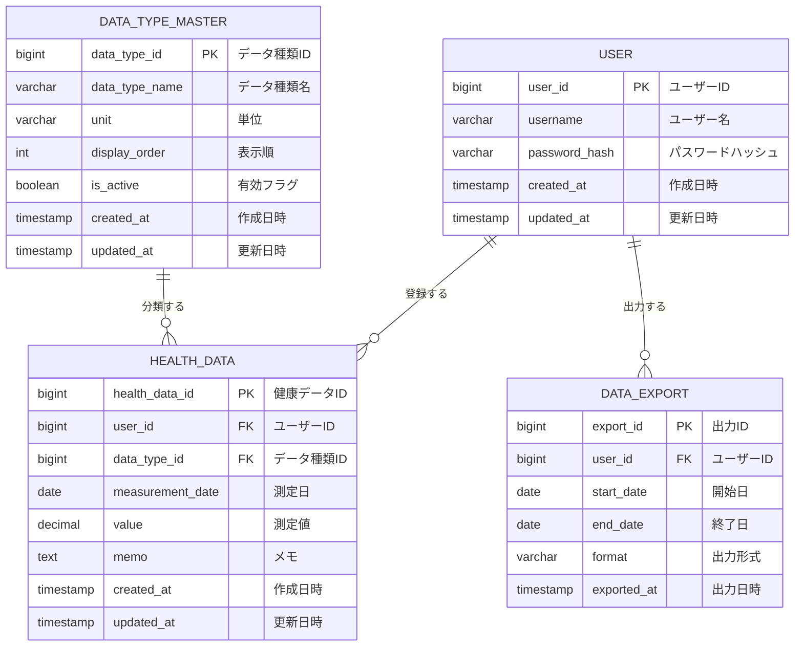

# 概念データモデル [ID:RDDD0401]

## 概要

本ドキュメントでは、個人ヘルスケアレコード(PHR)管理システムの概念データモデルを定義します。概念データモデルは、システムが管理する主要なエンティティとその関連性を明確にします。

---

## 概念データモデル図

---

## エンティティ詳細

### USER

#### エンティティの説明
USERエンティティは、システムを利用する個人ユーザーのアカウント情報を管理します。SH-01:システム利用者(個人ユーザー)に対応するエンティティです。

#### 他のエンティティとのリレーションの説明
- **HEALTH_DATA**: 1人のユーザーは0件以上の健康データを登録できます(1対多)
- **DATA_EXPORT**: 1人のユーザーは0件以上のデータ出力履歴を持ちます(1対多)

#### 作成のトリガー
- CBP-05-01(ユーザー登録): 新規ユーザーがシステムに登録した際に作成されます

#### 更新のトリガー
- CBP-05-02(パスワード変更): ユーザーがパスワードを変更した際にpassword_hashとupdated_atが更新されます

#### 削除のトリガー
- CBP-05-03(ユーザー削除): ユーザーまたはシステム管理者がアカウントを削除した際に削除されます
- 削除時には関連するHEALTH_DATAとDATA_EXPORTも自動的に削除されます(カスケード削除)

#### 参照する組織
- SH-01:システム利用者(個人ユーザー): 自身のアカウント情報を参照・管理
- SH-03:システム管理者: ユーザーアカウントの管理のために参照

---

### DATA_TYPE_MASTER

#### エンティティの説明
DATA_TYPE_MASTERエンティティは、血圧(上)、血圧(下)、脈拍、体重などのデータ種類をマスタデータとして管理します。ユーザーが登録する健康情報の分類基準を定義します。

#### 他のエンティティとのリレーションの説明
- **HEALTH_DATA**: 1つのデータ種類は0件以上の健康データに関連付けられます(1対多)

#### 作成のトリガー
- CBP-04-01(データ種類設定): システム管理者が新しいデータ種類を追加した際に作成されます

#### 更新のトリガー
- CBP-04-02(データ種類変更): システム管理者がデータ種類の名称、単位、表示順を変更した際に更新されます
- CBP-04-03(データ種類無効化): システム管理者がデータ種類を無効化した際にis_activeフラグが更新されます

#### 削除のトリガー
- 物理削除は行わず、論理削除(is_active=false)により無効化されます

#### 参照する組織
- SH-01:システム利用者(個人ユーザー): 健康情報登録時にデータ種類を選択するために参照
- SH-03:システム管理者: マスタデータの管理のために参照・更新

---

### HEALTH_DATA

#### エンティティの説明
HEALTH_DATAエンティティは、ユーザーが日々記録する健康情報(測定日、データ種類、測定値、メモ)を管理します。システムの中核的なデータエンティティです。

#### 他のエンティティとのリレーションの説明
- **USER**: 各健康データは1人のユーザーに所属します(多対1)
- **DATA_TYPE_MASTER**: 各健康データは1つのデータ種類に分類されます(多対1)

#### 作成のトリガー
- CBP-01-01(健康情報登録): ユーザーが新しい健康データを登録した際に作成されます
- CBP-06-01(過去データインポート): CSVファイルから過去データを一括インポートした際に作成されます

#### 更新のトリガー
- CBP-01-02(健康情報更新): ユーザーが既存の健康データの測定値やメモを変更した際に更新されます

#### 削除のトリガー
- CBP-01-03(健康情報削除): ユーザーが不要な健康データを削除した際に削除されます
- CBP-05-03(ユーザー削除): ユーザーアカウントが削除された際にカスケード削除されます

#### 参照する組織
- SH-01:システム利用者(個人ユーザー): 自身の健康データを参照・分析
- SH-02:かかりつけ医/医療従事者: ユーザーから提供されたデータ出力(PDF、CSV等)を通じて間接的に参照

---

### DATA_EXPORT

#### エンティティの説明
DATA_EXPORTエンティティは、ユーザーがデータ出力機能を利用した履歴を管理します。いつ、どの期間のデータを、どの形式で出力したかを記録します。

#### 他のエンティティとのリレーションの説明
- **USER**: 各データ出力履歴は1人のユーザーに所属します(多対1)

#### 作成のトリガー
- CBP-03-01(データ出力): ユーザーが健康データをPDF、CSV等の形式で出力した際に作成されます

#### 更新のトリガー
- 出力履歴は作成後に更新されません(不変データ)

#### 削除のトリガー
- CBP-05-03(ユーザー削除): ユーザーアカウントが削除された際にカスケード削除されます

#### 参照する組織
- SH-01:システム利用者(個人ユーザー): 自身の出力履歴を参照
- SH-03:システム管理者: システム利用状況の分析のために参照

---

## まとめ

本システムの概念データモデルは、4つの主要エンティティ(USER、DATA_TYPE_MASTER、HEALTH_DATA、DATA_EXPORT)で構成されています。

- **USER**: システム利用者のアカウント管理
- **DATA_TYPE_MASTER**: 健康データの分類基準の管理
- **HEALTH_DATA**: 日々の健康情報の記録・蓄積
- **DATA_EXPORT**: データ出力履歴の管理

これらのエンティティは、要求一覧(RDDD0301)および業務プロセス(RDDD0501、RDDD0502)と整合性を保ちつつ、システムのデータ構造を明確にしています。
