# データモデル [ID:RDDD0401]

## 概要

個人ヘルスケアレコード管理システム「sphr」の概念データモデルを定義し、システムで扱う主要なデータエンティティとその関係性を明確化する。

## 概念データモデル

以下のMermaid ER図により、システムの概念データモデルを示す。

```mermaid
erDiagram
    USER {
        string user_id PK "ユーザーID"
        string username "ユーザー名"
        string email "メールアドレス"
        string password_hash "パスワードハッシュ"
        date birth_date "生年月日"
        string gender "性別"
        timestamp created_at "作成日時"
        timestamp updated_at "更新日時"
        boolean is_active "アクティブ状態"
    }
    
    HEALTH_DATA_TYPE {
        string type_id PK "データ型ID"
        string type_name "データ型名"
        string unit "単位"
        string description "説明"
        boolean is_system_default "システム標準"
        boolean is_active "アクティブ状態"
    }
    
    HEALTH_RECORD {
        string record_id PK "レコードID"
        string user_id FK "ユーザーID"
        string type_id FK "データ型ID"
        decimal value "測定値"
        date measurement_date "測定日"
        time measurement_time "測定時刻"
        string notes "備考"
        timestamp created_at "作成日時"
        timestamp updated_at "更新日時"
        string created_by "作成者"
    }
    
    DATA_IMPORT_HISTORY {
        string import_id PK "インポートID"
        string user_id FK "ユーザーID"
        string filename "ファイル名"
        string file_format "ファイル形式"
        integer imported_records "インポート件数"
        integer failed_records "失敗件数"
        timestamp import_date "インポート日時"
        string status "ステータス"
        text error_log "エラーログ"
    }
    
    USER_PREFERENCE {
        string preference_id PK "設定ID"
        string user_id FK "ユーザーID"
        string preference_key "設定キー"
        string preference_value "設定値"
        timestamp created_at "作成日時"
        timestamp updated_at "更新日時"
    }
    
    PROXY_USER {
        string proxy_id PK "代理人ID"
        string user_id FK "ユーザーID"
        string proxy_user_id FK "代理ユーザーID"
        string relationship "関係性"
        json permissions "権限設定"
        date valid_from "有効期間開始"
        date valid_to "有効期間終了"
        boolean is_active "アクティブ状態"
        timestamp created_at "作成日時"
    }
    
    ANALYSIS_RESULT {
        string analysis_id PK "分析ID"
        string user_id FK "ユーザーID"
        string type_id FK "データ型ID"
        string analysis_type "分析種別"
        date period_start "分析期間開始"
        date period_end "分析期間終了"
        json result_data "分析結果"
        timestamp generated_at "生成日時"
    }
    
    EXPORT_HISTORY {
        string export_id PK "エクスポートID"
        string user_id FK "ユーザーID"
        string export_format "エクスポート形式"
        date period_start "期間開始"
        date period_end "期間終了"
        string file_path "ファイルパス"
        timestamp exported_at "エクスポート日時"
        string status "ステータス"
    }
    
    SESSION {
        string session_id PK "セッションID"
        string user_id FK "ユーザーID"
        timestamp login_time "ログイン時刻"
        timestamp last_access "最終アクセス"
        string ip_address "IPアドレス"
        string user_agent "ユーザーエージェント"
        boolean is_active "アクティブ状態"
    }
    
    AUDIT_LOG {
        string log_id PK "ログID"
        string user_id FK "ユーザーID"
        string action "アクション"
        string target_table "対象テーブル"
        string target_id "対象ID"
        json old_values "変更前値"
        json new_values "変更後値"
        timestamp timestamp "実行日時"
        string ip_address "IPアドレス"
    }

    %% リレーション定義
    USER ||--o{ HEALTH_RECORD : "記録する"
    USER ||--o{ DATA_IMPORT_HISTORY : "インポートする"
    USER ||--o{ USER_PREFERENCE : "設定する"
    USER ||--o{ PROXY_USER : "代理人として設定"
    USER ||--o{ ANALYSIS_RESULT : "分析する"
    USER ||--o{ EXPORT_HISTORY : "エクスポートする"
    USER ||--o{ SESSION : "ログインする"
    USER ||--o{ AUDIT_LOG : "操作する"
    
    HEALTH_DATA_TYPE ||--o{ HEALTH_RECORD : "分類する"
    HEALTH_DATA_TYPE ||--o{ ANALYSIS_RESULT : "分析対象"
    
    PROXY_USER }o--|| USER : "代理操作"
```

## エンティティ詳細定義

### ユーザー（USER）
個人健康記録システムの利用者を管理するマスターエンティティ。

**主要属性:**
- `user_id`: システム内でユーザーを一意に識別するプライマリキー
- `username`: ログイン用のユーザー名
- `email`: 連絡先兼ログイン用ID
- `password_hash`: セキュリティのためハッシュ化されたパスワード
- `birth_date`: 年齢計算、健康分析での参考情報
- `gender`: 健康基準値の性別差考慮

### 健康データ型（HEALTH_DATA_TYPE）
システムで取り扱う健康データの種別を定義するマスターエンティティ。

**主要属性:**
- `type_id`: データ型の一意識別子
- `type_name`: 血圧（収縮期）、血圧（拡張期）、脈拍、体重等
- `unit`: mmHg、bpm、kg等の測定単位
- `is_system_default`: システム標準提供のデータ型かカスタマイズ型か

### 健康記録（HEALTH_RECORD）
日々の健康データの実測値を記録するトランザクションエンティティ。

**主要属性:**
- `record_id`: 各レコードの一意識別子
- `user_id`: 記録者のユーザーID（外部キー）
- `type_id`: データ型（外部キー）
- `value`: 実測値（数値）
- `measurement_date/time`: 測定日時
- `created_by`: 本人入力 or 代理人入力かの識別

### データインポート履歴（DATA_IMPORT_HISTORY）
既存データの移行やファイルからの一括データ取込履歴を管理。

**主要属性:**
- `import_id`: インポート処理の一意識別子
- `filename`: 元ファイル名
- `file_format`: CSV、Excel等の形式
- `imported_records`: 成功件数
- `failed_records`: 失敗件数

### ユーザー設定（USER_PREFERENCE）
ユーザー毎のシステム設定を管理（キー・バリュー形式）。

**設定例:**
- `default_data_types`: 入力画面で表示するデフォルトデータ型
- `notification_settings`: 通知設定
- `display_preferences`: 画面表示設定

### 代理人（PROXY_USER）
家族や介護者等による代理操作を管理。

**主要属性:**
- `relationship`: 家族、介護者、医療関係者等
- `permissions`: 参照のみ、入力可能、エクスポート可能等の権限設定
- `valid_from/to`: 代理権限の有効期間

### 分析結果（ANALYSIS_RESULT）
統計分析やトレンド分析の結果をキャッシュとして保存。

**主要属性:**
- `analysis_type`: max/min/average、trend、moving_average等
- `period_start/end`: 分析対象期間
- `result_data`: JSON形式での分析結果

### エクスポート履歴（EXPORT_HISTORY）
データエクスポートの実行履歴を管理。

**主要属性:**
- `export_format`: PDF、CSV、JSON等
- `file_path`: 生成ファイルの保存場所
- `status`: 成功、失敗、処理中等

### セッション（SESSION）
ユーザーのログイン状態とセキュリティ監視を管理。

**主要属性:**
- `login_time`: ログイン時刻
- `last_access`: 最終アクセス時刻
- `ip_address`: アクセス元IP
- `user_agent`: ブラウザ情報

### 監査ログ（AUDIT_LOG）
全ての重要な操作履歴を記録してセキュリティとトレーサビリティを確保。

**主要属性:**
- `action`: CREATE、UPDATE、DELETE、LOGIN等
- `target_table`: 操作対象テーブル
- `old_values/new_values`: 変更前後の値（JSON形式）

## データ整合性制約

### 主要制約

1. **参照整合性制約**
   - 全外部キーは親テーブルに存在する値を参照
   - カスケード削除は慎重に設定（論理削除を基本とする）

2. **ビジネスルール制約**
   - `HEALTH_RECORD.value` は正数（体重、血圧等は負数になりえない）
   - `measurement_date` は未来日不可
   - `PROXY_USER.valid_to` は `valid_from` より後の日付

3. **セキュリティ制約**
   - パスワードは必ずハッシュ化して保存
   - セッション有効期限の自動管理
   - 監査ログの改ざん防止

## データライフサイクル

### データ保持期間

- **健康記録**: 無期限保持（ユーザー要求により削除可能）
- **セッション**: 30日間の非アクティブで自動削除
- **監査ログ**: 7年間保持（法的要件考慮）
- **分析結果**: 30日間キャッシュ後、必要に応じて再生成

### データ削除ポリシー

- **論理削除**: ユーザーデータは論理削除を基本とし、物理削除は特別な場合のみ
- **個人情報の完全削除**: ユーザーアカウント削除時は関連データを含めて完全削除

## 拡張性の考慮

### Phase 2以降での拡張

1. **医療機関連携**: 医療機関マスタ、連携履歴テーブルの追加
2. **代理人機能強化**: 代理人操作ログ、承認フロー等
3. **高度分析**: 機械学習モデル、予測結果テーブル等

### カスタマイズ対応

- `HEALTH_DATA_TYPE` により新しいデータ型を動的に追加可能
- `USER_PREFERENCE` によりユーザー固有設定を柔軟に管理

## まとめ

本概念データモデルは、個人健康記録システムの中核となるデータ構造を定義し、セキュリティ、拡張性、保守性を考慮した設計となっている。特にMVPで必要な基本機能から段階的な機能拡張まで対応可能な構造を提供する。