# 業務フロー及び業務機能詳細 [ID:RDDD0502]

## 概要

本ドキュメントでは、業務プロセス大分類・中分類(RDDD0501)に記載された各業務プロセス中分類について、業務フローと業務機能詳細を定義します。

---

## CBP-01: 健康情報管理

### CBP-01-01: 健康情報登録

#### 業務フロー

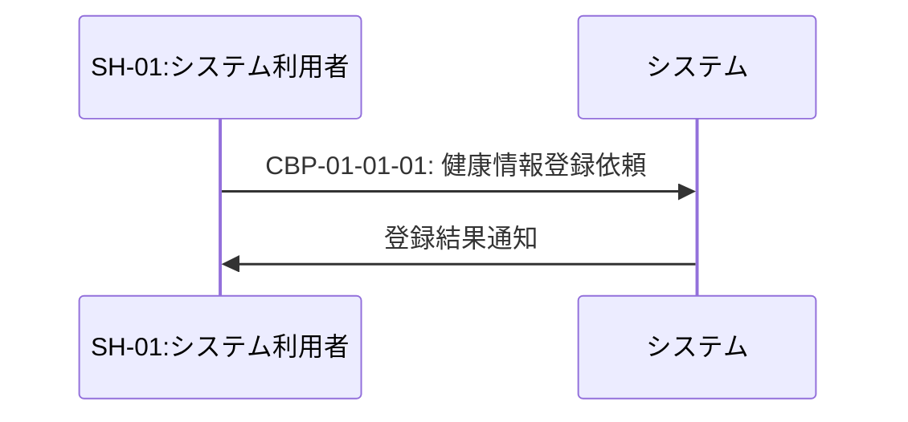

#### 業務機能詳細

##### CBP-01-01-01: 健康情報登録依頼

- **業務フロー番号**: CBP-01-01: 健康情報管理: 健康情報登録
- **アクター**: システム
- **説明**: ユーザーから受け取った健康情報(測定日、データ種類、測定値、メモ)を検証し、データベースに登録する業務処理
- **アクティビティのトリガー**: ユーザーが健康情報登録画面で測定日、データ種類、測定値を入力し、登録ボタンを押下
- **制約等**:
  - 測定日は過去日付または当日でなければならない
  - データ種類はDATA_TYPE_MASTERに登録されている有効なデータ種類でなければならない
  - 測定値は数値でなければならない
  - 同一ユーザー、同一測定日、同一データ種類の組み合わせは一意でなければならない

---

### CBP-01-02: 健康情報更新

#### 業務フロー

#### 業務機能詳細

##### CBP-01-02-01: 健康情報変更依頼

- **業務フロー番号**: CBP-01-02: 健康情報管理: 健康情報更新
- **アクター**: システム
- **説明**: ユーザーが選択した既存の健康情報の測定値またはメモを変更し、データベースに反映する業務処理
- **アクティビティのトリガー**: ユーザーが健康情報編集画面で測定値またはメモを変更し、保存ボタンを押下
- **制約等**:
  - 更新対象の健康情報は自身が所有するものでなければならない
  - 測定値は数値でなければならない

---

### CBP-01-03: 健康情報削除

#### 業務フロー

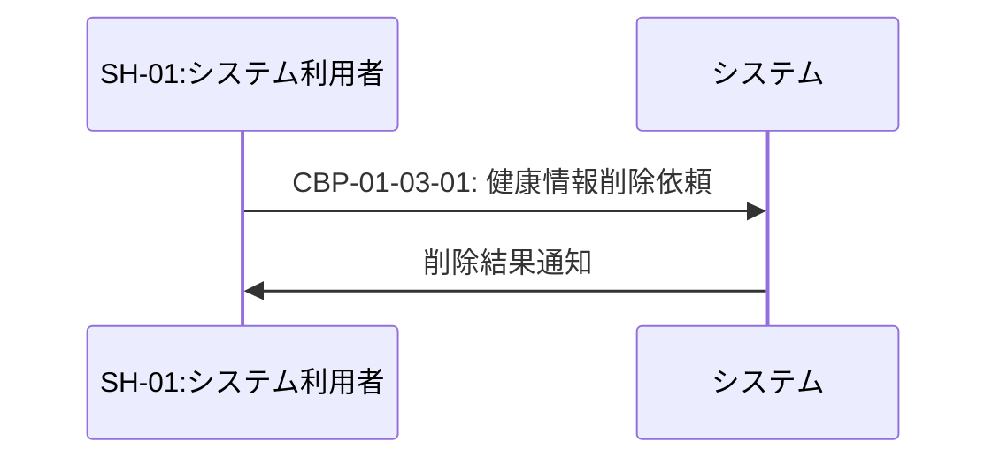

#### 業務機能詳細

##### CBP-01-03-01: 健康情報削除依頼

- **業務フロー番号**: CBP-01-03: 健康情報管理: 健康情報削除
- **アクター**: システム
- **説明**: ユーザーが選択した健康情報をデータベースから削除する業務処理
- **アクティビティのトリガー**: ユーザーが健康情報一覧画面で削除対象を選択し、削除確認後に削除ボタンを押下
- **制約等**:
  - 削除対象の健康情報は自身が所有するものでなければならない
  - 削除は物理削除であり、復元できない

---

### CBP-01-04: 健康情報参照

#### 業務フロー

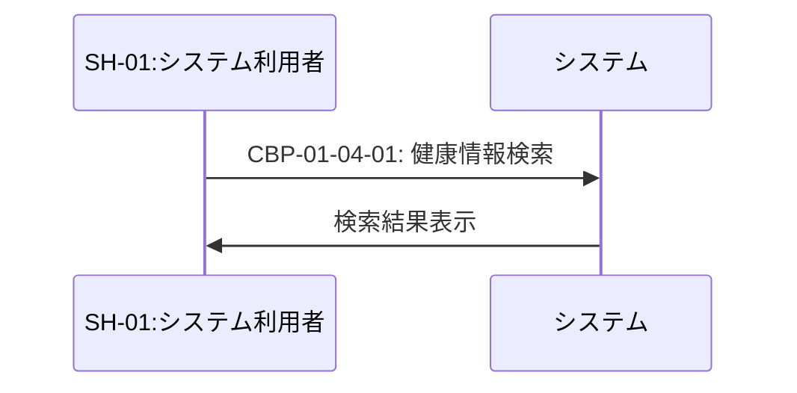

#### 業務機能詳細

##### CBP-01-04-01: 健康情報検索

- **業務フロー番号**: CBP-01-04: 健康情報管理: 健康情報参照
- **アクター**: システム
- **説明**: ユーザーが指定した検索条件(期間、データ種類)に基づいて健康情報を検索し、一覧形式で表示する業務処理
- **アクティビティのトリガー**: ユーザーが健康情報参照画面で検索条件(開始日、終了日、データ種類)を指定し、検索ボタンを押下
- **制約等**:
  - 開始日は終了日以前でなければならない
  - 検索結果は自身が所有する健康情報のみを対象とする
  - 検索結果は測定日の降順で表示する

---

## CBP-02: 健康情報分析

### CBP-02-01: 統計値分析

#### 業務フロー

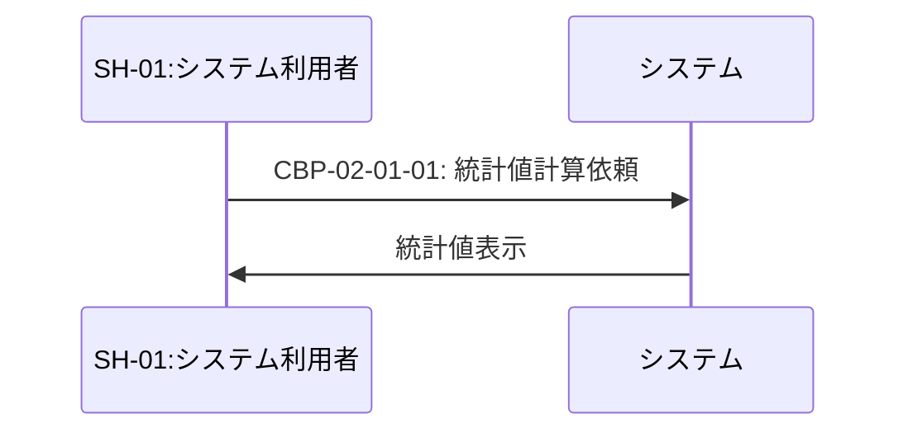

#### 業務機能詳細

##### CBP-02-01-01: 統計値計算依頼

- **業務フロー番号**: CBP-02-01: 健康情報分析: 統計値分析
- **アクター**: システム
- **説明**: 指定期間・データ種類の健康データから最大値、最小値、平均値を計算し、表示する業務処理
- **アクティビティのトリガー**: ユーザーが分析画面で期間とデータ種類を指定し、統計値計算ボタンを押下
- **制約等**:
  - 開始日は終了日以前でなければならない
  - データ種類はDATA_TYPE_MASTERに登録されている有効なデータ種類でなければならない
  - 対象データが0件の場合は統計値を計算しない

---

### CBP-02-02: グラフ分析

#### 業務フロー

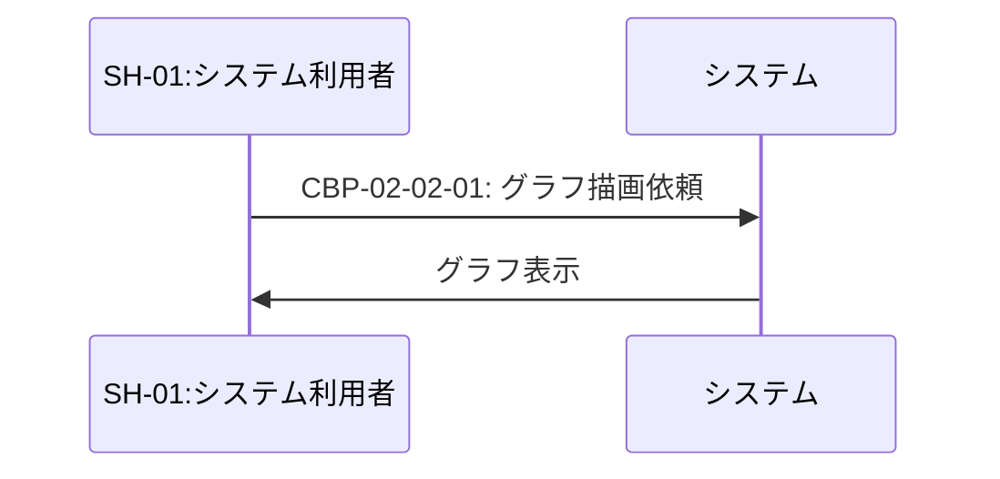

#### 業務機能詳細

##### CBP-02-02-01: グラフ描画依頼

- **業務フロー番号**: CBP-02-02: 健康情報分析: グラフ分析
- **アクター**: システム
- **説明**: 指定期間・データ種類の健康データを折れ線グラフで視覚化し、傾向を表示する業務処理
- **アクティビティのトリガー**: ユーザーが分析画面で期間とデータ種類を指定し、グラフ表示ボタンを押下
- **制約等**:
  - 開始日は終了日以前でなければならない
  - データ種類はDATA_TYPE_MASTERに登録されている有効なデータ種類でなければならない
  - 対象データが0件の場合はグラフを描画しない

---

### CBP-02-03: 移動平均分析

#### 業務フロー

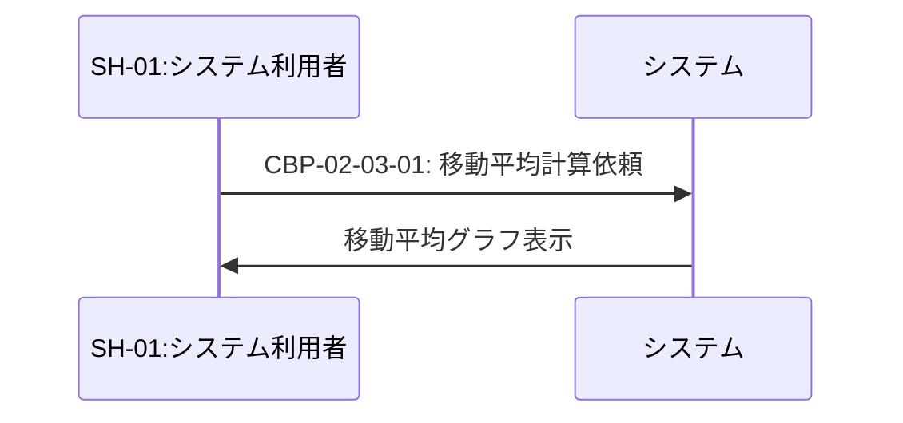

#### 業務機能詳細

##### CBP-02-03-01: 移動平均計算依頼

- **業務フロー番号**: CBP-02-03: 健康情報分析: 移動平均分析
- **アクター**: システム
- **説明**: 指定期間・データ種類の健康データから30日移動平均を計算し、折れ線グラフで表示する業務処理
- **アクティビティのトリガー**: ユーザーが分析画面で期間とデータ種類を指定し、移動平均表示ボタンを押下
- **制約等**:
  - 開始日は終了日以前でなければならない
  - データ種類はDATA_TYPE_MASTERに登録されている有効なデータ種類でなければならない
  - 対象データが30件未満の場合は移動平均を計算しない
  - 移動平均は直近30日間のデータの平均値とする

---

## CBP-03: 健康情報共有

### CBP-03-01: データ出力

#### 業務フロー

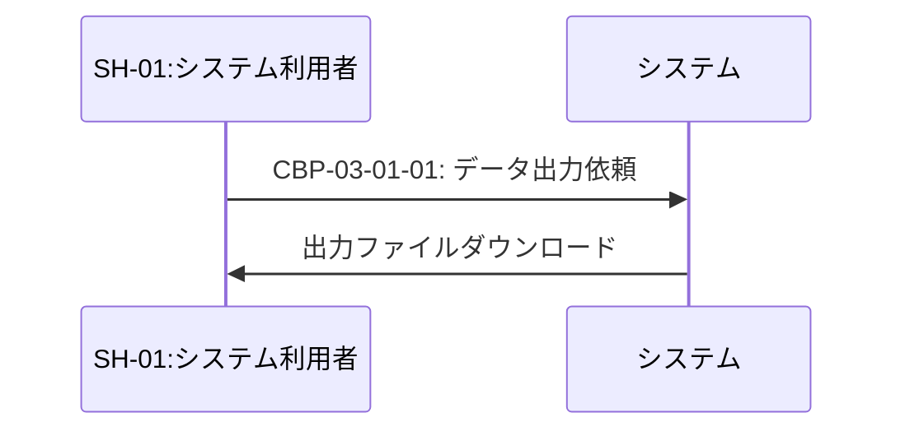

#### 業務機能詳細

##### CBP-03-01-01: データ出力依頼

- **業務フロー番号**: CBP-03-01: 健康情報共有: データ出力
- **アクター**: システム
- **説明**: 指定期間の健康データを指定形式(PDF、CSV等)で出力し、ダウンロード可能にする業務処理
- **アクティビティのトリガー**: ユーザーがデータ出力画面で期間と出力形式を指定し、出力ボタンを押下
- **制約等**:
  - 開始日は終了日以前でなければならない
  - 出力形式はPDFまたはCSVでなければならない
  - 出力履歴をDATA_EXPORTテーブルに記録する

---

### CBP-03-02: 医師への提供

#### 業務フロー

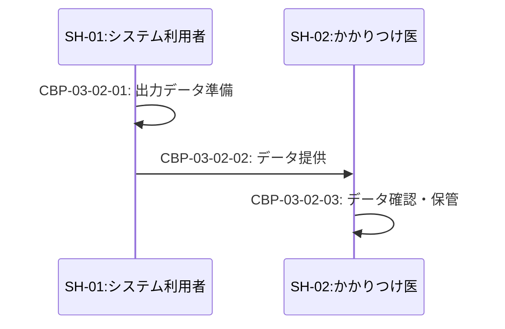

#### 業務機能詳細

##### CBP-03-02-01: 出力データ準備

- **業務フロー番号**: CBP-03-02: 健康情報共有: 医師への提供
- **アクター**: SH-01:システム利用者
- **説明**: 出力した健康データファイルを印刷またはメール添付用に準備する業務処理
- **アクティビティのトリガー**: ユーザーがダウンロードした出力ファイルを確認し、医師への提供を決定
- **補足**: システム外の業務処理(印刷、メール準備等)

##### CBP-03-02-02: データ提供

- **業務フロー番号**: CBP-03-02: 健康情報共有: 医師への提供
- **アクター**: SH-01:システム利用者
- **説明**: 準備した健康データを医療機関へ提供する業務処理(手渡し、メール送信、郵送等)
- **アクティビティのトリガー**: 医療機関への訪問時またはメール送信時
- **補足**: システム外の業務処理

##### CBP-03-02-03: データ確認・保管

- **業務フロー番号**: CBP-03-02: 健康情報共有: 医師への提供
- **アクター**: SH-02:かかりつけ医
- **説明**: 患者から提供された健康データを確認し、診療記録として保管する業務処理
- **アクティビティのトリガー**: 患者から健康データを受領
- **補足**: システム外の業務処理

---

## CBP-04: マスタデータ管理

### CBP-04-01: データ種類設定

#### 業務フロー

#### 業務機能詳細

##### CBP-04-01-01: データ種類登録依頼

- **業務フロー番号**: CBP-04-01: マスタデータ管理: データ種類設定
- **アクター**: システム
- **説明**: システム管理者から受け取った新しいデータ種類の情報(名称、単位、表示順)を検証し、DATA_TYPE_MASTERに登録する業務処理
- **アクティビティのトリガー**: システム管理者がマスタデータ管理画面でデータ種類情報を入力し、登録ボタンを押下
- **制約等**:
  - データ種類名は一意でなければならない
  - 表示順は1以上の整数でなければならない

---

### CBP-04-02: データ種類変更

#### 業務フロー

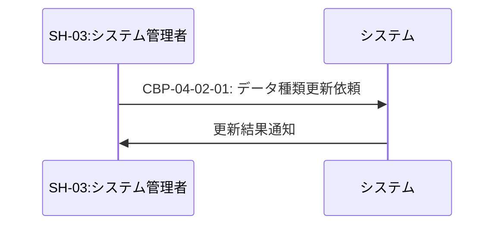

#### 業務機能詳細

##### CBP-04-02-01: データ種類更新依頼

- **業務フロー番号**: CBP-04-02: マスタデータ管理: データ種類変更
- **アクター**: システム
- **説明**: システム管理者が選択した既存のデータ種類の名称、単位、表示順を変更し、DATA_TYPE_MASTERに反映する業務処理
- **アクティビティのトリガー**: システム管理者がマスタデータ編集画面でデータ種類情報を変更し、保存ボタンを押下
- **制約等**:
  - データ種類名は一意でなければならない
  - 表示順は1以上の整数でなければならない

---

### CBP-04-03: データ種類無効化

#### 業務フロー

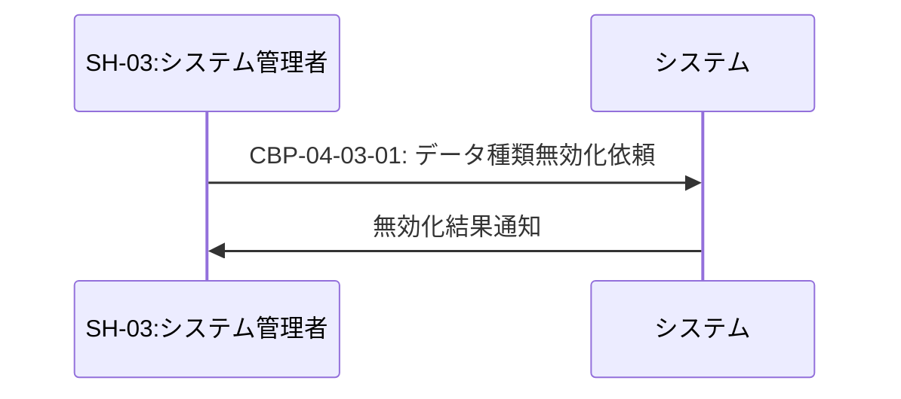

#### 業務機能詳細

##### CBP-04-03-01: データ種類無効化依頼

- **業務フロー番号**: CBP-04-03: マスタデータ管理: データ種類無効化
- **アクター**: システム
- **説明**: システム管理者が選択したデータ種類のis_activeフラグをfalseに設定し、論理削除する業務処理
- **アクティビティのトリガー**: システム管理者がマスタデータ管理画面で無効化対象を選択し、無効化確認後に無効化ボタンを押下
- **制約等**:
  - 物理削除は行わず、論理削除(is_active=false)のみ
  - 無効化されたデータ種類は新規登録時の選択肢に表示されない

---

## CBP-05: ユーザー管理

### CBP-05-01: ユーザー登録

#### 業務フロー

#### 業務機能詳細

##### CBP-05-01-01: ユーザー登録依頼

- **業務フロー番号**: CBP-05-01: ユーザー管理: ユーザー登録
- **アクター**: システム
- **説明**: 新規ユーザーから受け取ったユーザー名とパスワードを検証し、パスワードをハッシュ化してUSERテーブルに登録する業務処理
- **アクティビティのトリガー**: 新規ユーザーが登録画面でユーザー名とパスワードを入力し、登録ボタンを押下
- **制約等**:
  - ユーザー名は一意でなければならない
  - パスワードは8文字以上でなければならない
  - パスワードはハッシュ化して保存する

---

### CBP-05-02: パスワード変更

#### 業務フロー

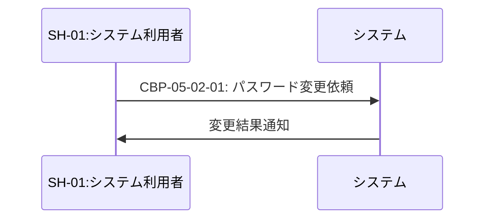

#### 業務機能詳細

##### CBP-05-02-01: パスワード変更依頼

- **業務フロー番号**: CBP-05-02: ユーザー管理: パスワード変更
- **アクター**: システム
- **説明**: ユーザーから受け取った現在のパスワードと新しいパスワードを検証し、新しいパスワードをハッシュ化してUSERテーブルを更新する業務処理
- **アクティビティのトリガー**: ユーザーがパスワード変更画面で現在のパスワードと新しいパスワードを入力し、変更ボタンを押下
- **制約等**:
  - 現在のパスワードが正しいことを確認する
  - 新しいパスワードは8文字以上でなければならない
  - 新しいパスワードはハッシュ化して保存する

---

### CBP-05-03: ユーザー削除

#### 業務フロー

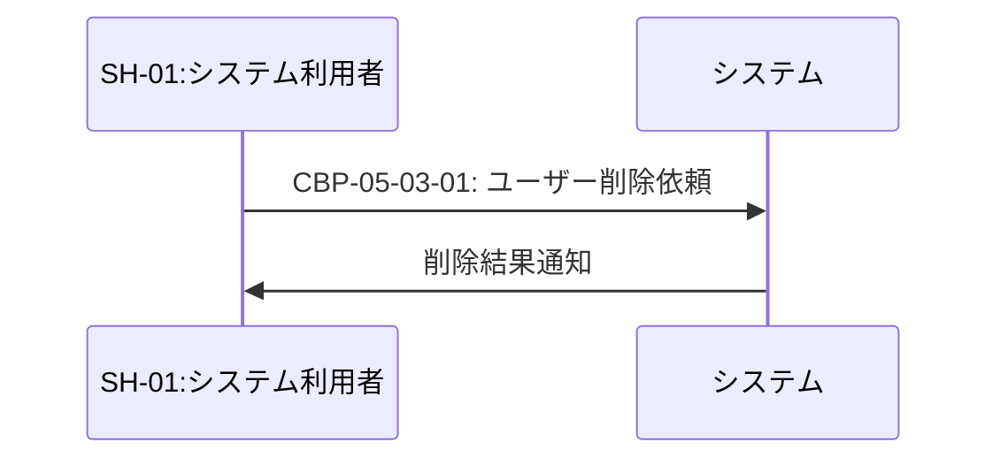

#### 業務機能詳細

##### CBP-05-03-01: ユーザー削除依頼

- **業務フロー番号**: CBP-05-03: ユーザー管理: ユーザー削除
- **アクター**: システム
- **説明**: ユーザーアカウントをUSERテーブルから削除し、関連するHEALTH_DATAとDATA_EXPORTをカスケード削除する業務処理
- **アクティビティのトリガー**: ユーザーがユーザー削除画面で削除確認を経て削除ボタンを押下
- **制約等**:
  - 削除対象は自身のアカウントでなければならない
  - USERの削除時にHEALTH_DATAとDATA_EXPORTをカスケード削除する
  - 削除は物理削除であり、復元できない

---

## CBP-06: データ移行

### CBP-06-01: 過去データインポート

#### 業務フロー

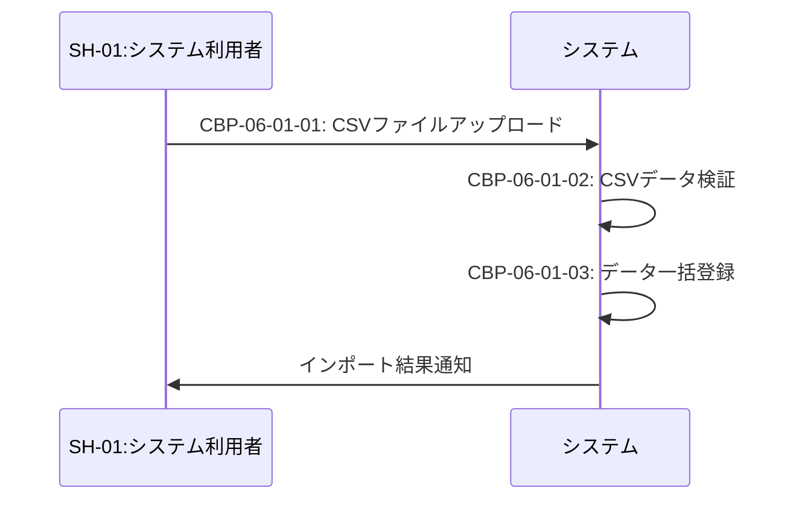

#### 業務機能詳細

##### CBP-06-01-01: CSVファイルアップロード

- **業務フロー番号**: CBP-06-01: データ移行: 過去データインポート
- **アクター**: システム
- **説明**: ユーザーからアップロードされたCSVファイルを受信し、一時保存する業務処理
- **アクティビティのトリガー**: ユーザーがデータインポート画面でCSVファイルを選択し、アップロードボタンを押下
- **制約等**:
  - ファイル形式はCSVでなければならない
  - ファイルサイズは10MB以下でなければならない

##### CBP-06-01-02: CSVデータ検証

- **業務フロー番号**: CBP-06-01: データ移行: 過去データインポート
- **アクター**: システム
- **説明**: アップロードされたCSVファイルのデータフォーマット、データ種類、測定値の妥当性を検証する業務処理
- **アクティビティのトリガー**: CSVファイルのアップロードが完了
- **制約等**:
  - CSVのカラムは「測定日,データ種類,測定値,メモ」の順でなければならない
  - 測定日は日付形式(YYYY-MM-DD)でなければならない
  - データ種類はDATA_TYPE_MASTERに登録されている有効なデータ種類でなければならない
  - 測定値は数値でなければならない
  - エラーがある行はインポート対象から除外し、エラー一覧を作成する

##### CBP-06-01-03: データ一括登録

- **業務フロー番号**: CBP-06-01: データ移行: 過去データインポート
- **アクター**: システム
- **説明**: 検証済みのCSVデータをHEALTH_DATAテーブルに一括登録する業務処理
- **アクティビティのトリガー**: CSVデータの検証が完了
- **制約等**:
  - 同一ユーザー、同一測定日、同一データ種類の組み合わせが既に存在する場合は上書き更新する
  - 登録件数とエラー件数を集計し、結果を通知する

---

## まとめ

本ドキュメントでは、6つの業務プロセス大分類(CBP-01〜CBP-06)に含まれる16個の業務プロセス中分類について、業務フローと業務機能詳細を定義しました。

### 業務フロー数
- CBP-01: 健康情報管理 - 4業務フロー
- CBP-02: 健康情報分析 - 3業務フロー
- CBP-03: 健康情報共有 - 2業務フロー
- CBP-04: マスタデータ管理 - 3業務フロー
- CBP-05: ユーザー管理 - 3業務フロー
- CBP-06: データ移行 - 1業務フロー

### 業務機能数
合計22個の業務機能(アクティビティ)を定義しました。

すべての業務フローは要求一覧(RDDD0301)および業務プロセス大分類・中分類(RDDD0501)と整合性を保っています。
