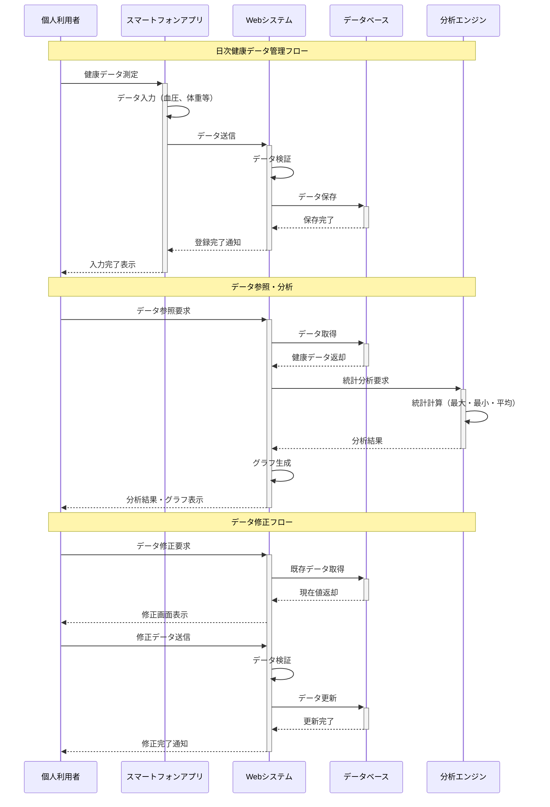
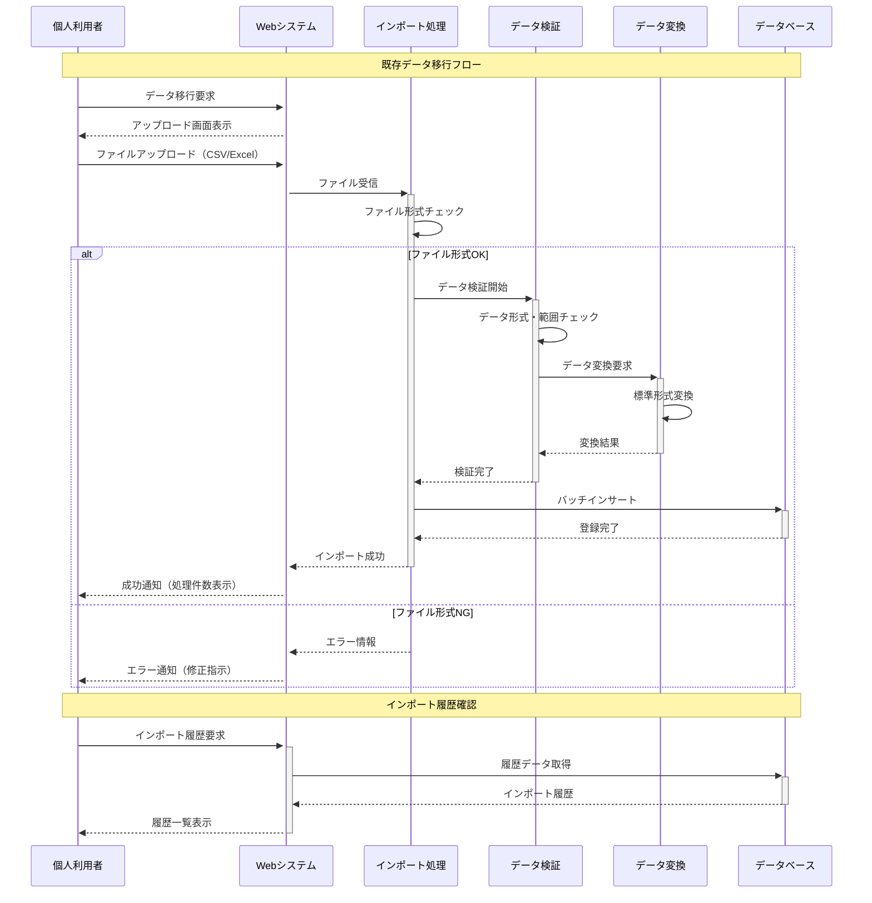
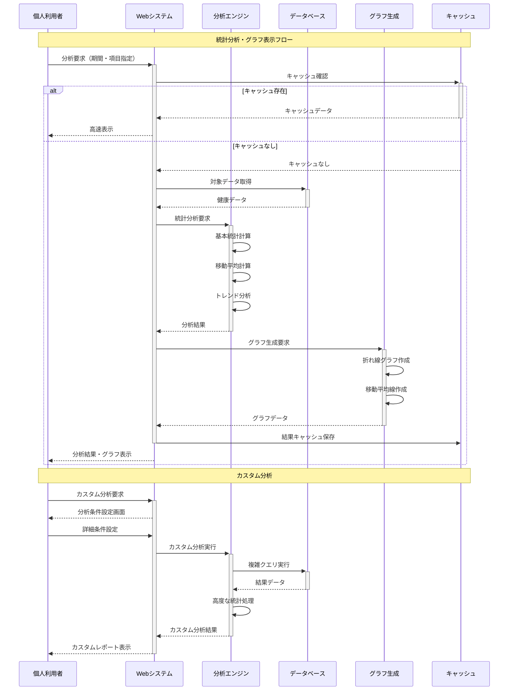
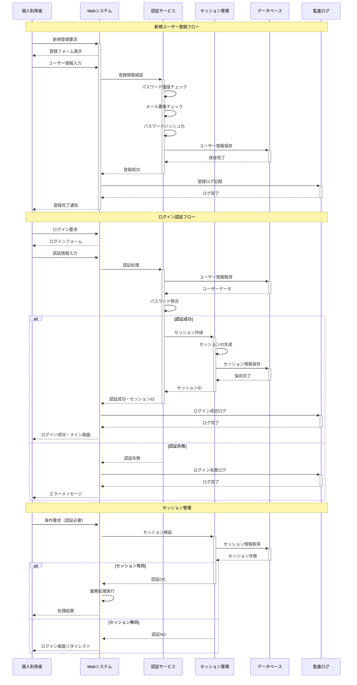

# 業務フロー [ID:RDDD0502]

## 概要

個人ヘルスケアレコード管理システム「sphr」の主要業務プロセスについて、To-Be業務フローをMermaidシーケンス図で表現し、新たなビジネスの流れを明確化する。

## 主要業務フロー

### WF001: 健康データ管理フロー

日々の健康データ入力から分析まての基本的な業務フローを示す。

### WF002: データ移行・インポートフロー

既存の健康データを本システムに移行するための業務フローを示す。

### WF003: 統計分析・可視化フロー

健康データの分析とグラフ表示のための業務フローを示す。

### WF004: ユーザー認証・セッション管理フロー

セキュアなユーザー認証とセッション管理の業務フローを示す。

## 業務フローの特徴と改善点

### 現状（As-Is）との比較

#### 従来の問題点
- **データ入力**: 複数アプリでの分散入力、操作の複雑さ
- **データ分析**: 限定的な分析機能、視覚化の不足
- **データ共有**: 手作業でのデータ収集、非効率な情報伝達

#### 改善後（To-Be）の特徴
- **統合管理**: 単一プラットフォームでの一元管理
- **自動化**: データ検証、統計計算の自動化
- **視覚化**: 直感的なグラフ表示、トレンド分析
- **セキュリティ**: 多層防御による安全な認証・セッション管理

### フロー最適化のポイント

#### 効率化要素
1. **キャッシュ活用**: 分析結果の高速表示
2. **バッチ処理**: 大量データの効率的な移行
3. **非同期処理**: ユーザビリティを損なわない処理
4. **自動検証**: 人的エラーの削減

#### ユーザビリティ向上
1. **レスポンシブ対応**: マルチデバイスでの一貫した操作性
2. **プログレス表示**: 処理状況の可視化
3. **エラーハンドリング**: 明確なエラーメッセージとリカバリ手順
4. **直感的UI**: 最小限のクリック数での目的達成

## Phase別実装計画

### Phase 1 (MVP): 基本フロー
- **WF001**: 健康データ管理フロー（基本機能）
- **WF002**: データ移行・インポートフロー
- **WF003**: 統計分析・可視化フロー（基本統計）
- **WF004**: ユーザー認証・セッション管理フロー

### Phase 2: 機能拡張
- 医療機関連携フロー
- データエクスポートフロー
- 高度な分析フロー

### Phase 3: 高度化
- 代理人操作フロー
- 承認ワークフロー
- 機械学習分析フロー

## エラー処理とリカバリ

### 主要なエラーパターン
1. **データ入力エラー**: 範囲外値、形式不正
2. **システムエラー**: DB接続エラー、処理タイムアウト
3. **認証エラー**: セッション期限切れ、権限不足
4. **ファイルエラー**: 形式不正、サイズ超過

### リカバリ手順
1. **自動復旧**: セッション再作成、処理リトライ
2. **ユーザー対応**: 明確なエラーメッセージ、修正手順案内
3. **管理者対応**: システム監視、手動復旧処理
4. **データ保護**: トランザクション管理、バックアップ復旧

## まとめ

4つの主要業務フローにより、個人健康記録管理システムの新しいビジネスプロセスを明確化した。各フローは相互に連携し、従来の課題を解決しつつ、ユーザビリティとセキュリティを両立する設計となっている。特に、データ管理から分析・可視化までの一連のフローが統合されることで、個人の健康管理体験が大幅に向上する。