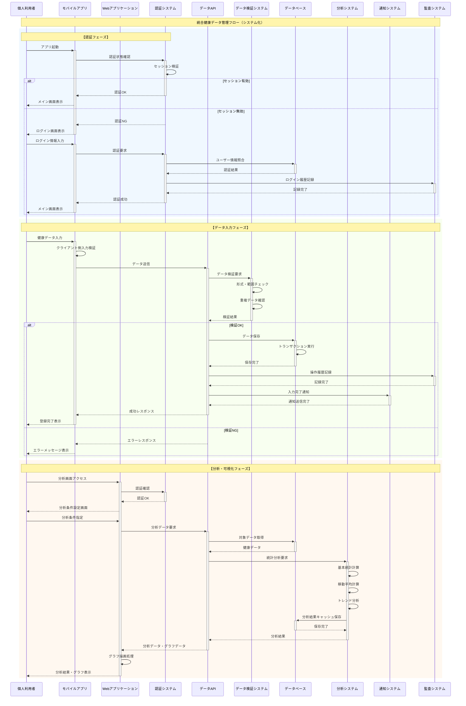
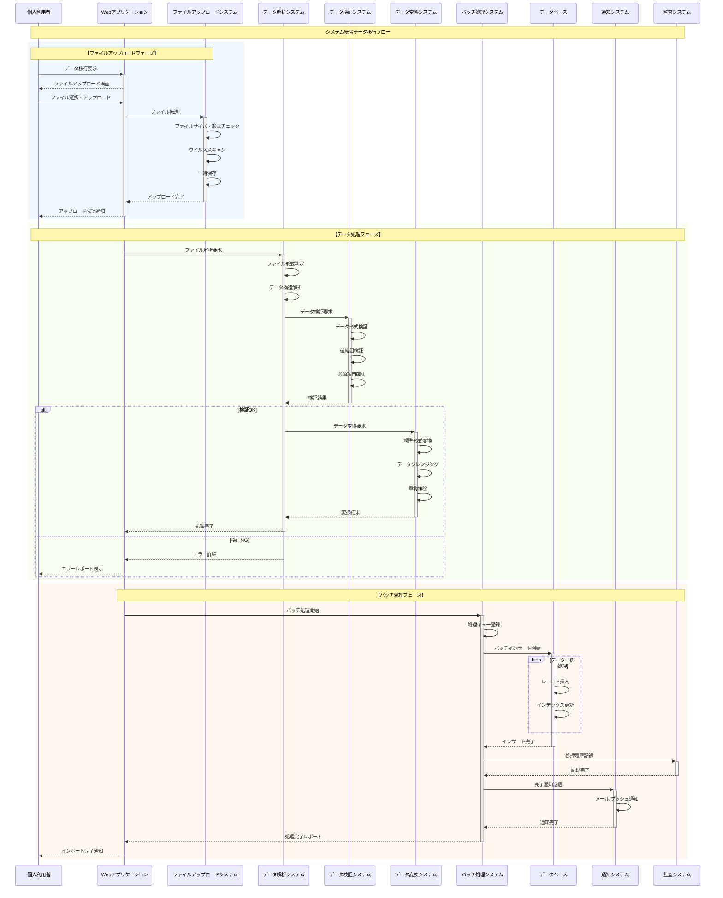
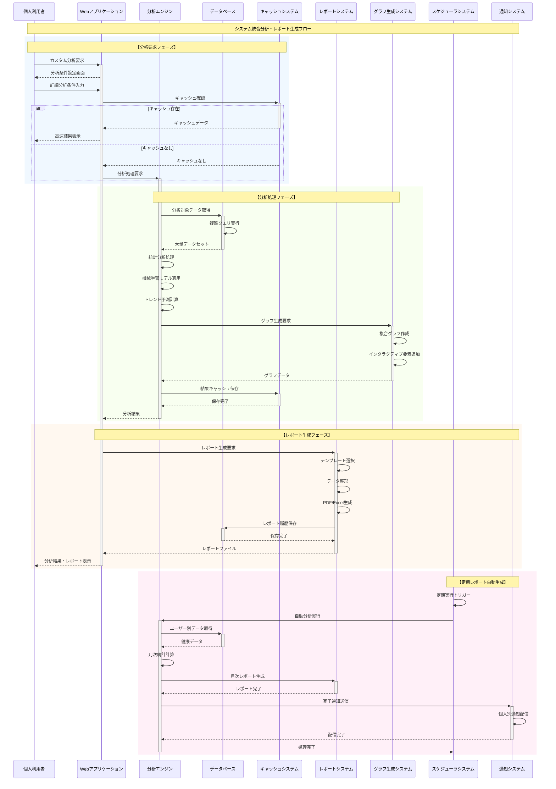

# システム化業務フロー [ID:RDDD0503]

## 概要

個人ヘルスケアレコード管理システム「sphr」において、業務機能とシステム機能を統合したTo-Beシステム化業務フローを定義し、システムに対する具体的な機能要求を明確化する。

## システム化業務フロー

### SWF001: システム統合健康データ管理フロー

業務機能とシステム機能を統合した健康データ管理の全体フローを示す。

### SWF002: システム統合データ移行フロー

既存データの移行処理において、複数システムが連携する統合フローを示す。

### SWF003: システム統合分析・レポート生成フロー

高度な分析とレポート生成における複数システムの協調動作を示す。

## システム機能要求の明確化

### 認証・セキュリティシステム要求

#### 必須機能
- **マルチファクタ認証**: SMS、メール認証の段階的導入
- **セッション管理**: タイムアウト、同時セッション制限
- **権限管理**: ロールベースアクセス制御（RBAC）
- **監査証跡**: 全操作の完全ログ記録

#### 性能要求
- **認証レスポンス**: 2秒以内
- **セッション維持**: 8時間（設定可能）
- **同時認証処理**: 1,000セッション/分

### データ管理システム要求

#### 必須機能
- **CRUD操作**: 高性能な作成・参照・更新・削除
- **データ検証**: リアルタイムバリデーション
- **トランザクション管理**: ACID特性の保証
- **データバックアップ**: 日次自動バックアップ

#### 性能要求
- **データ登録**: 1秒以内（単一レコード）
- **データ検索**: 3秒以内（複雑クエリ）
- **同時アクセス**: 500ユーザー同時処理

### 分析システム要求

#### 必須機能
- **リアルタイム分析**: オンデマンド統計計算
- **バッチ分析**: 大量データの定期処理
- **機械学習**: 予測モデルの適用
- **結果キャッシュ**: 高速レスポンスのための最適化

#### 性能要求
- **基本統計**: 5秒以内
- **複雑分析**: 30秒以内
- **グラフ生成**: 3秒以内

### 通知システム要求

#### 必須機能
- **マルチチャネル**: メール、プッシュ、SMS通知
- **個人設定**: 通知設定のカスタマイズ
- **配信制御**: 配信スケジュールと頻度制限
- **テンプレート**: 動的コンテンツ生成

#### 性能要求
- **即時通知**: 30秒以内配信
- **バッチ通知**: 10,000件/時間処理
- **配信成功率**: 99%以上

## システム間連携要件

### API設計要件
- **RESTful API**: 統一されたインターフェース設計
- **認証**: JWT トークンベース認証
- **レート制限**: API呼び出し頻度制限
- **バージョニング**: 後方互換性の確保

### データ整合性要件
- **分散トランザクション**: システム間のデータ整合性
- **結果的整合性**: 非同期処理での最終整合性
- **エラーハンドリング**: 障害時の自動復旧機能

### 監視・運用要件
- **ヘルスチェック**: 各システムの稼働監視
- **性能監視**: レスポンス時間、スループット監視
- **ログ管理**: 統一されたログ形式と集約
- **アラート**: 閾値超過時の自動通知

## Phase別システム実装計画

### Phase 1 (MVP): 基盤システム
- 認証・セキュリティシステム
- データ管理システム（基本CRUD）
- 分析システム（基本統計）
- 通知システム（基本機能）

### Phase 2: 機能拡張
- 高度分析システム
- レポート生成システム
- バッチ処理システム拡張
- 外部連携API

### Phase 3: 高度化
- 機械学習システム
- リアルタイム処理システム
- 代理人権限管理システム
- 高度な監視・運用システム

## まとめ

システム化業務フローにより、業務機能とシステム機能の統合的な動作を明確化した。各システムは疎結合でありながら協調動作し、高性能・高可用性・高セキュリティを実現する。特に、認証からデータ処理、分析、通知まで一連のシステムが連携することで、シームレスな個人健康管理体験を提供する。