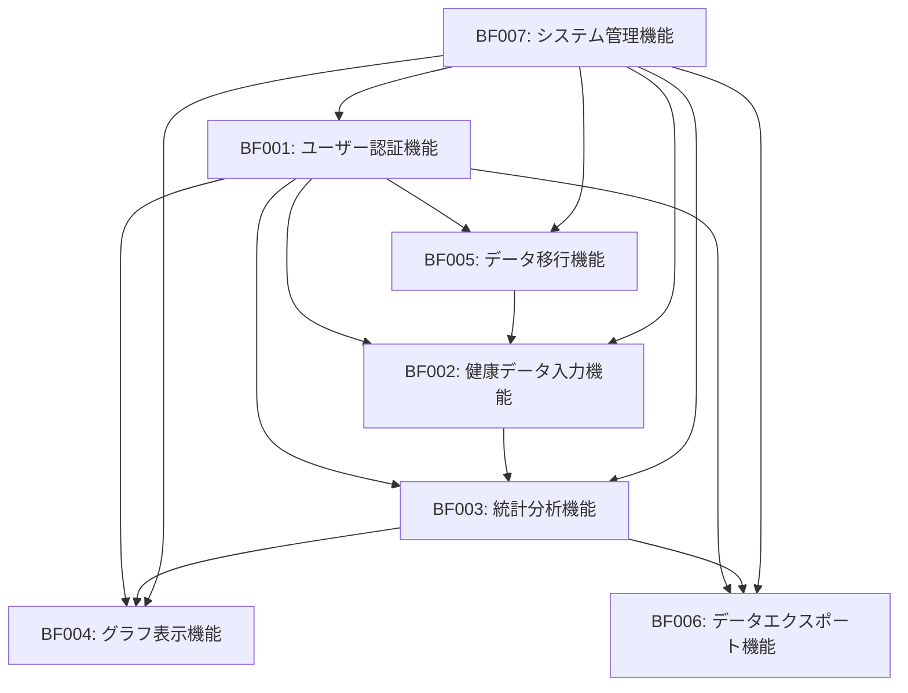

# 業務機能定義 [ID:RDDD0504]

## 概要

個人ヘルスケアレコード管理システム「sphr」のビジネスプロセスフローに含まれる各アクティビティについて、業務処理の詳細内容を定義し、システム機能の仕様ベースラインを確立する。

## 業務機能定義一覧

### BF001: ユーザー認証機能

#### 機能概要
システムへの安全なアクセスを制御し、個人健康情報の機密性を保護する認証機能。

#### 詳細定義

| 項目 | 内容 |
|------|------|
| 機能ID | BF001 |
| 機能名 | ユーザー認証機能 |
| 対応ビジネスプロセス | BP005: ユーザー管理・認証プロセス |
| 機能分類 | セキュリティ・基盤機能 |

#### 業務ルール

1. **新規ユーザー登録ルール**
   - メールアドレスは一意である必要がある
   - パスワードは8文字以上、英数字記号を含む
   - 生年月日は1900年以降、未来日は不可
   - 利用規約への同意が必須

2. **ログイン認証ルール**
   - 連続ログイン失敗3回でアカウント一時ロック（30分）
   - セッション有効期限は8時間（延長可能）
   - 最終アクセスから30日間未使用でセッション自動削除
   - 同一アカウントの同時ログイン数は5セッションまで

3. **パスワード管理ルール**
   - パスワード変更は現在パスワード確認後に実行
   - 過去3回のパスワードは再利用不可
   - パスワードリセットはメール認証必須
   - 管理者によるパスワード強制変更機能

#### 入力データ

| データ項目 | 必須 | データ型 | 制約条件 |
|------------|------|----------|----------|
| メールアドレス | ○ | 文字列 | RFC 5322準拠、最大254文字 |
| パスワード | ○ | 文字列 | 8-128文字、複雑性要件 |
| ユーザー名 | ○ | 文字列 | 3-50文字、英数字・日本語 |
| 生年月日 | ○ | 日付 | 1900/1/1以降、未来日不可 |
| 性別 | - | 選択 | 男性/女性/その他/回答しない |

#### 出力データ

| データ項目 | データ型 | 説明 |
|------------|----------|------|
| セッションID | 文字列 | セッション識別子（UUID） |
| 認証結果 | 真偽値 | 認証成功/失敗 |
| エラーメッセージ | 文字列 | 認証失敗時の詳細情報 |
| ユーザー情報 | JSON | 認証済みユーザーの基本情報 |

### BF002: 健康データ入力機能

#### 機能概要
日々の健康測定値（血圧、脈拍、体重等）を継続的に記録・管理する中核機能。

#### 詳細定義

| 項目 | 内容 |
|------|------|
| 機能ID | BF002 |
| 機能名 | 健康データ入力機能 |
| 対応ビジネスプロセス | BP001: 健康データ管理プロセス |
| 機能分類 | データ入力・基本機能 |

#### 業務ルール

1. **データ入力ルール**
   - 測定日は過去3年から当日まで入力可能
   - 同一データ型・同一日時の重複入力は上書き確認
   - 必須項目：データ型、測定値、測定日
   - 測定時刻は省略可能（省略時は入力時刻を設定）

2. **データ検証ルール**
   - 血圧（収縮期）: 50-300 mmHg
   - 血圧（拡張期）: 30-200 mmHg
   - 脈拍: 30-200 bpm
   - 体重: 20-300 kg
   - 各データ型でカスタム範囲設定可能

3. **データ保存ルール**
   - 入力データは即座にDB保存
   - 操作履歴は監査ログに記録
   - バックアップは日次実行
   - 削除データは論理削除（90日後物理削除）

#### 入力データ

| データ項目 | 必須 | データ型 | 制約条件 |
|------------|------|----------|----------|
| データ型ID | ○ | 文字列 | システム定義済みデータ型 |
| 測定値 | ○ | 数値 | 正数、小数点以下2桁まで |
| 測定日 | ○ | 日付 | 過去3年-当日 |
| 測定時刻 | - | 時刻 | 00:00-23:59 |
| 備考 | - | 文字列 | 最大200文字 |

#### 出力データ

| データ項目 | データ型 | 説明 |
|------------|----------|------|
| レコードID | 文字列 | 登録されたレコードの一意識別子 |
| 登録結果 | 真偽値 | 登録成功/失敗 |
| 警告メッセージ | 文字列 | 範囲外値等の警告情報 |
| 入力サマリー | JSON | 入力データの確認情報 |

### BF003: 統計分析機能

#### 機能概要
蓄積された健康データから統計情報（最大・最小・平均値）を算出し、期間指定での分析結果を提供する。

#### 詳細定義

| 項目 | 内容 |
|------|------|
| 機能ID | BF003 |
| 機能名 | 統計分析機能 |
| 対応ビジネスプロセス | BP002: 分析・可視化プロセス |
| 機能分類 | 分析・可視化機能 |

#### 業務ルール

1. **分析期間ルール**
   - 最短分析期間: 7日間
   - 最長分析期間: 3年間
   - デフォルト期間: 過去30日間
   - 分析対象データが5件未満の場合は警告表示

2. **統計計算ルール**
   - 基本統計: 最大値、最小値、平均値、標準偏差
   - 移動平均: 7日、14日、30日移動平均
   - パーセンタイル: 25%, 50%, 75%分位数
   - 欠損値は計算から除外

3. **結果キャッシュルール**
   - 同一条件での分析結果は24時間キャッシュ
   - データ更新時はキャッシュ無効化
   - キャッシュサイズは100MB上限

#### 入力データ

| データ項目 | 必須 | データ型 | 制約条件 |
|------------|------|----------|----------|
| データ型ID | ○ | 文字列配列 | 1-10個まで同時指定可能 |
| 開始日 | ○ | 日付 | 過去3年から当日まで |
| 終了日 | ○ | 日付 | 開始日以降、当日まで |
| 分析種別 | - | 文字列配列 | basic/trend/moving_average |

#### 出力データ

| データ項目 | データ型 | 説明 |
|------------|----------|------|
| 分析結果 | JSON | データ型別の統計値 |
| データ件数 | 数値 | 分析対象データ件数 |
| 期間情報 | JSON | 実際の分析期間情報 |
| 警告情報 | 文字列配列 | データ不足等の警告 |

### BF004: グラフ表示機能

#### 機能概要
健康データの時系列変化を折れ線グラフや移動平均で視覚化し、直感的な健康状態把握を支援する。

#### 詳細定義

| 項目 | 内容 |
|------|------|
| 機能ID | BF004 |
| 機能名 | グラフ表示機能 |
| 対応ビジネスプロセス | BP002: 分析・可視化プロセス |
| 機能分類 | 可視化機能 |

#### 業務ルール

1. **グラフ種別ルール**
   - 標準: 折れ線グラフ（時系列データ）
   - 移動平均: 平滑化された折れ線
   - 複合グラフ: 複数データ型の重ね合わせ
   - 散布図: 2つのデータ型の相関分析

2. **表示制御ルール**
   - 最大表示データ点数: 1,000点
   - データ点数超過時は自動間引き
   - X軸: 時間軸（日、週、月単位）
   - Y軸: 測定値（データ型別単位）

3. **インタラクション ルール**
   - ズーム: 期間拡大・縮小機能
   - ツールチップ: データ点詳細表示
   - 凡例: データ系列の表示・非表示切替
   - エクスポート: PNG、SVG形式での保存

#### 入力データ

| データ項目 | 必須 | データ型 | 制約条件 |
|------------|------|----------|----------|
| 分析結果データ | ○ | JSON | BF003の出力データ |
| グラフ種別 | ○ | 文字列 | line/moving_average/scatter |
| 表示オプション | - | JSON | 色、サイズ等の表示設定 |

#### 出力データ

| データ項目 | データ型 | 説明 |
|------------|----------|------|
| グラフデータ | JSON | D3.js互換のグラフデータ |
| 画像URL | 文字列 | 生成されたグラフ画像のURL |
| インタラクション設定 | JSON | ズーム、選択等の設定 |

### BF005: データ移行機能

#### 機能概要
既存の健康データファイル（CSV、Excel等）をシステムに取り込み、過去データの有効活用を実現する。

#### 詳細定義

| 項目 | 内容 |
|------|------|
| 機能ID | BF005 |
| 機能名 | データ移行機能 |
| 対応ビジネスプロセス | BP004: データ移行・インポートプロセス |
| 機能分類 | データ連携機能 |

#### 業務ルール

1. **ファイル形式ルール**
   - 対応形式: CSV、Excel (.xlsx)、JSON
   - 最大ファイルサイズ: 10MB
   - 文字エンコード: UTF-8、Shift_JIS
   - 最大レコード数: 10,000件/ファイル

2. **データマッピングルール**
   - 必須列: 日付、データ型、測定値
   - 日付形式: YYYY-MM-DD、YYYY/MM/DD
   - データ型: システム定義済みの型への自動マッピング
   - 重複データは最新データで上書き

3. **エラーハンドリングルール**
   - 形式エラー: 行番号付きエラーレポート
   - データエラー: 範囲外値は警告として処理継続
   - 処理中断: 致命的エラー時は全件ロールバック
   - 部分成功: 正常データのみ取り込み、エラー詳細レポート

#### 入力データ

| データ項目 | 必須 | データ型 | 制約条件 |
|------------|------|----------|----------|
| アップロードファイル | ○ | ファイル | CSV/Excel/JSON、10MB以下 |
| データマッピング設定 | ○ | JSON | 列とデータ型の対応定義 |
| インポートオプション | - | JSON | 重複処理、エラー処理設定 |

#### 出力データ

| データ項目 | データ型 | 説明 |
|------------|----------|------|
| インポート結果 | JSON | 成功・失敗・警告件数 |
| エラーレポート | 文字列配列 | 行別エラー詳細 |
| インポートID | 文字列 | 処理履歴識別子 |
| プレビューデータ | JSON | インポート前データ確認用 |

### BF006: データエクスポート機能

#### 機能概要
蓄積された健康データを標準フォーマット（PDF、CSV等）で出力し、医療機関との情報共有を支援する。

#### 詳細定義

| 項目 | 内容 |
|------|------|
| 機能ID | BF006 |
| 機能名 | データエクスポート機能 |
| 対応ビジネスプロセス | BP003: 医療機関連携プロセス |
| 機能分類 | データ連携機能 |

#### 業務ルール

1. **エクスポート形式ルール**
   - PDF: 医療機関向け標準レポート
   - CSV: データ分析用構造化データ
   - JSON: システム間連携用
   - Excel: 表計算ソフト利用用

2. **データ選択ルール**
   - 期間指定: 任意の開始日・終了日
   - データ型選択: 複数データ型の組み合わせ可能
   - 統計情報含有: 基本統計値の自動付加
   - 個人情報制御: 匿名化オプション

3. **セキュリティルール**
   - アクセス制御: 本人のみエクスポート可能
   - ダウンロード制限: 24時間以内にダウンロード
   - ファイル暗号化: パスワード付きZIPファイル
   - 操作ログ: エクスポート操作の完全記録

#### 入力データ

| データ項目 | 必須 | データ型 | 制約条件 |
|------------|------|----------|----------|
| エクスポート期間 | ○ | 日付範囲 | 開始日≤終了日 |
| データ型選択 | ○ | 文字列配列 | 1個以上選択必須 |
| 出力形式 | ○ | 文字列 | PDF/CSV/JSON/Excel |
| オプション設定 | - | JSON | 統計含有、匿名化等 |

#### 出力データ

| データ項目 | データ型 | 説明 |
|------------|----------|------|
| ファイルURL | 文字列 | ダウンロード用一時URL |
| ファイルサイズ | 数値 | 生成ファイルサイズ（バイト） |
| レコード件数 | 数値 | エクスポートされたレコード数 |
| 有効期限 | 日時 | ダウンロードリンク有効期限 |

### BF007: システム管理機能

#### 機能概要
システム全体の稼働監視、性能管理、セキュリティ監査を行う運用基盤機能。

#### 詳細定義

| 項目 | 内容 |
|------|------|
| 機能ID | BF007 |
| 機能名 | システム管理機能 |
| 対応ビジネスプロセス | BP006: システム管理・運用プロセス |
| 機能分類 | 運用・管理機能 |

#### 業務ルール

1. **監視ルール**
   - 稼働率監視: 99.5%以上維持
   - レスポンス監視: 平均応答時間3秒以下
   - リソース監視: CPU 80%、メモリ 85%で警告
   - セキュリティ監視: 不正アクセスの自動検知

2. **アラート配信ルール**
   - 緊急アラート: 即座にメール・SMS通知
   - 警告アラート: 5分間隔で通知
   - 復旧通知: 問題解決時の自動通知
   - エスカレーション: 1時間未対応で上位者通知

3. **ログ管理ルール**
   - 保存期間: 監査ログ7年、システムログ1年
   - ログローテーション: 日次実行
   - ログ暗号化: 保存時暗号化必須
   - ログ検索: 全文検索インデックス

#### 入力データ

| データ項目 | 必須 | データ型 | 制約条件 |
|------------|------|----------|----------|
| 監視対象 | ○ | 文字列配列 | システム・サービス識別子 |
| 監視間隔 | - | 数値 | 秒単位、デフォルト60秒 |
| アラート設定 | - | JSON | 閾値・通知先設定 |

#### 出力データ

| データ項目 | データ型 | 説明 |
|------------|----------|------|
| システム状態 | JSON | 各システムの稼働状況 |
| 性能メトリクス | JSON | レスポンス時間、スループット等 |
| アラート情報 | JSON配列 | 発生中のアラート一覧 |
| 稼働率レポート | JSON | 期間別稼働率統計 |

## 業務機能間の連携関係

### 主要な機能連携

### 連携仕様

1. **認証連携**: 全機能は認証機能による権限確認が前提
2. **データ連携**: 入力→分析→可視化の連続処理
3. **監視連携**: 管理機能が全機能の稼働状況を監視

## Phase別実装計画

### Phase 1 (MVP)
- **必須**: BF001, BF002, BF003, BF004, BF005, BF007
- **重点**: 基本機能の安定稼働

### Phase 2 (機能拡張)
- **追加**: BF006（データエクスポート）
- **強化**: BF003（高度分析）、BF004（インタラクティブ表示）

### Phase 3 (高度化)
- **拡張**: 機械学習分析、代理人機能
- **最適化**: 全機能の性能チューニング

## 品質要件

### 性能要件
- **レスポンス時間**: 全機能平均3秒以内
- **同時利用者数**: 500ユーザー対応
- **データ処理能力**: 100万件/日の入力処理

### 信頼性要件
- **稼働率**: 99.5%以上
- **データ整合性**: ACID特性の完全遵守
- **バックアップ**: RTO 4時間、RPO 1時間

### セキュリティ要件
- **認証**: 多要素認証対応
- **暗号化**: 保存時・通信時の完全暗号化
- **監査証跡**: 全操作の完全ログ記録

## まとめ

7つの業務機能により、個人健康記録管理システムの全体的な業務処理を詳細に定義した。各機能は独立性を保ちながら連携し、段階的な実装により継続的な価値提供を実現する。特に、データ入力から分析・可視化まで一貫した業務フローが確立され、システム機能の具体的な仕様要件が明確化されている。