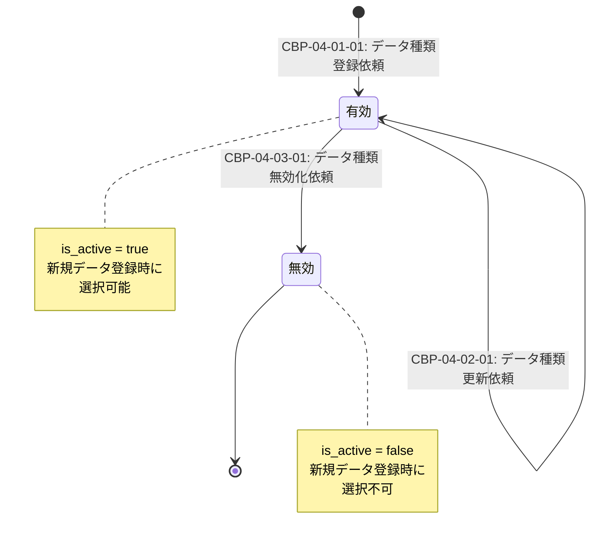

# 状態遷移図 [ID:RDDD0601]

## 概要

本ドキュメントでは、個人ヘルスケアレコード(PHR)管理システムにおいて状態遷移を管理すべきエンティティについて状態遷移図を定義します。

---

## 状態遷移が必要なエンティティの検討

概念データモデル(RDDD0401)に記載されている以下のエンティティについて、状態遷移の必要性を検討しました:

- **USER**: ユーザーアカウントの状態遷移(有効/無効、ロック等)は本システムでは管理しないため、状態遷移図は不要
- **DATA_TYPE_MASTER**: is_activeフラグによる有効/無効の状態遷移があるため、状態遷移図を作成
- **HEALTH_DATA**: 健康データは登録後に更新・削除されるのみで、複雑な状態遷移はないため、状態遷移図は不要
- **DATA_EXPORT**: 出力履歴は作成後に変更されない不変データのため、状態遷移図は不要

---

## DATA_TYPE_MASTER の状態遷移図

### 状態遷移図

### 状態の説明

#### 有効状態 (is_active = true)
- **説明**: データ種類が有効であり、ユーザーが健康情報登録時にデータ種類として選択可能な状態
- **遷移元**: なし(初期状態)
- **遷移先**: 無効状態
- **遷移トリガー**: CBP-04-03-01: データ種類無効化依頼

#### 無効状態 (is_active = false)
- **説明**: データ種類が無効化されており、ユーザーが健康情報登録時にデータ種類として選択不可の状態。過去に登録されたHEALTH_DATAは削除されないが、新規登録時の選択肢には表示されない。
- **遷移元**: 有効状態
- **遷移先**: なし(終了状態)
- **遷移トリガー**: なし

### 補足

- データ種類は物理削除されず、論理削除(is_active=false)により無効化されます
- 無効化されたデータ種類は再度有効化することは想定していません(必要であれば新規登録する)
- 無効化されたデータ種類に関連するHEALTH_DATAは削除されず、参照可能です

---

## まとめ

本システムでは、DATA_TYPE_MASTERエンティティのみ状態遷移を管理します。状態は「有効」と「無効」の2つであり、有効状態から無効状態への一方向の遷移のみが存在します。

この状態遷移は、業務プロセス(RDDD0501、RDDD0502)および概念データモデル(RDDD0401)と整合性を保っています。
