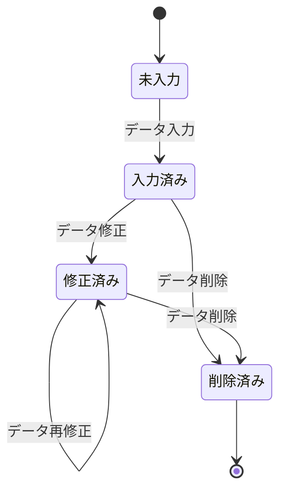
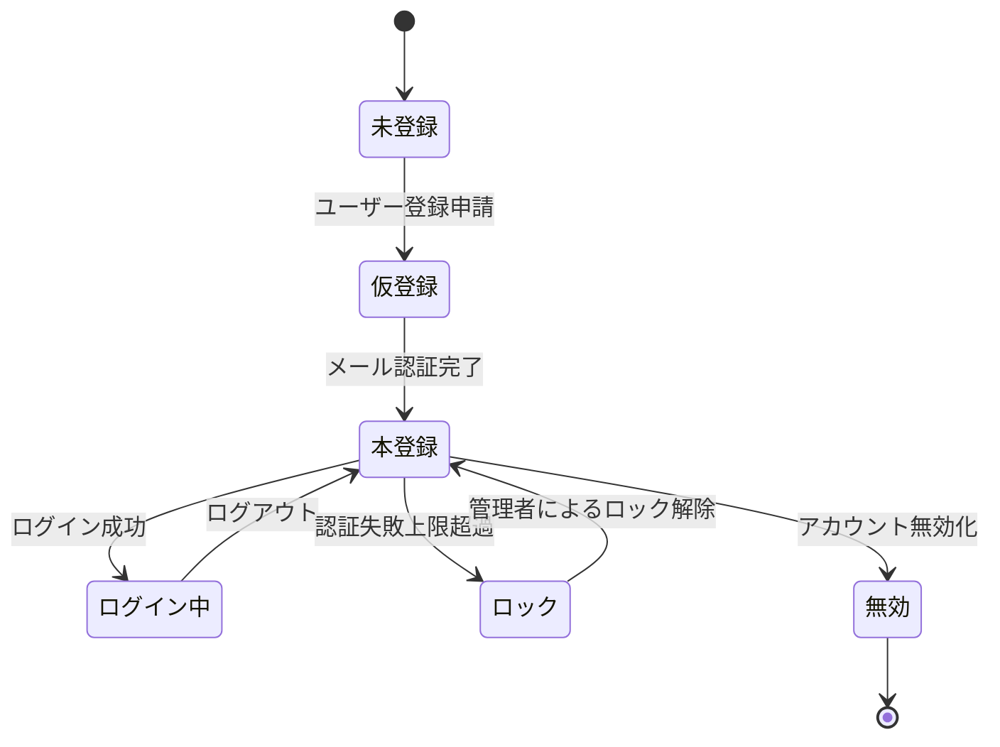
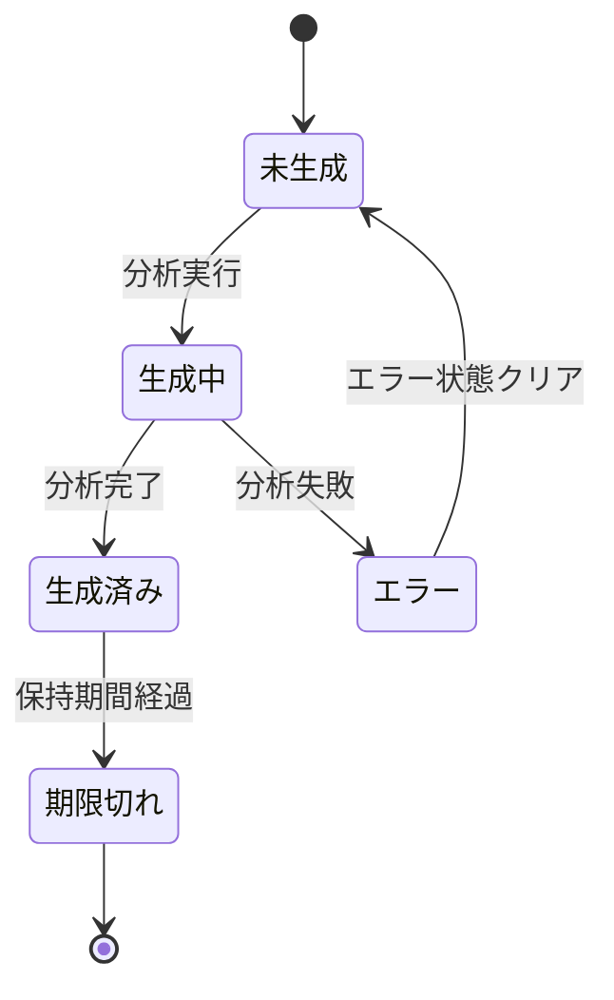

# 状態遷移図 [ID:RDDD0601]

## **概要**

健康データ記録システムにおける主要エンティティの状態遷移を定義し、業務プロセスとの整合性を確保する。

## **健康記録データの状態遷移**

健康記録データ（血圧、脈拍、体重等）の状態遷移を以下に示す。

### **状態の定義**

| 状態 | 説明 |
|------|------|
| 未入力 | データがまだ入力されていない初期状態 |
| 入力済み | ユーザーによってデータが入力された状態 |
| 修正済み | 入力済みデータが修正された状態 |
| 削除済み | データが論理削除された最終状態 |

### **状態遷移の詳細**

| 遷移 | トリガー | 条件 | 処理 |
|------|----------|------|------|
| 未入力 → 入力済み | データ入力 | 認証済みユーザー | データ登録、タイムスタンプ記録 |
| 入力済み → 修正済み | データ修正 | データ所有者または権限を持つユーザー | データ更新、修正履歴記録 |
| 修正済み → 修正済み | データ再修正 | データ所有者または権限を持つユーザー | データ更新、修正履歴記録 |
| 入力済み → 削除済み | データ削除 | データ所有者または権限を持つユーザー | 論理削除、削除フラグ設定 |
| 修正済み → 削除済み | データ削除 | データ所有者または権限を持つユーザー | 論理削除、削除フラグ設定 |

## **ユーザーアカウントの状態遷移**

### **状態の定義**

| 状態 | 説明 |
|------|------|
| 未登録 | アカウントが存在しない初期状態 |
| 仮登録 | ユーザー登録申請済みだがメール認証未完了 |
| 本登録 | メール認証完了済みで利用可能な状態 |
| ログイン中 | 認証済みでシステムにアクセス中の状態 |
| ロック | 認証失敗回数超過等によりアクセスが制限された状態 |
| 無効 | アカウントが無効化された最終状態 |

## **データ分析結果の状態遷移**

### **状態の定義**

| 状態 | 説明 |
|------|------|
| 未生成 | 分析結果がまだ生成されていない状態 |
| 生成中 | 分析処理が実行中の状態 |
| 生成済み | 分析結果が生成完了し利用可能な状態 |
| エラー | 分析処理でエラーが発生した状態 |
| 期限切れ | 分析結果の保持期間が経過し削除対象となった状態 |

## **業務プロセスとの整合性確認**

- 健康記録データの状態遷移は、データ登録・修正・削除の業務フローと一致している
- ユーザーアカウントの状態遷移は、認証・認可の業務フローと一致している  
- データ分析結果の状態遷移は、統計分析・可視化の業務フローと一致している